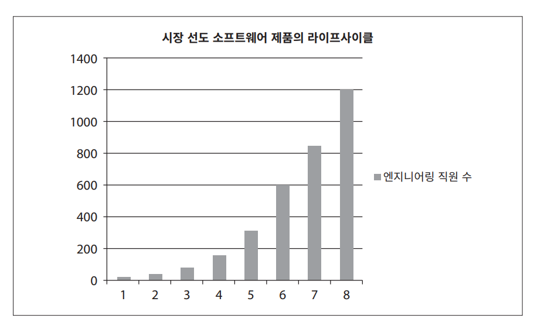
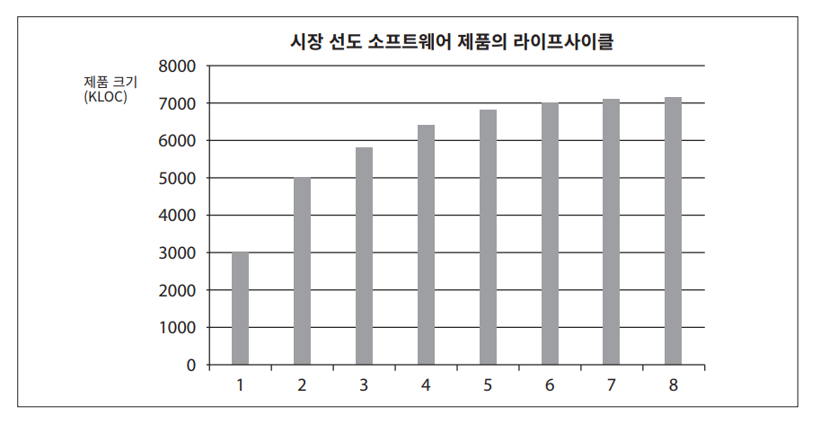
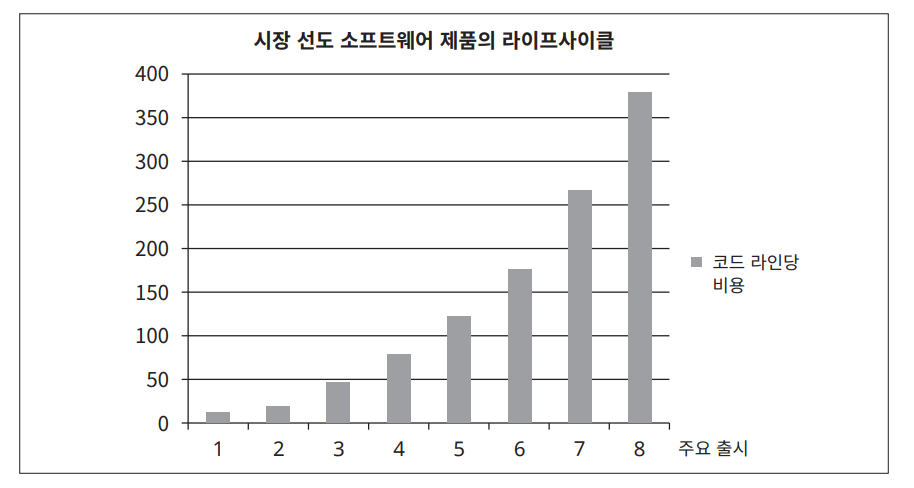
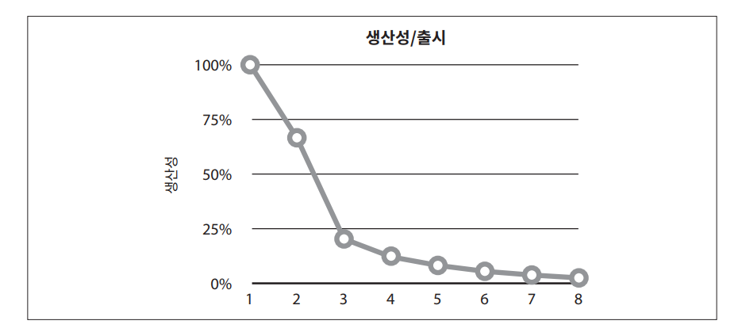
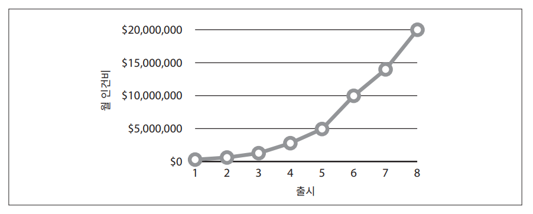
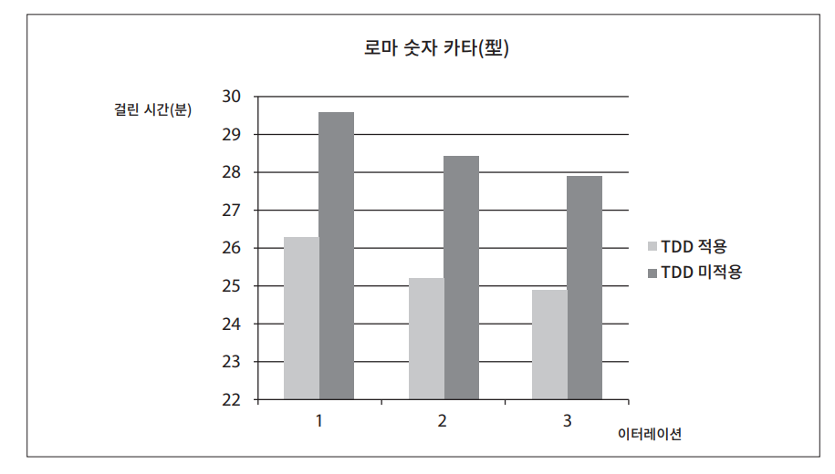

# **설계와 아키텍처란?**  
설계(design)와 아키텍처(architecture)의 차이점은 없다.  
  
'아키텍처'는 저수준의 세부사항과는 분리된 고수준의 무언가를 가리킬 때 흔히 사용되는 반면 '설계'는 저수준의 구조 또는 결정사항 들을 의미할 때가 
많다. 하지만 아키텍트가 실제로 하는 일을 살펴보면 이러한 구분은 무의미하다.  
  
새로운 집을 설계하는 아키텍트가 있다고 하자. 이 집은 아키텍처를 가지고 있는가? 당연히 있다. 그렇다면 그 집의 아키텍처는 무엇인가? 아마 집의 형태, 
외관, 입면도, 공간이나 방의 배치 등이 여기에 포함된다. 하지만 아키텍트가 만든 도면을 살펴보면 무수히 많은 저수준의 세부사항도 확인할 수 있다. 
콘센트, 전등 스위치, 전등이 모두 어디에 위치하는지를 도면에서 알 수 있다. 보일러는 어디에 놓이고, 온수기와 배출 펌프의 크기와 위치는 어떻게 되는지 
역시 볼 수 있다. 벽, 지붕 그리고 기초 공사가 어떻게 진행될지도 상세히 확인할 수 있다.  
  
다시 말해 모든 고수준의 결정사항을 지탱하는 모든 세부사항을 자세하게 확인할 수 있다. 이러한 저수준의 세부사항과 고수준의 결정사항은 집의 전체 
설계의 구성요소가 된다.  
  
소프트웨어 설계도 마찬가지다. 저수준의 세부사항과 고수준의 구조는 모두 소프트웨어 전체 설계의 구성요소다. 이 둘은 단절 없이 이어진 직물과 같으며 
이를 통해 대상 시스템의 구조를 정의한다. 개별로는 존재할 수 없고 실제로 이 둘을 구분 짓는 경계는 뚜렷하지 않다. 고수준에서 저수준으로 향하는 
의사결정의 연속성만이 있을 뿐이다.  
  
# **목표는?**  
그렇다면 이러한 의사결정의 목표와 좋은 소프트웨어 설계의 목표는 다음 설명과 크게 다르지 않다.  
  
- 소프트웨어 아키텍처의 목표는 필요한 시스템을 만들고 유지보수하는 데 투입되는 인력을 최소화하는 데 있다.  
  
설계 품질을 재는 척도는 고객의 요구를 만족시키는 데 드는 비용을 재는 척도와 다름없다. 이 비용이 낮을 뿐만 아니라 시스템의 수명이 다할 때까지 
낮게 유지할 수 있다면 좋은 설계라고 말할 수 있다. 새로운 기능을 출시할 때마다 비용이 증가한다면 나쁜 설계다. 좋은 설계란 이처럼 단순명료하다.  
  
# **사례 연구**  
다음 사례를 살펴보자. 이 사례는 익명으로 남길 원하는 실제 회사의 진짜 데이터를 바탕으로 만들어졌다.  
  
  
  
먼저 엔지니어링 직원 수가 늘어나는 추세를 살펴보자. 분명 이러한 추세를 굉장히 고무적인 상황으로 여길 것이다. 위 그림과 같은 성장은 굉장한 성공을 
이뤄냈음을 가리키는 지표라고 말이다.  
  
  
  
이제 같은 기간 회사의 생산성을 보자. 생산성은 단순히 코드 라인 수로만 측정했다.  
  
무언가 명백히 잘못되었다. 매번 새로운 기능을 출시할 때마다 개발자의 수는 지속적으로 증가했지만 코드 생산성은 마치 한곳으로 수렴하는 것처럼 보인다.  
  
  
  
이제 정말 두려운 그래프를 볼 차례다. 위 그림은 같은 기간에 코드 한 라인당 비용이 어떻게 변했는지를 보여준다.  
  
이 추세로는 오래 갈 수 없다. 지금 당장의 수익성은 중요치 않다. 결국 이러한 비용 곡선은 사업 모델의 수익을 엄청나게 고갈시키며 회사의 성장을 멈추게 
하거나 심지어는 완전히 망하게 만든다.  
  
이처럼 생산성을 현저하게 변화시킨 요인은 대체 무엇인가? 여덟 번째 출시한 제품의 코드는 처음 제품보다 왜 40배나 더 많은 비용이 드는가?  
  
# **엉망진창이 되어 가는 신호**  
지금 보고 있는 것은 엉망진창이 되어 가는 신호다. 시스템을 급하게 만들거나 결과물의 총량을 순전히 프로그래머 수만으로 결정하거나 코드와 설계의 구조를 
깔끔하게 만들려는 생각을 전혀 하지 않으면 파국으로 치닫는 이 비용 곡선에 올라타게 된다.  
  
  
  
위 그림은 이 비용 곡선을 개발자 관점에서 보여준다. 개발자의 생산성은 거의 100%로 시작했지만 출시할 때마다 하락한다. 네 번째 출시에 다다르면 
확실히 생산성은 거의 바닥을 치고 결국에는 0으로 수렴한다.  
  
개발자 입장에서 보자면 이러한 현산은 지독한 절망감을 안겨주는데 모두가 열심히 일하고 있기 때문이다. 전력을 기울이지 않는 개발자는 없다.  
  
개발자가 초인적인 노력을 기울이고 잔업을 하며 헌신함에도 불구하고 더 이상 진척이 없는 상황에 처하게 된다. 개발자의 노력은 기능 개발보다는 엉망이 된 
상황에 대처하는 데 소모되기 시작한다. 심지어 사소한 기능을 추가하는 일도 그저 엉망이 된 코드를 이곳에서 저곳으로, 다시 다음 곳으로 이동하는 반복 
작업으로 변질된다. 개발자들이 쏟은 노력의 가치가 결국 보잘것없게 된다.  
  
# **경영자의 시각**  
이러한 상황이 나쁘게 보인다면 이제 경영자 입장에서는 어떻게 보이는지 생각해 보자.  
  
  
  
위 그림은 같은 기간에 개발하는 데 쓰인 월별 인건비를 보여준다.  
  
첫 번째 출시에는 매월 수십만 달러의 인건비만으로 제품을 전달했다. 두 번째 출시에는 수십만 달러가 더 들었다. 여덟 번째 출시에 들어서면 월 인건비는 
2천만 달러가 되고 계속 증가하는 추세다.  
  
단수히 이 차트 하나만 봐도 겁이 난다. 무언가 믿을 수 없는 일이 벌어지는 게 틀림없다. 누군가는 수익이 지출을 초과하므로 지출을 정당화하려는 희망을 
품는다. 하지만 이 차트를 어떤 식으로 보든 우려의 대상임에는 틀림 없다.  
  
출시별 월 인건비 곡선과 출시별 코드 라인 수를 비교해 보자. 초기 출시에는 매월 수십만 달러의 비용으로 많은 기능을 탑재할 수 있었다. 하지만 마지막 
출시에서는 2천만 달러를 들이고도 얻은 게 거의 없다. 어떤 CFO라도 이 두 그래프를 본다면 참사를 미연에 방지하기 위한 조치를 지금 당장 취해야 한다고 
할 것이다.  
  
# **무엇이 잘못되었나?**  
현대의 대다수 개발자는 뼈 빠지게 일한다. 하지만 그들의 뇌는 잠에 취해 있다. 훌륭하고 깔끔하게 잘 설계된 코드가 중요하다는 사실을 알고 있는 바로 
그 뇌가 잠자고 있다.  
  
이들 개발자는 "코드는 나중에 정리하면 돼. 당장은 시장에 출시하는게 먼저야!"라는 흔해 빠진 거짓말에 속는다. 이렇게 속아 넘어간 개발자라면 나중에 코들르 
정리하는 경우는 한 번도 없는데 시장의압박은 절대로 수그러들지 않기 때문이다. '시장 출시가 먼저'라는 생각을 하는 이유는 바로 뒤에 여러 무리의 경쟁자가 
뒤쫓고 있고 경쟁자보다 앞서 가려면 가능한 한 빠르게 달려야 하기 떄문이다.  
  
결국 개발자는 절대로 태세를 전환하지 않는다. 이전에 작성한 코드로 돌아가 정리하는 일은 일어나지 않는데 바로 다음에 만들어야 할 새로운 기능이 
기다리고 있고 다음기능, 또 다음기능, 또 다음 기능이 계속 기다리고 있기 떄문이다. 결국 엉망진창이 되고 생산성은 0을 향해 수렴하기 시작한다.  
  
개발자는 생산성을 유지할 수 있다고 자신의 능력을 과신한다. 하지만 엉망진창인 코드가 서서히 쌓이면 개발자 생산성은 차츰 낮아지고 코드가 엉망이 되는 
추세는 절대 멈축나 수그러들지 않는다. 이대로 진행되면 결국 생산성이 0으로 수렴하는 일은 시간문제다.  
  
개발자가 속는 더 잘못된 거짓말은 "지저분한 코드를 작성하면 단기간에는 빠르게 갈 수 있고 장기적으로 볼 떄만 생산성이 낮아진다"는 견해다. 이 거짓말을 
받아들인 개발자는 엉망인 코드를 만드는 태세에서 나중에 기회가 되면 엉망이 된 코드를 정리하는 태세로 전환할 수 있다고 자신의 능력을 과신하게 된다. 
하지만 이는 그저 진실을 오인한 것일 뿐이다. 진실은 다음과 같다. 엉망으로 만들면 깔끔하게 유지할 때보다 항상 더 느리다. 시간 척도를 어떻게 보든지 
관계없이 말이다.  
  
  
  
제이슨 고먼이 수행한 실험 중 주목할 만한 결과를 위 그림에서 볼 수 있다. 제이슨은 이 실험을 6일에 걸쳐 실행했다. 매일 그는 정수를 로마 숫자로 
변환하는 단순한 프로그램을 완성했다. 사전에 정의한 일련의 인수 테스트(acceptance test)를 프로그램이 통과하면 개발이 완료된 것으로 봤다. 이 작업은 
매일 30분도 채 걸리지 않았다. 제이슨은 코드를 깔끔하게 유지하는 잘 알려진 수련법 중 하나인 테스트 주도 개발(TDD)을 첫째 날, 셋째 날, 다섯째 날에 
적용했다. 나머지 3일에는 TDD를 사용하지 않은 채 코드를 작성했다.  
  
먼저 위 그림에서 학습 곡선이 뚜렷하게 나타남을 볼 수 있다. 날이 지날수록 이전 날보다 빠르게 프로그램을 완성했다. 또한 TDD를 적용한 날이 적용하지 않은 
날보다 대략 10%빠르게 작업이 완성되었고 심지어 TDD를 적용한 날 중 가장 느렸던 날이 TDD를 적용하지 않고 가장 빨리 작업한 날보다도 더 빨랐다.  
  
소프트웨어 개발의 단순한 진리는 다음과 같다.  
  
- 빨리 가는 유일한 방법은 제대로 가는 것이다.  
  
그리고 이 진실이 경영자의 딜레마에 대한 해답이다. 생산성이 감소되고 비용이 증가하는 현상을 되돌릴 수 있는 유일한 방법은 개발자로 하여금 과신하려는 믿음을 
버리고 만들어 낸 엉망진창인 코드를 개발자가 책임지도록 하는 것뿐이다.  
  
개발자는 처음부터 다시 시작하여 전체 시스템을 재설계하는 것이 해답이라고 생각할지도 모른다. 엉망진창으로 내몰았던 바로 그 과신이 더 나은 코드를 만들 
수 있다고 말하고 있는 것이다. 현실은 장맛빛 기대와는 거리가 멀다.  
  
- 자신을 과신한다면 재설계하더라도 원래의 프로젝트와 똑같이 엉망으로 내몰린다.  
  
