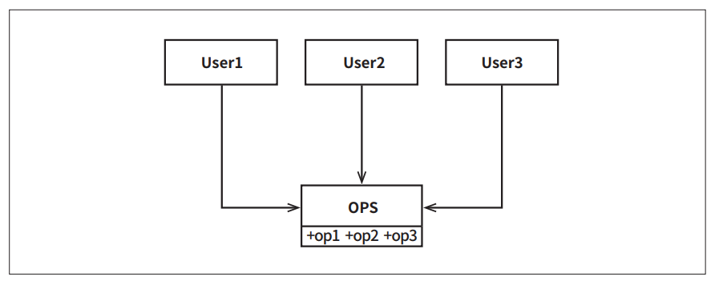
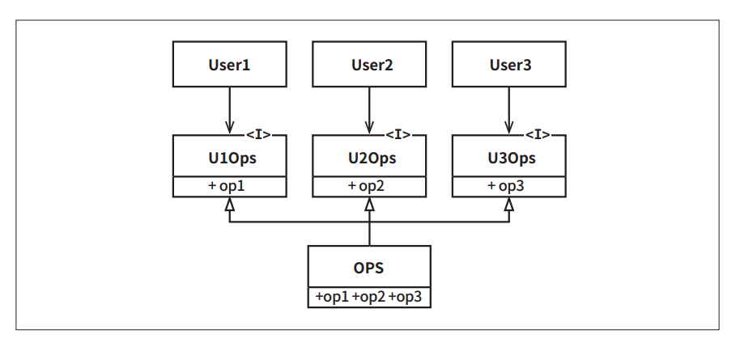

# **ISP: 인터페이스 분리 원칙**  
  
  
인터페이스 분리 원칙(ISP)는 위 그림에서 보는 다이어그램에서 그 이름이 유래했다.  
  
위 그림에서 기술된 상황에서 다수의 사용자가 OPS 클래스의 오퍼레이션을 사용한다. User1은 오직 op2만을 User3은 op3만을 사용한다고 가정해 보자.  
그리고 OPS가 정적 타입 언어로 작성된 클래스라고 해보자. 이 경우 User1에서는 op2와 op3를 전혀 사용하지 않음에도 User1의 소스 코드는 이 두 
메서드에 의존하게 된다. 이러한 의존성으로 인해 OPS 클래스에서 op2의 소스 코드가 변경되면 User1도 다시 컴파일한 후 새로 배포해야 한다. 사실 
User1과 관련된 코드는 전혀 변경되지 않았음에도 말이다.  
  
  
  
이러한 문제는 위 그림에서 보는 것처럼 오퍼레이션을 인터페이스 단위로 분리하여 해결할 수 있다.  
  
이번에도 마찬가지로 정적 타입 언어로 이 다이어그램을 구현했다고 가정하면 User1의 소스 코드는 U1Ops와 op1에 의존하지만 OPS에는 의존하지 않게 된다. 
따라서 OPS에서 발생한 변경이 User1과는 전혀 관계없는 변경이라면 User1을 다시 컴파일하고 새로 배포하는 상황은 초래되지 않는다.  
  
