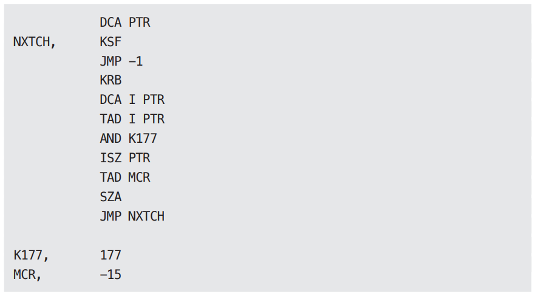
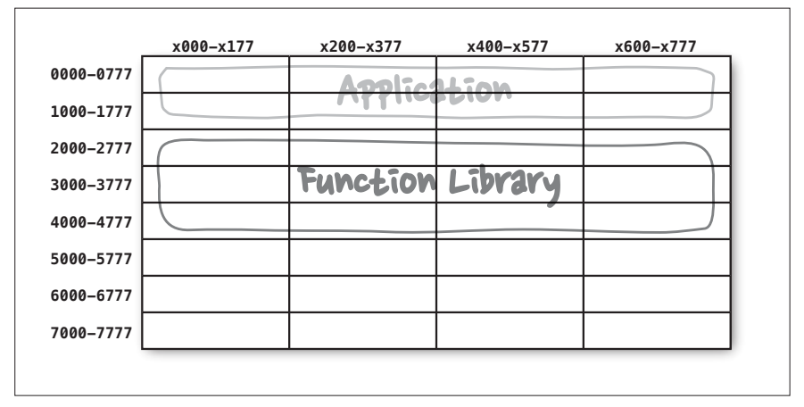
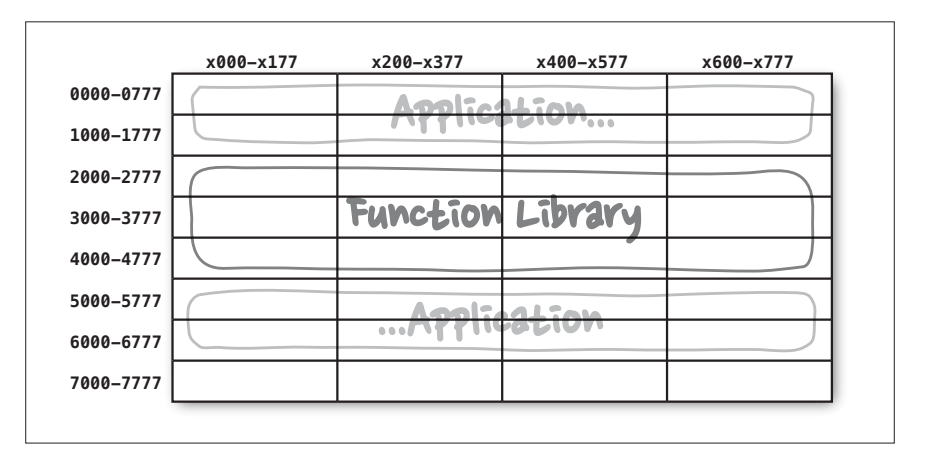

# **컴포넌트 원칙**  
SOLID 원칙이 벽과 방에 벽돌을 배치하는 방법을 알려준다면 컴포넌트 원칙은 빌딩에 방을 배치하는 방법을 설명해준다. 큰 빌딩과 마찬가지로 대규모 
소프트웨어 시스템은 작은 컴포넌트들로 만들어진다.  
  
# **컴포넌트**  
컴포넌트는 배포 단위다. 컴포넌트는 시스템의 구성 요소로 배포할 수 있는 가장 작은 단위다. 자바의 경우 jar 파일이 컴포넌트다. 루비에서는 gem 파일이다. 
닷넷에서는 DLL이다. 컴파일형 언어에서 컴포넌트는 바이너리 파일의 결합체다. 인터프리터형 언어의 경우는 소스 파일의 결합체다. 모든 언어에서 컴포넌트는 
배포할 수 있는 단위 입자다.  
  
여러 컴포넌트를 서로 링크하여 실행 가능한 단일 파일로 생성할 수 있다. 또는 여러 컴포넌트를 서로 묶어서 .war 파일과 같은 단일 아카이브로 만들 수도 
있다. 또는 컴포넌트 각각을 .jar나 .dll 같이 동적으로 로드할 수 있는 플러그인이나 .exe 파일로 만들어서 독립적으로 배포할 수도 있다. 컴포넌트가 
마지막에 어떤 형태로 배포되든 잘 설계된 컴포넌트라면 반드시 독립적으로 배포 가능한, 따라서 독립적으로 개발 가능한 능력을 갖춰야 한다.  
  
# **컴포넌트의 간략한 역사**  
소프트웨어 개발 초창기에는 메모리에서의 프로그램 위치와 레이아웃을 프로그래머가 직접 제어헀다. 프로그램의 시작부에는 프로그램이 로드될 주소를 선언하는 
오리진(origin)구문이 나와야 했다.  
  
다음의 간단한 PDP-9 프로그램을 살펴보자. 이 프로글매은 키보드로부터 문자열을 입력받아 버퍼에 저장하는 GETSTR 이라는 이름의 서브루틴을 포함한다. 
그리고 이 GETSTR을 검사하는 간단한 단위 테스트 프로그램도 포함한다.  
  
  
  
  
프로그램 시작부에 있는 *200 명령어를 주목하자. 이 명령어는 메모리 주소 200(8)에 로드할 코드를 생성하라고 컴파일러에 알려준다.  
  
오늘날의 프로그래머는 이러한 프로그래밍 방식이 낯설 것이다. 요즘의 프로그래머는 프로그램을 메모리의 어느 위치에 로드할지 고민할 필요가 거의 없다. 
하지만 프로그래밍 초창기에는 프로그램을 로드할 메모리의 위치를 정하는 일이 프로그래머가 가장 먼저 결정해야 하는 사항 중 하나였다. 이 시절에는 프로그램의 
위치가 한번 결정되면 재배치가 불가능했다.  
  
앞의 코드가 구시대에 라이브러리 함수에 접근하는 방식을 보여준다. 즉 프로그래머가 라이브러리 함수의 소스 코드를 애플리케이션 코드에 직접 포함시켜 
단일 프로그램으로 컴파일했다. 라이브러리는 바이너리가 아니라 소스 코드 형태로 유지되었다.  
  
이 시대에는 장치는 느리고 메모리는 너무 비싸서 자원이 한정적이었기에 이러한 접근법은 문제가 있었다. 컴파일러는 소스 코드 전체를 여러 번에 걸쳐서 
읽어야 했지만 메모리가 너무 작아서 소스 코드 전체를 메모리에 상주시킬 수가 없었다. 결국 컴파일러는 느린 장치를 이용해서 소스 코드를 여러 차례 읽어야만 했다.  
  
이 과정은 오래 걸렸다. 함수 라이브러리가 크면 클수록 컴파일은 더 오래 걸렸다. 대규모 프로그램을 컴파일하는 데는 몇 시간씩 걸리곤 했다.  
  
컴파일 시간을 닥축시키기 위해 프로그래머는 함수 라이브러리의 소스 코드를 애플리케이션 코드로부터 분리했다. 함수 라이브러리를 개별적으로 컴파일하고 
컴파일된 바이너리를 메모리의 특정 위치(예를 들어 2000(8))에 로드했다. 함수 라이브러리에 대한 심벌 테이블을 생성한 후 이를 이용해 애플리케이션 코드를 
컴파일했다. 그리고 애플리케이션을 실행해야 한다면 바이너리 함수 라이브러리를 로드한 다음 애플리케이션을 로드했다. 이 경우 메모리는 아래 그림과 같이 
배치되었다.  
  
  
  
애플리케이션이 메모리에서 0000(8)과 1777(8) 사이의 주소 공간에 들어갈 수 있는 한 이 방식은 잘 동작했다. 하지만 애플리케이션은 점점 커졌고 결국 할당된 
공간을 넘어서게 되었다.  
  
  
  
이 시점이 되면 프로그래머는 애플리케이션을 두 개의 주소 세그먼트로 분리하여 함수 라이브러리 공간을 사이에 두고 오가며 동작하게 배치해야 한다(위 그림).  
  
이러한 상황은 분명히 지속 가능하지 않았다. 프로그래머가 함수 라이브러리에 더 많은 함수를 추가하면 이 역시 할당된 메모리 주소를 넘어서게 되고 
결국 추가 공간을 할당해야 한다(이 경우에는 7000(8) 근처에), 프로그램과 라이브러리가 사용하는 메모리가 늘어날수록 이와 같은 단편화는 계속될 수밖에 
없었다.  
  
# **재배치성**  
해결책은 재배치가 가능한 바이너리(relocatable binary)였다. 이 해결책의 이면에 있는 발상은 아주 단순했다. 그것은 바로 지능적인 로더를 사용해서 메모리에 
재배치할 수 있는 형태의 바이너리를 생성하도록 컴파일러를 수정하자는 것이었다. 이때 로더는 재배치 코드가 자리할 위치 정보를 전달받았다. 그리고 재배치 
코드에는 로드한 데이터에서 어느 부분을 수정해야 정해진 주소에 로드할 수 있는지를 알려주는 플래그가 삽입되었다. 대개 이러한 플래그는 바이너리에서 
참조하는 메모리의 시작 주소였다.  
  
이제 프로그래머는 함수 라이브러리를 로드할 위치와 애플리케이션을 로드할 위치를 로더에게 지시할 수 있게 되었다. 실제로 로더는 여러 개의 바이너리를 입력받은 후 
단순히 하나씩 차례로 메모리로 로드하면서 재배치하는 작업을 처리했다. 이를 통해 프로그래머는 오직 필요한 함수만을 로드할 수 있게 되었다.  
  
또한 컴파일러는 재배치 가능한 바이너리 안의 함수 이름을 메타데이터 형태로 생성하도록 수정되었다. 만약 프로그램이 라이브러리 함수를 호출한다면 컴파일러는 
라이브러리 함수 이름을 외부 참조(external reference)로 생성했다. 반면 라이브러리 함수를 정의하는 프로그램이라면 컴파일러는 해당 이름을 외부 정의(
external definition)로 생성했다. 이렇게 함으로써 외부 정의를 로드할 위치가 정해지기만 하면 로더가 외부 참조를 외부 정의에 링크시킬 수 있게 된다.  
  
이렇게 링킹 로더(linking loader)가 탄생했다.  
  
# **링커**  
링킹 로더의 등장으로 프로그래머는 프로그램을 개별적으로 컴파일하고 로드할 수 있는 단위로 분할할 수 있게 되었다. 작은 프로그램과 비교적 작은 라이브러리를 
링크할 때는 이러한 방식이 대체로 잘 동작했다. 하지만 1960년대 말과 1970년대 초가 되자 프로그래머들은 더 큰 야심을 품었고 프로그램도 훨씬 커지게 되었다.  
  
결국 링킹 로더가 너무 느려서 함을 수 없는 지경에 다다랐다. 함수 라이브러리는 자기 테이프와 같이 느린 장치에 저장되었다. 이 시절에는 심지어 디스크조차 
상당히 느렸다. 링킹 로더는 이처럼 대체로 느린 장치를 사용해서 수십에서 수백 개의 바이너리 라이브러리를 읽고 외부 참조를 해석해야 했다. 프로그램은 계속 
커지고 라이브러리 함수가 라이브러리로 계속 쌓이면서 링킹 로더가 프로그램 하나를 로드하는 데만 한 시간 이상이 걸리게 되었다.  
  
마침내 로드와 링크가 두 단계로 분리되었다. 프로그래머가 느린 부분, 즉 링크 과정을 맡았는데 링커(linker)라는 별도의 애플리케이션으로 이 작업을 처리하도록 
만들었다. 링커는 링크가 완료된 재배치 코드를 만들어 주었고 그 덕분에 로더의 로딩 과정이 아주 빨라졌다. 비록 느린 링커를 사용해서 실행 파일을 만들었지만 
한번 만들어둔 실행 파일은 언제라도 빠르게 로드할 수 있게 되었다.  
  
그리고 1980년대가 되었다. 프로그래머는 C나 또 다른 고수준 언어를 사용하기 시작했다. 프로그래머는 더 큰 야심을 품었고 프로그램도 더 커졌다. 이제 프로그램 
코드가 수십만 라인을 넘어서는 게 별일도 아니게 되었다.  
  
소스 모듈은 .c 파일에서 .o 파일로 컴파일된 후 링커로 전달되어 빠르게 로드될 수 있는 형태의 실행 파일로 만들어졌다. 각 모듈은 컴파일하는 과정은 
상대적으로 빨랐지만 전체 모듈을 컴파일하는 일은 꽤 시간이 걸렸다. 이후에 링커에서는 더 많은 시간이 소요되었다. 결국 전체 소요 시간은 또다시 늘어났고 
한 시간 이상 걸리는 경우가 많아지게 되었다.  
  
마치 프로그래머는 하염없이 헛수고를 할 수밖에 없는 운명을 타고난 것처럼 보였다. 1960 ~ 1980년대에 걸쳐서 처리 과정을 더 빠르게 만들기 위해서 온갖 
시도를 했지만 프로그래머의 야심 그리고 이로 인해 늘어난 프로그램의 크기로 인해 좌초되었다. 총 한 시간이나 걸리는 이 상태에서 프로그래머가 빠져나갈 
구멍은 없어 보였다. 로드 시간은 여전히 빨랐지만 컴파일-링크 시간이 병목 구간이었다.  
  
우리는 프로그램 크기와 관련된 머피의 법칙을 겪고 있다.  
  
- 컴파일하고 링크하는 데 사용 가능한 시간을 모두 소모할 때까지 프로그램은 커진다.  
  
하지만 이 업계에는 머피에 필적하는 경쟁자가 있었다. 무어가 등장했고 1980년대 후반에 들어서자 전투가 벌어졌다. 승자는 무어였다. 디스크는 작아지기 
시작했고 놀랄 만큼 빨라졌다. 컴퓨터 메모리는 말도 안 될 정도로 저렴해져서 디스크에 저장된 만흥ㄴ 데이터를 모두 램에 캐싱할 수 있을 정도였다. 
컴퓨터 클록 속도는 1MHz에서 100MHz까지 증가했다.  
  
1990년대 후반이 되자 프로그래머가 야심차게 프로그램을 성장시키는 속도보다 링크 시간이 줄어드는 속도가 더 빨라지기 시작했다. 많은 경우 링크 시간은 
초 단위 수준이 될 정도로 감소했다. 소규모 작업이라면 링킹 로더마저도 다시금 사용할 만하게 되었다.  
  
이렇게 액티브 X와 공유 라이브러리 시대가 열렸고 .jar 파일도 등장하기 시작했다. 컴퓨터와 장치가 빨라져서 또다시 로드와 링크를 동시에 할 수 있게 
되었다. 다수의 .jar 파일 또는 다수의 공유 라이브러리를 순식간에 서로 링크한 후 링크가 끝난 프로그램을 실행할 수 있게 되었다. 이렇게 컴포넌트 플러그인 
아키텍처(component plugin architecture)가 탄생했다.  
  
오늘날에는 .jar 파일, DLL, 공유 라이브러리를 기존 애플리케이션에 플러그인 형태로 배포하는 것이 일상적인 일이 되었다. 예를 들어 마인크래프트에 
모드를 생성하고 싶다면 단순히 특정 폴더에 여러분이 수정한 .jar 파일을 추가하면 된다. 비주얼 스튜디오에 ReSharper 플러그인을 추가하려면 그저 적당한 
DLL 파일을 추가하면 된다.  
  
# **결론**  
런타임에 플러그인 형태로 결합할 수 있는 동적 링크 파일이 이 책에서 말하는 소프트웨어 컴포넌트에 해당한다. 여기까지 오는 데 50년이 걸렸다. 과거에는 
초인적인 노력을 들여야만 컴포넌트 플러그인 아키텍처를 적용할 수 있었지만 이제는 기본으로 쉽게 사용할 수 있는 지점까지 다다랐다.  

