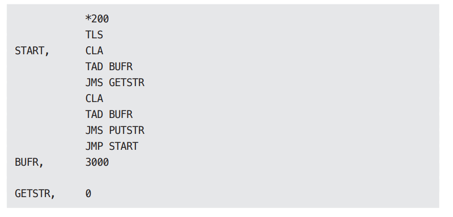

# **컴포넌트 원칙**  
SOLID 원칙이 벽과 방에 벽돌을 배치하는 방법을 알려준다면 컴포넌트 원칙은 빌딩에 방을 배치하는 방법을 설명해준다. 큰 빌딩과 마찬가지로 대규모 
소프트웨어 시스템은 작은 컴포넌트들로 만들어진다.  
  
# **컴포넌트**  
컴포넌트는 배포 단위다. 컴포넌트는 시스템의 구성 요소로 배포할 수 있는 가장 작은 단위다. 자바의 경우 jar 파일이 컴포넌트다. 루비에서는 gem 파일이다. 
닷넷에서는 DLL이다. 컴파일형 언어에서 컴포넌트는 바이너리 파일의 결합체다. 인터프리터형 언어의 경우는 소스 파일의 결합체다. 모든 언어에서 컴포넌트는 
배포할 수 있는 단위 입자다.  
  
여러 컴포넌트를 서로 링크하여 실행 가능한 단일 파일로 생성할 수 있다. 또는 여러 컴포넌트를 서로 묶어서 .war 파일과 같은 단일 아카이브로 만들 수도 
있다. 또는 컴포넌트 각각을 .jar나 .dll 같이 동적으로 로드할 수 있는 플러그인이나 .exe 파일로 만들어서 독립적으로 배포할 수도 있다. 컴포넌트가 
마지막에 어떤 형태로 배포되든 잘 설계된 컴포넌트라면 반드시 독립적으로 배포 가능한, 따라서 독립적으로 개발 가능한 능력을 갖춰야 한다.  
  
# **컴포넌트의 간략한 역사**  
소프트웨어 개발 초창기에는 메모리에서의 프로그램 위치와 레이아웃을 프로그래머가 직접 제어헀다. 프로그램의 시작부에는 프로그램이 로드될 주소를 선언하는 
오리진(origin)구문이 나와야 했다.  
  
다음의 간단한 PDP-9 프로그램을 살펴보자. 이 프로글매은 키보드로부터 문자열을 입력받아 버퍼에 저장하는 GETSTR 이라는 이름의 서브루틴을 포함한다. 
그리고 이 GETSTR을 검사하는 간단한 단위 테스트 프로그램도 포함한다.  
  
  
  
  
프로그램 시작부에 있는 *200 명령어를 주목하자. 이 명령어는 메모리 주소 200(8)에 로드할 코드를 생성하라고 컴파일러에 알려준다.  
  
오늘날의 프로그래머는 이러한 프로그래밍 방식이 낯설 것이다. 요즘의 프로그래머는 프로그램을 메모리의 어느 위치에 로드할지 고민할 필요가 거의 없다. 
하지만 프로그래밍 초창기에는 프로그램을 로드할 메모리의 위치를 정하는 일이 프로그래머가 가장 먼저 결정해야 하는 사항 중 하나였다. 이 시절에는 프로그램의 
위치가 한번 결정되면 재배치가 불가능했다.  
  
앞의 코드가 구시대에 라이브러리 함수에 접근하는 방식을 보여준다. 즉 프로그래머가 라이브러리 함수의 소스 코드를 애플리케이션 코드에 직접 포함시켜 
단일 프로그램으로 컴파일했다. 라이브러리는 바이너리가 아니라 소스 코드 형태로 유지되었다.  
  
이 시대에는 장치는 느리고 메모리는 너무 비싸서 자원이 한정적이었기에 이러한 접근법은 문제가 있었다. 컴파일러는 소스 코드 전체를 여러 번에 걸쳐서 
읽어야 했지만 메모리가 너무 작아서 소스 코드 전체를 메모리에 상주시킬 수가 없었다. 결국 컴파일러는 느린 장치를 이용해서 소스 코드를 여러 차례 읽어야만 했다.  
  
이 과정은 오래 걸렸다. 함수 라이브러리가 크면 클수록 컴파일은 더 오래 걸렸다. 대규모 프로그램을 컴파일하는 데는 몇 시간씩 걸리곤 했다.  
  
컴파일 시간을 닥축시키기 위해 프로그래머는 함수 라이브러리의 소스 코드를 애플리케이션 코드로부터 분리했다. 함수 라이브러리를 개별적으로 컴파일하고 
컴파일된 바이너리를 메모리의 특정 위치(예를 들어 2000(8))에 로드했다. 함수 라이브러리에 대한 심벌 테이블을 생성한 후 이를 이용해 애플리케이션 코드를 
컴파일했다. 그리고 애플리케이션을 실행해야 한다면 바이너리 함수 라이브러리를 로드한 다음 애플리케이션을 로드했다. 이 경우 메모리는 아래 그림과 같이 
배치되었다.  
  
  
  
애플리케이션이 메모리에서 0000(8)과 1777(8) 사이의 주소 공간에 들어갈 수 있는 한 이 방식은 잘 동작했다. 하지만 애플리케이션은 점점 커졌고 결국 할당된 
공간을 넘어서게 되었다.  
  
  
  
이 시점이 되면 프로그래머는 애플리케이션을 두 개의 주소 세그먼트로 분리하여 함수 라이브러리 공간을 사이에 두고 오가며 동작하게 배치해야 한다(위 그림).  
  
이러한 상황은 분명히 지속 가능하지 않았다. 프로그래머가 함수 라이브러리에 더 많은 함수를 추가하면 이 역시 할당된 메모리 주소를 넘어서게 되고 
결국 추가 공간을 할당해야 한다(이 경우에는 7000(8) 근처에), 프로그램과 라이브러리가 사용하는 메모리가 늘어날수록 이와 같은 단편화는 계속될 수밖에 
없었다.  
  

