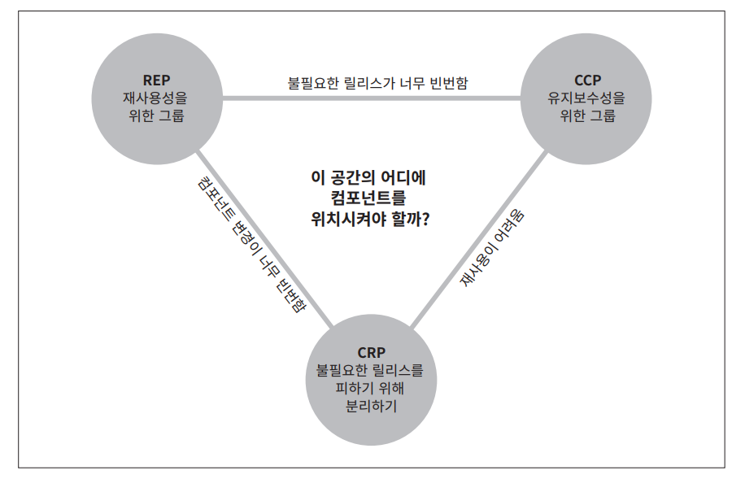

# **컴포넌트 응집도**  
어떤 클래스를 어느 컴포넌트에 포함시켜야 할까? 이는 중요한 결정이므로 제대로 된 소프트웨어 엔지니어링 원칙의 도움을 받아야 한다. 안타깝게도 수년 
동안 우리는 거의 순전히 상황에 따라 임시방편적으로 결정을 내려왔다.  
  
이 장에서는 컴포넌트 응집도와 관련된 세 가지 원칙을 논의한다.  
  
- REP: 재사용/릴리스 등가 원칙(Reuse/Release Equivalence Principle)  
- CCP: 공통 폐쇄 원칙(Common Closure Principle)  
- CRP: 공통 재사용 원칙(Common Reuse Principle)  
  
# **REP: 재사용/릴리스 등가 원칙**  
- 재사용 단위는 릴리스 단위와 같다.  
  
지난 십 년은 메이븐, 라이닝언, RVM 같은 모듈 관리 도구가 우후죽순으로 등장한 시기였다. 이 같은 도구는 점점 중요해졌는데 이 기간에 재사용 가능한 
컴포넌트나 컴포넌트 라이브러리가 엄청나게 많이 만들어졌기 때문이다. 우리는 이제 소프트웨어 재사용의 시대에 살고 있다. 객체 지향 모델의 오랜 약속 중 
하나가 실현되었다.  
  
돌이켜 보면 재사용/릴리스 등가 원칙(REP)은 너무 당연해 보인다. 소프트웨어 컴포넌트가 릴리스 절차를 통해 추적 관리되지 않거나 릴리스 번호가 부여되지 않는다면 
해당 컴포넌트를 재사용하고 싶어도 할 수 없고 하지도 않을 것이다.  
  
릴리스 번호가 없다면 재사용 컴포넌트들이 서로 호환되는지 보증할 방법이 전혀 없다. 하지만 이 단순한 이유 때문만은 아니다. 이보다는 새로운 버전이 
언제 출시되고 무엇이 변헀는지를 소프트웨어 개발자들이 알아야 하기 때문이다.  
  
새로운 릴리스가 나온다는 소식을 접하면 개발자는 새 릴리스의 변경 사항을 살펴보고 기존 버전을 계속 쓸지 여부를 결정하곤 한다. 따라서 릴리스 절차에는 
적절한공지화 함께 릴리스 문서 작성도 포함되어야 한다. 그래야 개발자가 충분한 정보를 바탕으로 새 릴리스를 통합할지, 한다면 언제 할지를 결정할 수 있다.  
  
이 원칙을 소프트웨어 설계와 아키텍처 관점에서 보면 단일 컴포넌트는 응집성이 높은 클래스와 모듈들로 구성되어야 함을 뜻한다. 단순히 뒤죽박죽 임의로 
선택된 클래스와 모듈로 구성되어서는 안 된다. 컴포넌트를 구성하는 모든 모듈은 서로 공유하는 중요한 테마나 목적이 있어야 한다.  
  
이 사실은 물론 너무 당연하다. 하지만 이 논의를 그다지 당연해 보이지 않는 색다른 시각으로 바라볼 수도 있다. 하나의 컴포넌트로 묶인 클래스와 모듈은 반드시 함께 
릴리수할 수 있어야 한다. 하나의 컴포넌트로 묶은 클래스와 모듈은 버전 번호가 같아야 하며 동일한 릴리스로 추적 관리되고 동일한 릴리스 문서에 포함되어야 
한다는 사실은 컴포넌트 제작자 입장이나 사용자 입장에서도 이치에 맞는 얘기다.  
  
하지만 이 조언은 약하다. 무언가가 "이치에 맞다"라고 말하는 일은 그저 허공에 손을 흔들면서 권위 있는 척하는 것에 불과하다. 이 조언만으로는 클래스와 모듈을 
단일 컴포넌트로 묶는 방법을 제대로 설명하기 힘들기에 이 조언이 약하다고 하는 것이다. 그렇더라도 이 원칙 자체는 중요하다. 이 원칙을 어기면 쉽게 발견할 
수 있기 때문이다. 즉 이 원칙을 어기면 '이치에 맞지'않게 된다. 만약 당신이 만든 컴포넌트가 REP를 위배하면 컴포넌트 사용자가 알게 되고 당신의 아키텍트로서의 
능력을 높게 평하지 않을 것이다.  
  
이 원칙의 약점은 다음에 다룰 두 원칙이 지닌 강점을 통해 충분히 보완할수 있다. 실제로 CCP와 CRP는 REP를 엄격하게 하지만 제약을 가하는 측면에서 정의한다.  
  
# **CCP: 공통 폐쇄 원칙**  
- 동일한 이유로 동일한 시점에 변경되는 클래스를 같은 컴포넌트로 묶어라. 서로 다른 시점에 다른 이유로 변경되는 클래스는 다른 컴포넌트로 분리하라.  
  
이 원칙은 단일 책임 원칙(SRP)을 컴포넌트 관점에서 다시 쓴 것이다. SRP에서 단일 클래스는 변경의 이유가 여러 개 있어서는 안 된다고 말하듯이 공통 
폐쇄 원칙(CCP)에서도 마찬가지로 단일 컴포넌트는 변경의 이유가 여러 개 있어서는 안 된다고 말한다.  
  
대다수의 애플리케이션에서 유지보수성(maintainability)은 재사용성보다 훨씬 중요하다. 애플리케이션에서 코드가 반드시 변경되어야 한다면 이러한 변경이 
여러 컴포넌트 도처에 분산되어 발생하기보다는 차라리 변경 모두가 단일 컴포넌트에서 발생하는 편이 낫다. 만약 변경을 단일 컴포넌트로 제한할 수 있다면 
해당 컴포넌트만 재배포하면 된다. 변경된 컴포넌트에 의존하지 않는 다른 컴포넌트는 다시 검증하거나 배포할 필요가 없다.  
  
CCP는 같은 이유로 변경될 가능성이 있는 클래스는 모두 한곳으로 묶을 것을 권한다. 물리적 또는 개념적으로 강하게 결합되어 항상 함께 변경되는 클래스들은 
하나의 컴포넌트에 속해야 한다. 이를 통해 소프트웨어를 릴리스, 재검증, 배포하는 일과 관련된 작업량을 최소화할 수 있다.  
  
이 원칙은 개방 폐쇄 원칙(OCP)과도 밀접하게 관련되어 있다. 실제로 CCP에서 마하는 폐쇄는 OCP에서 말하는 폐쇄와 그 뜻이 같다. OCP에서는 클래스가 
변경에는 닫혀 있고 확장에는 열여 있어야 한다고 말한다. 100% 완전한 폐쇄란 불가능하므로 전략적으로 폐쇄해야 한다. 우리는 발생할 가능성이 있거나 과거에 
발생했던 대다수의 공통적인 변경에 대해서 클래스가 닫혀 있도록 설계한다.  
  
CCP에서는 동일한 유형의 변경에 대해 닫혀 있는 클래스들을 하나의 컴포넌트로 묶음으로써 OCP에서 얻은 교훈을 확대 적용한다. 따라서 변경이 필요한 
요구사항이 발생했을 때 그 변경이 영향을 주는 컴포넌트들이 최소한으로 한정될 가능성이 확실히 높아진다.  
  
# **SRP와의 유사성**  
앞서 언급했듯이 CCP는 컴포넌트 수준의 SRP다. SRP에서는 서로 다른 이유로 변경되는 메서드를 서로 다른 클래스로 분리하라고 말한다. CCP에서는 서로 
다른 이유로 변경되는 클래스를 서로 다른 컴포넌트로 분리하라고 말한다. 두 원칙은 모두 다음과 같은 교훈으로 요약할 수 있다.  
  
- 동일한 시점에 동일한 이유로 변경되는 것들을 한데 묶어라. 서로 다른 시점에 다른 이유로 변경되는 것들은 서로 분리하라.  
  
# **CRP: 공통 재사용 원칙**  
- 컴포넌트 사용자들을 필요하지 않는 것에 의존하게 강요하지 말라.  
  
공통 재사용 원칙(CRP)도 클래스와 모듈을 어느 컴포넌트에 위치시킬지 결정할 때 도움되는 원칙이다. CRP에서는 같이 재사용되는 경향이 있는 클래스와 모듈들은 
같은 컴포넌트에 포함해야 한다고 말한다.  
  
개별 클래스가 단독으로 재사용되는 경우는 거의 없다. 대체로 재사용 가능한 클래스는 재사용 모듈의 일부로써 해당 모듈의 다른 클래스와 상호작용하는 경우가 
많다.  
  
간단한 사례로 컨테이너 클래스와 해당 클래스의 이터레이터 클래스를 들 수 있다. 이들 클래스는 서로 강하게 결합되어 있기 때문에 함께 재사용된다. 따라서 
이들 클래스는 반드시 동일한 컴포넌트에 위치해야 한다.  
  
이처럼 CRP는 각 컴포넌트에 어떤 클래스들을 포함시켜야 하는지를 설명해준다. 그런데 이게 전부가 아니다. CRP는 동일한 컴포넌트로 묶어서는 안되는 클래스가 
무엇인지도 말해준다. 어떤 컴포넌트가 다른 컴포넌트를 사용하면 두 컴포넌트 사이에는 의존성이 생겨난다. 어쩌면 사용하는 컴포넌트가 사용되는 컴포넌트에서 단 
하나의 클래스만 사용할 수도 있다. 그렇다고 해서 의존성은 조금도 약해지지 않는다. 사용하는 컴포넌트는 사용되는 컴포넌트에 여전히 의존한다.  
  
이 같은 의존성으로 인해 사용되는 컴포넌트가 변경될 때마다 사용하는 컴포넌트도 변경해야 할 가능성이 높다. 또는 사용하는 컴포넌트를 변경하지 않더라도, 
재컴파일, 재검증, 재배포를 해야 하는 가능성은 여전히 남아 있다. 심지어 사용되는 컴포넌트에서 발생한 변경이 사용하는 컴포넌트와는 전혀 관련 없는 경우라도 
말이다.  
  
따라서 의존하는 컴포넌트가 있다면 해당 컴포넌트의 모든 클래스에 대해 의존함을 확실히 인지해야 한다. 바꿔 말하면 한 컴포넌트에 속한 클래스들은 더 
자게 그룹지을 수 없다. 즉 그중 일부 클래스에만 의존하고 다른 클래스와는 독립적일 수 없음을 확실히 인지해야 한다. 그렇지 않다면 필요 이상으로 많은 
컴포넌트를 재배포하느라 우리의 소중한 노력을 허비하게 된다.  
  
따라서 CRP는 어떤 클래스를 한데 묶어도 되는지보다는 어떤 클래스를 한데 묶어서는 안 되는지에 대해서 훨씬 더 많은 것을 이야기한다. CRP는 강하게 결합되지 
않은 클래스들은 동일한 컴포넌트에 위치시켜서는 안 된다고 말한다.  
  
# **ISP와의 관계**  
CRP는 인터페이스 분리 원칙(ISP)의 포괄적인 버전이다. ISP는 사용하지 않는 메서드가 있는 클래스에 의존하지 말라고 조언한다. CRP는 사용하지 않는 
클래스를가진 컴포넌트에 의존하지 말라고 조언한다.  
  
이 두 조언은 다음의 한 문장으로 요약할 수 있다.  
  
- 필요하지 않은 것에 의존하지 말라.  
  
# **컴포넌트 응집도에 대한 균형 다이어그램**  
아마도 응집도에 관한 세 원칙이 서로 상충된다는 사실을 눈치챘을 거라고 본다. REP와 CCP는 포함 원칙이다. 즉 두 원칙은 컴포넌트를 더욱 크게 만든다. 
CRP는 배제 원칙이며 컴포넌트를 더욱 작게 만든다. 뛰어난 아키텍트라면 이 원칙들이 균형을 이루는 방법을 찾아야 한다.  
  
  
  
위 그림은 균형 다이어그램으로 응집도에 관한 세 원칙이 서로 어떻게 상호작용하는지 보여준다. 다이어그램의 각 변은 반대쪽 꼭지점에 있는 우원칙을 포기했을 
때 감수해야 할 비용을 나타낸다.  
  
오로지 REP와 CRP에만 중점을 두면 사소한 변경이 생겼을 때 너무 많은 컴포넌트에 영향을 미친다. 반대로 CCP와 REP에만 과도하게 집중하면 불필요한 릴리스가 
너무 빈번해진다.  
  
뛰어난 아키텍트라면 이 균형 삼각형에서 개발팀이 현재 관심을 기울이는 부분을 충족시키는 위치를 찾아야 하며 또한 시간이 흐르면서 개발팀이 주의를 
기울이는 부분 역시 변한다는 사실도 이애하고 있어야 한다. 예를 들어 프로젝트 초기에는 CCP가 REP보다 훨신 더 중요한데 개발 가능이 재사용보다 더욱 
중요하기 떄문이다.  
  
일반적으로 프로젝트는 삼각형의 오른쪽에서 싲가하는 편이며 이떄는 오직 재사용성만 희생하면 된다. 프로젝트가 성숙하고 그 프로젝트로부터 파생된 또 
다른 프로젝트가 시작되면 프로젝트는 삼각형에서 점차 왼쪽으로 이동해 간다. 즉 프로젝트의 컴포넌트 구조는 시간과 성숙도에 따라 변한다는 뜻이다. 
다시 말해 프로젝트가 실제로 수행하는 일 자체보다는 프로젝트가 발전되고 사용되는 방법과 더 관련이 깊다.  
  
# **결론**  
과거에는 결합도에 대한 우리의 인식 수준이 REP, CCP, CRP가 의미하는 것보다는 훨씬 단순했다. 응집도를 '모듈은 단 하나의 기능만 수행해야 한다'는 
속성 정도로 단순하게 이해한 적도 있었다. 하지만 컴포넌트 응집도에 관한 세 가지 원칙은 응집도가 가질 수 있는 훨씬 복잡한 다양성을 설명해 준다. 
어느 클래스들을 묶어서 컴포넌트로 만들지를 결정할 때, 재사용성과 개발 가능성이라는 상충하는 힘을 반드시 고려해야 한다. 이들 사이에서 애플리케이션의 
요구에 맞게 균형을 잡는 일은 중요하다. 심지어 이 균형점은 거의 항상 유동적이다. 즉 두 힘을 현재 상황에 맞게 잘 분배했더라고 내년이 되면 맞지 않을 
수 있다. 결과적으로 시간이 흐름에 따라 프로젝트의 초점이 개발가능성에서 재사용성으로 바뀌고 그에 따라 컴포넌트를 구성하는 방식도 조금씩 흐트러지고 
또 진화한다.