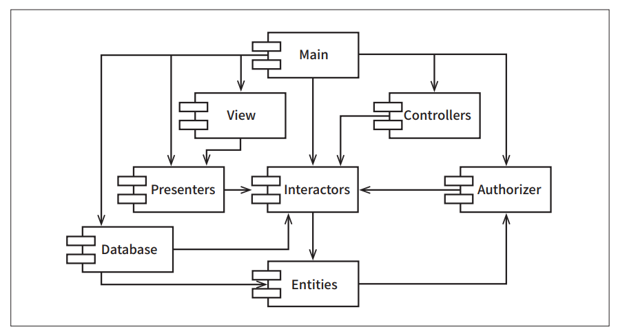

# **컴포넌트 결합**  
지금부터 다룰 세 가지 원칙은 컴포넌트 사이의 관계를 설명한다. 이 장에서도 마찬가지로 개발 가능성과 논리적 설계 사이의 균형을 다룬다. 컴포넌트 
구조와 관련된 아키텍처를 침범하는 힘은 기술적이며, 정치적이고, 가변적이다.  
  
# **ADP: 의존성 비순환 원칙**  
- 컴포넌트 의존성 그래프에 순환(cycle)이 있어서는 안 된다.  
  
하루 종일 일해서 무언가를 작동하게 만들어 놓고 퇴근했는데 이틑날 출근해 보면 전혀 돌아가지 않는 경험을 해본 적이 있지 않은가? 왜 작동하지 않게 
되었나? 왜냐하면 누군가 당신보다 더 늦게까지 일하면서 당신이 의존하고 있던 무언가를 수정했기 때문이다. 저자는 이러한 현상을 숙취 증후군이라고 부른다.  
  
숙취 증후군은 많은 개발자가 동일한 소스 파일을 수정하는 환경에서 발생한다. 소수의 개발자로 구성된 상대적으로 작은 프로젝트에서는 이 증후군이 그다지 
큰 문제가 되지 않는다. 하지만 프로젝트와 개발팀 규모가 커지면 숙취는 지독한 악몽이 될 수도 있다. 개발팀이 프로젝트의 안정 버전을 빌드하지 못한 채 
몇 주가 그냥 흘러가버리는 일도 드물지 않다. 빌드는 커녕 개발팀 모두가 누군가가 마지막으로 수정한 코드 떄문에 망가진 부분이 동작하도록 만들기 위해 
코드를 수정하고 또 수정하는 작업만이 계속될 뿐이다.  
  
지난 수십 년 동안 이 문제의 해결책으로 두 가지 방법이 발전되어 왔는데 이 두 해결책은 모두 통신 업계에서 만들어졌다. 첫 해결책은 주 단위 빌드(weekly build) 
이며 두 번째 해결책은 의존성 비순환 원칙(Acyclic Dependencies Principle, ADP)이다.  
  
# **주 단위 빌드(Weekly Build)**  
주 단위 빌드는 중간 규모의 프로젝트에서는 흔하게 사용된다. 주 단위 빌드를 하는 방법은 다음과 같다. 먼저 모든 개발자는 일주일의 첫 4일 동안은 서로를 
신경 쓰지 않는다. 개발자는 모두 코드를 개인적으로 복사하여 작업하며 전체적인 기준에서 작업을 어떻게 통합할지는 걱정하지 않는다. 그런 후 금요일이 되면 
변경된 코드를 모두 통합하여 시스템을 빌드한다.  
  
이 접근법은 5일 중 4일 동안 개발자를 고립된 세계에서 살 수 있게 보장해 준다는 아주 멋진 장점을 가진다. 물론 단점은 금요일에 통합과 관련된 막대한 업보를 
치러야 한다는 사실이다.  
  
안타깝게도 프로젝트가 커지면 프로젝트 통합은 금요일 하루 만에 끝마치는 게 불가능해진다. 통합이라는 짐은 점점 커지고 결국 토요일까지 넘어가기 시작한다. 
토요일까지 지연되는 현상이 반복되면 개발자는 통합을 적어도 목요일에는 시작해야 한다고 확신하게 된다. 그러면서 통합을 시작하는 날이 한 주의 중반을 
향해 슬금슬금 움직이게 된다.  
  
개발보다 통합에 드는 시간이 늘어나면서 팀의 효율성도 서서히 나빠진다. 결국 이러한 상황에 봉착하면 개발자나 프로젝트 관리자는 불만이 쌓이고 빌드를 
격주로 해야 한다고 딱 잘라 말하게 된다. 격주 빌드는 잠깐 동안은 만족스럽겠지만 프로젝트 규모가 성장하면서 통합에 드는 시간은 계속해서 늘어난다.  
  
이 같은 흐름은 마침내 위기를 초래한다. 효율성을 유지하기 위해 빌드 일정을 계속 늘려야 하고 빌드 주기가 늦어질수록 프로젝트가 감수할 위험은 커진다. 
통합과 테스트를 수행하기가 점점 더 어려워지고 팀은 빠른 피드백을 주는 장점을 잃는다.  
  
# **순환 의존성 제거하기**  
이 문제의 해결책은 개발 환경을 릴리스 가능한 컴포넌트 단위로 분리하는 것이다. 이를 통해 컴포넌트는 개별 개발자 또는 단일 개발팀이 책임질 수 있는 
작업 단위가 된다. 개발자가 해당 컴포넌트가 동작하도록 만든 후 해당 컴포넌트를 릴리스하여 다른 개발자가 사용할 수 있도록 만든다. 담당 개발자는 이 
컴포넌트에 릴리스 번호를 부여하고 다른 팀에서 사용할 수 있는 디렉토리로 이동시킨다. 그런 다음 개발자는 자신만의 공간에서 해당 컴포넌트를 지속적으로 수정한다. 
나머지 개발자는 릴리스된 버전을 사용한다.  
  
컴포넌트가 새로 릴리스되어 사용할 수 있게 되면 다른 팀에서는 새 릴리스를 당장 적용할지를 결정해야 한다. 적용하지 않기로 했다면 그냥 과거 버전의 
릴리스를 계속 사용한다. 새 릴리스를 적용할 준비가 되었다는 판단이 들면 새 릴리스를 사용하기 시작한다.  
  
따라서 어떤 팀도 다른 팀에 의해 좌우되지 않는다. 특정 컴포넌트가 변경되더라도 다른 팀에 즉각 영향을 주지는 않는다. 각 팀은 특정 컴포넌트가 새롭게 
릴리스되면 자신의 컴포넌트를 해당 컴포넌트에 맞게 수정할 시기를 스스로 결정할 수 있다. 뿐만 아니라 통합은 작고 점진적으로 이뤄진다. 특정 시점에 모든 
개발자가 한데 모여서 진행 중인 작업을 모두 통합하는 일은 사라진다.  
  
이 같은 작업 절차는 단순하며 합리적이어서 널리 사용되는 방식이다. 하지만 이 절차가 성공적으로 동작하려면 컴포넌트 사이의 의존성 구조를 반드시 
관리해야 한다. 의존성 구조에 순환이 있어서는 안 된다. 의존성 구조에 순환이 생기면 숙취 증후군을 피해 갈 수 없다.  
  
  
  
위 그림의 컴포넌트 다이어그램에서는 컴포넌트를 조립하여 애플리케이션을 만드는 다소 전형적인 구조를 볼 수 있다. 이 애플리케이션이 수행하는 기능이 
무엇인지는 이 예제에서 설명하려는 목적과는 관련이 없다. 중요한 점은 컴포넌트 간의 의존성 구조다. 이 구조가 방향 그래프(directed graph)임에 
주의하자. 컴포넌트는 정점(vertex)에 해당하고 의존성 관계는 방향이 있는 간선(directed edge)에 해당한다.  
  
한 가지 더 주목할 점이 있다. 어느 컴포넌트에서 시작하더라도 의존성 관계를 따라가면서 최초의 컴포넌트로 되돌아갈 수 없다는 사실이다. 이 구조에는 
순환이 없다. 즉 이 구조는 비순환 방향 그래프(Directed Acyclic Graph, DAG)다.  
  
이제 Presenters를 담당하는 팀에서 이 컴포넌트의 새로운 릴리스를 만들면 무슨 일이 벌어질지를 생각해 보자. 이 릴리스에 영향받는 팀은 쉽게 찾을 
수 있다. 의존성 화살표를 거꾸로 따라가면 된다. 즉 View와 Main 컴포넌트 둘 다 영향을 받는다. 이 두 컴포넌트를 작업 중인 개발자라면 Presenters의 
새로운 릴리스와 자신의 작업물을 언제 통합할지를 반드시 결정해야 한다.  
  
또한 Main은 새로 릴리스되더라도 시스템에서 이로 인해 영향받는 컴포넌트가 전혀 없다는 사실에 주목하자. 나머지 컴포넌트는 Main에 대해 알지 못하므로 
Main이 변경되더라도 전혀 개의치 않는다. 멋진 일이다. 즉 Main을 릴리스함으로써 미치게 되는 충격은 대체로 작다는 뜻이다.  
  
Presenters 컴포넌트를 만드는 개발자가 이 컴포넌트를 테스트하고자 한다면 단순히 현재 사용 중인 버전의 Interactors와 Entities를 이용해서 Presenters 
자체 버전을 빌드하면 그만이다. 이 빌드 과정에 시스템의 나머지 컴포넌트는 전혀 관련이 없다. 멋진 일이다. 즉 Presenters를 만드는 개발자가 테스트를 
구성할 때 대체로 적은 노력이 든다는 뜻이며 고려해야 할 변수도 상대적으로 적다는 뜻이기도 하다.  
  
시스템 전체를 릴리스해야 할 때가 오면 릴리스 절차는 상향식으로 진행된다. 먼저 Entities 컴포넌트를 컴파일하고, 테스트하고, 릴리스한다. 그러고 나서 
Database와 Interactors에 대해서도 동일한 과정을 거친다. 그다음에는 Presenters, View, Controllers, Authorizer 순으로 진행한다. Main은 
마지막에 처리한다. 이 같은 절차는 상당히 명료하며 쉽게 처리할 수 있다. 이처럼 구성요소 간 의존성을 파악하고 있으면 시스템을 빌드하는 방법을 알 수 
있다.  
  
# **순환이 컴포넌트 의존성 그래프에 미치는 영향**  
새로운 요구사항이 발생해서 Entities에 포함된 클래스 하나가 Authorizer에 포함된 클래스 하나를 사용하도록 변경할 수밖에 없다고 가정해 보자. 예를 
들어 Entities의 User 클래스가 Authorizer의 Permissions 클래스를 사용한다고 해보자. 이렇게 되면 아래 그림에서 보듯이 순환 의존성이 발생한다.  
  
  
  
이 순환은 즉각적인 문제를 일으킨다. 예를 들면 Database 컴포넌트를 만드는 개발자는 컴포넌트를 릴리스하려면 Entities 컴포넌트와 반드시 호환되어야 
한다는 사실을 알고 있다. 하지만 Entities 컴포넌트에는 순환이 있으므로 Database 컴포넌트는 또한 Authorizer와도 호환되어야 한다. 그런데 Authorizer는 
Interactors에 의존한다. 이로 인해 Database는 릴리스하기가 훨씬 어려워진다. Entities, Authorizer, Interactors는 사실상 하나의 거대한 컴포넌트가 
되어 버린다. 이 말은 결국 개발자들은 모두 이들 컴포넌트 중 어느 것을 개발하더라도 숙취 증후군에 떠는 경험을 하게 될 거라는 의미다. 해당 컴포넌트의 
개발자들은 모두 서로에게 얽매이게 되는데 모두 항상 정확하게 동일한 릴리스를 사용해야 하기 떄문이다.  
  
하지만 이는 겪게 될문제 중 일부일 뿐이다. Entities 컴포넌트를 테스트할 때 무슨 일이 벌어질지를 생각해 보라. 유감스럽게도 Authorizer와 Interactors 까지도 
반드시 빌드하고 통합해야 한다. 컴포넌트 사이에 이 정도까지 결합이 발생하면 문제가 될 뿐만 아니라 받아들이기 어려워진다.  
  
여러 클래스 중 하나에 간단한 단위 테스트를 실행하는 데 왜 일렇게도 많고 다양한 라이브러리와 다른 사람들의 많은 작업물을 포함해야만 하는지가 궁금할 
것이다. 이 문제를 조금 조사해 보면 의존성 그래프에 순환이 있기 떄문이라는 사실을 발견하게 될 것이다. 이처럼 순환이 생기면 컴포넌트를 분리하기가 상당히 
어려워진다. 단위 테스트를 하고 릴리스를 하는 일도 굉장히 어려워지며 에러도 쉽게 발생한다. 게다가 모듈의 개수가 많아짐에 따라 빌드 관련 이슈는 
기하급수적으로 증가한다.  
  
뿐만 아니라 의존성 그래프에 순환이 생기면 컴포넌트를 어떤 순서로 빌드해야 올바를지 파악하기가 상당히 힘들어진다. 사실 순환이 생기면 올바른 순서라는 
것 자체가 없을 수 있다. 특히 자바와 같이 컴파일된 바이너리 파일에서 선언문을 읽어 들이는 언어라면 끔찍한 문제가 일어날 수도 있다.  
  
# **순환 끊기**  
컴포넌트 사이의 순환을 끊고 의존성을 다시 DAG로 원상복구하는 일은 언제라도 가능하다. 이를 위한 주요 메커니즘 두 가지를 살펴보자.  
  
  
  
1. 의존성 역전 원칙(DIP)을 적용한다. 위 그림처럼 User가 필요로 하는 메서드를 제공하는 인터페이스를 생성한다. 그리고 이 인터페이스는 Entities에 
위치시키고 Authorizer에서는 이 인터페이스를 상속받는다. 이렇게 하면 Entities와 Authorizer 사이의 의존성을 역전시킬 수 있고 이를 통해 순환을 
끊을 수 있다.  
  
  
  
2. Entities와 Authorizer가 모두 의존하는 새로운 컴포넌트를 만든다. 그리고 두 컴포넌트가 모두 의존하는 클래스들을 새로운 컴포넌트로 이동시킨다. (위 그림)  
  
# **흐트러짐(Jitters)**  
두 번째 해결책에서 시사하는 바는 요구사항이 변경되면 컴포넌트 구조도 변경될 수 있다는 사실이다. 실제로 애플리케이션이 성장함에 따라 컴포넌트 의존성 
구조는 서서히 흐트러지며 또 성장한다. 따라서 의존성 구조에 순환이 발생하는지를 항상 관찰해야 한다. 순환이 발생하면 어떤 식으로든 끊어야 한다. 이 말은 
때론 새로운 컴포넌트를 생성하거나 의존성 구조가 더 커질 수도 있음을 의미한다.  
  
# **하향식(top-down) 설계**  
지금까지 논의로 우리는 피할 수 없는 결론에 다다르게 된다. 즉 컴포넌트 구조는 하향식으로 설계될 수 없다. 컴포넌트는 시스템에서 가장 먼저 설계할 수 있는 
대상이 아니며 오히려 시스템이 성장하고 변경될 때 함께 진화한다.  
  
이 결론이 직관에서 어긋난다고 생각하는 독자도 있을 수 있다. 어쩄든 우리는 컴포넌트와 같이 큰 단위로 분해된 구조는 고수준의 기능적인 구조로 다시 분해할 
수 있다고 기대하기 때문이다.  
  
컴포넌트 의존성 구조와 같이 큰 단위로 분해된 집단을 관찰하면 시스템의 기능적 측면을 컴포넌트가 어떤 식으로든 표현하리라고 믿는다. 하지만 이는 컴포넌트 
의존성 다이어그램이 가진 속성으로 보이지는 않는다.  
  
사실 컴포넌트 의존성 다이어그램은 애플리케이션의 기능을 기술하는 일과는 거의 관련이 없다. 오히려 컴포넌트 의존성 다이어그램은 애플리케이션의 빌드 가능성과 
유지보수성을 보여주는 지도와 같다. 바로 이러한 이유 떄문에 컴포넌트 구조는 프로젝트 초기에 설계할 수 없다. 빌드하거나 유지보수할 소프트웨어가 없다면 
빌드와 유지보수에 관한지도 또한 필요 없기 떄문이다. 하지만 구현과 설계가 이뤄지는 프로젝트 초기에 모듈들이 점차 쌓이기 시작하면 숙취 증후군을 겪지 않고 프로젝트를 
개발하기 위해서 의존성 관리에 대한 요구가 점차 늘어나게 된다. 뿐만 아니라 변경되는 범위가 시스템의 가능한 한 작은 일부로 한정되기를 원한다. 그래서 
결국 단일 책임 원칙(SRP)과 공통 폐쇄 원칙(CCP)에 관심을 갖기 시작하고 이를 적용해 함께 변경되는 클래스는 같은 위치에 배치되도록 만든다.  
  
의존성 구조와 관련된 최우선 관심사는 변동성을 격리하는 일이다. 우리는 변덕스러운 이유로 자주 변경되는 컴포넌트로 인해, 그렇지 않았다면 안정적이었을 
컴포넌트가 영향받는 일을 원치 않는다. 예를 들어 GUI에서 표현 형식이 변경되더라도 업무 규칙에까지 영향을 주는 일은 바라지 않는다. 출력할 보고서에 
무언가가 추가되거나 수정되더라도 최상위 수준의 정책이 영향받는 일은 원치 않는다. 결국 컴포넌트 의존성 그래프는 자주 변경되는 컴포넌트로부터 안정적이며 가치가 
높은 컴포넌트를 보호하려는 아키텍트가 만들고 가다듬게 된다.  
  
애플리케이션이 계속 성장함에 따라 우리는 재사용 가능한 요소를 만드는 일에 관심을 기울이기 시작한다. 이 시점이 되면 컴포넌트를 조합하는 과정에 공통 
재사용 원칙(CRP)이 영향을 미치기 시작한다. 결국 순환이 발생하면 ADP가 적용되고 컴포넌트 의존성 그래프는 조금씩 흐트러지고 또 성장한다.  
  
아직 아무런 클래스도 설계하지 않은 상태에서 컴포넌트 의존성 구조를 설계하려고 시도한다면 상당히 큰 실패를 맛볼 수 있다. 공통 폐쇄에 대해 그다지 많이 
파악하지 못하고 있고 재사용 가능한 요소도 알지 못하며 컴포넌트를 생성할 때 거의 확실히 순환 의존성이 발생할 것이다. 따라서 컴포넌트 의존성 구조는 
시스템의 논리적 설계에 발맞춰 성장하며 또 진화해야 한다.  
  
# **SDP: 안정된 의존성 원칙**  
- 안정성의 방향으로(더 안정된 쪽에) 의존하라.  
  
설계는 결코 정적일 수 없다. 설계를 유지하다 보면 변경은 불가피하다. 공토 폐쇄 원칙을 준수함으로써 컴포넌트가 다른 유형의 변경에는 영향받지 않으면서도 
특정 유형의 변경에만 민감하게 만들 수 있다. 이처럼 컴포넌트 중 입루는 변동성을 지니도록 설계된다. 우리는 변동성을 지니도록 설계한 컴포넌트는 언젠가 
변경되리라고 예상한다.  
  
변경이 쉽지 않은 컴포넌트가 변동이 예상되는 컴포넌트에 의존하게 만들어서는 절대로 안 된다. 한번 의존하게 되면 변동성이 큰 컴포넌트도 결국 변경이 어려워진다.  
  
이는 소프트웨어가 가진 괴팍함이다. 즉 당신이 모듈을 만들 때는 변경하기 쉽도록 설계했지만 이 모듈에 누군가가 의존성을 매달아 버리면 당신의 모듈도 변경하기 
어려워진다. 당신의 모듈에서는 단 한 줄의 코드도 변경되지 않았지만 어느 순간 갑자기 당신의 모듈을 변경하는 일이 상당히 도전적적인 일이 되어버린다. 
안정된 의존성 원칙(Stable Dependencies Principle, SDP)을 준수하면 변경하기 어려운 모듈이 변경하기 쉽게 만들어진 모듈에 의존하지 않도록 만들 수 
있다.  
  
# **안정성**  
무언가 안정적이라는 말을 웹스터 사전에서는 '쉽게 움직이지 않는'이라고 정의한다. 안정성은 변경을 만들기 위해 필요한 작업량과 관련된다. 옆면으로 선 
동전이 안정적이지 않은 이유는 그다지 힘을 쓰지 않고도 넘어뜨릴 수 있기 때문이다. 반면 탁자는 상당히 안정적인데 탁자를 뒤집으려면 상당한 수고를 감수해야 
하기 떄문이다.  
  
이러한 사실과 소프트웨어는 어떤 관련이 있을까? 소프트웨어 컴포넌트를 변경하기 어렵게 만드는 데는 많은 요인이 존재하며 그 예로는 컴포넌트의 크기, 복잡도, 
간겨함 등을 들 수 있다. 여기에서는 이러한 요인들은 모두 무시하고 좀 더 특이한 요인에 주목하려고 한다. 소프트웨어 컴포넌트를 변경하기 어렵게 만드는 
확실한 방법 하나는 수많은 다른 컴포넌트가 해당 컴포넌트에 의존하게 만드는 것이다. 컴포넌트 안쪽으로 들어오는 의존성이 많아지면 상당히 안정적이라고 
볼 수 있는데 사소한 변경이라도 의존하는 모든 컴포넌트를 만족시키면서 변경하려면 상당한 노력이 들기 떄문이다.  
  
  
  
위 그림의 X는 안정된 컴포넌트다. 세 컴포넌트가 X에 의존하며 따라서 X 컴포넌트는 변경하지 말아야 할 이유가 세 가지나 되기 떄문이다. 이 경우 X는 
세 컴포넌트를 책임진다라고 말한다. 반대로 X는 어디에도 의존하지 않으므로 X가 변경되도록 만들 수 있는 외적인 영향이 전혀 없다. 이 경우 X는 독립적이다 라고 
말한다.  
  
  
  
위 그림의 Y는 상당히 불안정한 컴포넌트다. 어떤 컴포넌트도 Y에 의존하지 않으므로 Y는 책임성이 없다고 말할 수 있다. 또한 Y는 세 개의 컴포넌트에 
의존하므로 변경이 발생할 수 있는 외부 요인이 세 가지다. 이 경우 Y는 의존적이라고 말한다.  
  
# **안정성 지표**  
어떻게 하면 컴포넌트 안정성을 측정할 수 있을까? 컴포넌트로 들어오고 나가는 의존성의 개수를 세어 보는 방법이 있을 수 있다. 이 숫자를 통해 컴포넌트가 위치상 
어느 정도의 안정성을 가지는지 계산할 수 있다.  
  
- Fan-in: 안으로 들어오는 의존성. 이 지표는 컴포넌트 내부의 클래스에 의존하는 컴포넌트 외부의 클래스 개수를 나타낸다.  
- Fan-out: 바깥으로 나가는 의존성. 이 지표는 컴포넌트 외부의 클래스에 의존하는 컴포넌트 내부의 클래스 개수를 나타낸다.  
- I(불안정성): I = Fan-out / (Fan-in + Fan-out) 이 지표는 [0, 1] 범위의 값을 갖는다. I = 0이면 최고로 안정된 컴포넌트라는 뜻이다. I = 1이면 
최고로 불안정한 컴포넌트라는 뜻이다.  
  
Fan-in과 Fan-out 지표는 특정 컴포넌트 내부의 클래스에 의존하는 컴포넌트 외부에 위치한 클래스의 개수를 세어서 계산할 수 있다. 아래 그림의 예를 보자.  
  
  
  
Cc 컴포넌트의 안정성을 계산해야 한다고 해보자. 보다시피 Cc 내부의 클래스에 의존하며 Cc 외부에 있는 클래스는 세 개다. 따라서 Fan-in=3이다. 또한 
Cc 내부의 클래스가 의존하는 Cc 외부에 위치한 클래스는 한 개다. 따라서 Fan-out=1이고, I=1/4이다.  
  
C++에서 이러한 의존성은 대체로 #include문을 이용해서 표현된다. 실제로소스 파일이 클래스당 하나가 되도록 소스 코드를 구조화하면 I 지표는 정말 쉽게 
계산할 수 있다. 자바의 경우 I 지표는 import 구문과 완전한 클래스 이름의 개수를 세어서 계산할 수 있다.  
  
I 값이 1이면 어떤 컴포넌트도 해당 컴포넌트에 의존하지 않지만(Fan-in=0), 해당 컴포넌트는 다른 컴포넌트에 의존한다(Fan-out>0)는 뜻이다. 이러한 
상태는 컴포넌트가 가질 수 있는 최고로 불안정한 상태다. 이 컴포넌트는 책임성이 없으며 의존적이다. 자신에게 의존하는 컴포넌트가 없으므로 이 컴포넌트는 
변경하지 말아야 할 이유가 없다. 반대로 이 컴포넌트가 다른 컴포넌트에 의존한다는 사실은 언젠가는 해당 컴포넌트를 변경해야 할 이유가 있다는 뜻이다.  
  
반대로 I 값이 0이면 해당 컴포넌트에 의존하는 다른 컴포넌트가 있지만(Fan-in > 0), 해당 컴포넌트 자체는 다른 컴포넌트에 의존하지 않는다(Fan-out = 0)는 뜻이다. 
이러한 컴포넌트는 다른 컴포넌트를 책임지며 또 독립적이다. 이러한 상태는 컴포넌트가 가질 수 있는 최고로 안정된 상태다. 자신에게 의존하는 컴포넌트가 
있으므로 해당 컴포넌트는 변경하기가 어렵지만 해당 컴포넌트를 변경하도록 강제하는 의존성은 갖지 않는다.  
  
SDP에서 컴포넌트의 I 지표는 그 컴포넌트가 의존하는 다른 컴포넌트들의 I보다 커야 한다고 말한다. 즉 의존성 방향으로 갈수록 I 지표 값이 감소해야 한다.  
  
# **모든 컴포넌트가 안정적이어야 하는 것은 아니다**  
모든 컴포넌트가 최고로 안정적인 시스템이라면 변경이 불가능하다. 이는 바람직한 상황이 아니다. 사실 우리가 컴포넌트 구조를 설계할 때 기대하는 것은 
불안정한 컴포넌트도 있고 안정된 컴포넌트도 존재하는 상태다. 아래 그림의 다이어그램은 세 컴포넌트로 구성된 시스템이 가질 수 있는 이상적인 구조다.  
  
  
  
위쪽에는 변경 가능한 컴포넌트가 보이고 아래의 안정된 컴포넌트에 의존한다. 다이어그램에서 불안정한 컴포넌트를 관례적으로 위쪽에 두는데 이 관례를 따르면 
상당히 유용하다. 위로 향하는 화살표가 있으면 SDP를 위배하는(그리고 나중에 보곘지만 ADP도 위반하는) 상태가 되기 때문이다.  
  
아래 그림의 다이어그램에서는 SDP가 어떻게 위배될 수 있는지를 보여 준다.  
  
  
  
Flexible은 변경하기 쉽도록 설계한 컴포넌트다. 우리는 Flexible이 불안정한 상태이기를 바란다. 하지만 Stable 컴포넌트에서 작업하던 개발자가 Flexible에 
의존성을 걸게 되었다. 이로 인해 SDP를 위배하는데, Stable의 I 지표는 Flexibledml I 지표보다는 더 작기 때문이다. 결국 Flexible은 변경하기가 어렵게 
되었다. Flexible을 변경하게 되면 이제 Stable과 Stable에 의존하는 나머지 컴포넌트에도 어떤 조치를 취해야 한다.  
  
이 문제를 해결하려면 Stable의 Flexible에 대한 의존성을 어떤 식으로든 끊어야 한다. 이 의존성은 무슨 이유로 존재하는가? Stable 내부의 클래스 U가 
Flexible 내부의 클래스 C를 사용한다고 가정해보자(아래 그림)  
  
  
  
DIP를 도입하면 이 문제를 해결할 수 있다. 먼저 US라는 인터페이스를 생성한 후 UServer 컴포넌트에 넣는다. 이때 US 인터페이스에는 U가 사용하는 모든 
메서드가 반드시 선언되어 있어야 한다. 그리고 나서 아래 그림처럼 C가 해당 인터페이스를 구현하도록 만든다. 이를 통해 Stable의 Flexible에 대한 의존성을 
끊을 수 있고 두 컴포넌트는 모두 UServer에 의존하도록 강제한다. UServer는 매우 안정된 상태이며(I=0), Flexible은 자신에게 맞는 불안정성(I=1)을 
그대로 유지할 수 있다. 이제 모든 의존성은 I가 감소하는 방향으로 향한다.  
  
  
  
# **추상 컴포넌트**  
오로지 인터페이스만을 포함하는 컴포넌트(이 예제의 경우 UServer)를 생성하는 방식이 이상하게 보일 수도 있다. 이러한 컴포넌트에는 실행 가능한 코드가 
전혀 없는데? 이러한 컴포넌트에는 실행 가능한 코드가 전혀 없는데? 하지만 자바나 C# 같은 정적 타입 언어를 사용할 때 이 방식은 상당히 흔할 뿐만 아니라 
꼭 필요한 전략으로 알려져 있다. 이러한 추상 컴포넌트는 상당히 안정적이며 따라서 덜 안정적인 컴포넌트가 의존할 수 있는 이상적인 대상이다.  
  
루비나 파이썬 같은 동적 타입 언어를 사용할 때는 이러한 추상 컴포넌트가 전혀 존재하지 않을 뿐만 아니라 추상 컴포넌트로 향하는 의존성 같은 것도 전혀 
없다. 이들 언어에서 의존성 구조는 훨씬 단순한데 의존성을 역전시킬 때 인터페이스를 선언하거나 상속받는 일이 전혀 필요하지 않기 떄문이다.  
  
# **SAP: 안정된 추상화 원칙**  
- 컴포넌트는 안정된 정도만큼만 추상화되어야 한다.  
  
# **고수준 정책을 어디에 위치시켜야 하는가?**  
시스템에는 자주 변경해서는 절대로 안 되는 소프트웨어도 있다. 고수준 아키텍처나 정책 결정과 관련된 소프트웨어가 그 예다. 이처럼 업무 로직이나 아키텍처와 
관련된 결정에는 변동성이 없기를 기대한다. 따라서 시스템에서 고수준 정책을 캡슐화하는 소프트웨어는 반드시 안정된 컴포넌트(I=0)에 위치해야 한다. 
불안정한 컴포넌트(I=1)는 반드시 변동서이 큰 소프트웨어, 즉 쉽고 빠르게 변경할 수 있는 소프트웨어만을 포함해야 한다.  
  
하지만 고수준 정책을 안정된 컴포넌트에 위치시키면 그 정책을 포함하는 소스 코드는 수정하기가 어려워진다. 이로 인해 시스템 전체 아키텍처가 유연성을 
잃는다. 컴포넌트가 최고로 안정된 상태이면서도(I=0) 동시에 변경에 충분히 대응할 수 있을 정도로 유연하게 만들 수 있을까? 해답은 개방 폐쇄 원칙(OCP)
에서 찾을 수 있다. OCP에서는 클래스를 수정하지 않고도 확장이 충분히 가능할 정도로 클래스를 유연하게 만들 수 있을 뿐만 아니라 바람직한 방식이라고 말한다. 
어떤 클래스가 이 원칙을 준수하는가? 바로 추상 클래스다.  
  
# **안정된 추상화 원칙**  
안정된 추상화 원칙(Stable Abtractions Principle, SAP)은 안정성과 추상화 정도 사이의 관계를 정의한다. 이 원칙은 한편으로는 안정된 컴포넌트는 
추상 컴포넌트여야 하며 이를 통해 안정성이 컴포넌트를 확장하는 일을 방해해서는 안 된다고 말한다. 다른 한편으로는 불안정한 컴포넌트는 반드시 구체 
컴포넌트여야 한다고 말하는데 컴포너트가 불안정하므로 컴포넌트 내부의 구체적인 코드를 쉽게 변경할 수 있어야 하기 떄문이다.  
  
따라서 안정적인 컴포넌트라면 반드시 인터페이스와 추상 클래스로 구성되어 쉽게 확장할 수 있어야 한다. 안정된 컴포넌트가 확장이 가능해지면 유연성을 
얻게 되고 아키텍처를 과도하게 제약하지 않게 된다.  
  
SAP와 SDP를 결합하면 컴포넌트에 대한 DIP나 마찬가지가 된다. 실제로 SDP에서는 의존성이 반드시 안정성의 방향으로 향해야 한다고 말하며 SAP에서는 
안정성이 결국 추상화를 의미한다고 말하기 때문이다. 따라서 의존성은 추상화의 방향으로 향하게 된다.  
  
하지만 DIP는 클래스에 대한 원칙이며 클래스의 경우 중간은 존재하지 않는다. 즉 클래스는 추상적이거나 아니거나 둘 중 하나다. SDP와 SAP의 조합은 
컴포넌트에 대한 원칙이며 컴포넌트는 어떤 부분은 추상적이면서 다른 부분은 안정적일 수 있다.  
  
# **추상화 정도 측정하기**  
A 지표는 컴포넌트의 추상화 정도를 측정한 값이다. 이 값은 컴포넌트의 클래스 총 수 대비 인터페이스와 추상 클래스의 개수를 단순히 계산한 값이다.  
  
- Nc: 컴포넌트의 클래스 개수  
- Na: 컴포넌트의 추상 클래스와 인터페이스의 개수  
- A: 추상화 정도. A = Na / Nc  
  
A 지표는 0과 1 사이의 값을 갖는다. A가 0이면 컴포넌트에는 추상 클래스가 하나도 없다는 뜻이다. A가 1이면 컴포넌트는 오로지 추상 클래스만을 포함한다는 
뜻이다.  
  
# **주계열**  
이제 안정성(I)과 추상화 정도(A) 사이의 관계를 정의해야 할 때가 왔다. 이를 위해 수직축에는 A를, 수평축에는 I를 나타내는 그래프를 그린다.(아래 그림)  
  
  
  
이 그래프에 두 종류의 유의미한 컴포넌트르 표시해 보면 최고로 안정적이며 추상화된 컴포넌트는 좌측 상단인 (0, 1)에 위치하는 것을 확인할 수 있다. 
최고로 불안정하며 구체화된 컴포넌트는 우측 하단인 (1, 0)에 위치한다.  
  
모든 컴포넌트가 이 두 지점에 위치하는 것은 아닌데 대체로 컴포넌트는 추상화와 안정화의 정도가 다양하기 때문이다. 예를 들어 추상 클래스는 흔히 또 
다른 추상 클래스로부터 파생해서 만들곤 한다. 이러한 파생 클래스는 추상적이면서도 의존성을 가진다. 따라서 이 클래스는 최고로 추상적이지만 최고로 
안정적인 것은 아니다. 의존성으로 인해 안정성이 감소하기 때문이다.  
  
모든 컴포넌트가 (0, 1) 또는 (1, 0)에 위치해야 한다는 규칙을 강요할 수는 없으므로 A/I 그래프 상에서 컴포넌트가 위치할 수 있는 합리적인 지점을 정의하는 
점의 궤적이 있으리라고 가정해 볼 수 있다. 이 궤적은 컴포넌트가 절대로 위치해서는 안 되는 영역, 다시 말해 배제할 구역(Zone of Exclusion)을 찾는 
방식으로 추론할 수 있다.(아래 그림)  
  
  
  
# **고통의 구역**  
(0, 0) 주변 구역에 위치한 컴포넌트를 살펴보자. 이 컴포넌트는 매우 안정적이며 구체적이다. 이러한 컴포넌트는 바람직한 상태가 아닌데 뻣뻣한 상태이기 
때문이다. 추상적이지 않으므로 확장할 수 없고 안정적이므로 변경하기도 상당히 어렵다. 따라서 제대로 설계된 컴포넌트라면 (0, 0) 근처에는 위치하지 않을 
거라고 보는 게 일반적이다. (0, 0) 주변 영역은 배제해야 할 구역이며 고통의 구역(Zone of Pain)이라고 부른다.  
  
사실 일부 소프트웨어 엔티티는 고통의 구역에 위치하곤 한다. 데이터베이스 스키마가 한 예다. 데이터베이스 스키마는 변동성이 높기로 악명이 높으며 극단적으로 
구체적이며 많은 컴포넌트가 여기에 의존한다. 바로 이러한 이유로 OO 애플리케이션과 데이터베이스 사이에 위치한 인터페이스는 관리하기가 굉장히 어려울 
뿐만 아니라 스키마가 변경되면 대체로 고통을 수반한다.  

(0, 0) 근처에 위치한 또 다른 소프트웨어로는 구체적인 유틸리티 라이브러리를 들 수 있다. 비록 이러한 라이브러리는 I 지표가 1일지라도 실제로는 변동성이 
거의 없다. 예를 들어 String 컴포넌트를 생각해 보자. 이 컴포넌트에 속한 클래스는 모두 구체 클래스다. 하지만 이 컴포넌트는 굉장히 광범위하게 사용되기 
때문에 이 컴포넌트를 수정해버리면 혼란을 초래할 수 있다. 따라서 String은 변동성이 없다.  
  
변동성이 없는 컴포넌트는 (0, 0) 구역에 위치했더라도 해롭지 않다. 변동될 가능성이 거의 없기 떄문이다. 이러한 이유로 고통의 구역에서 문제가 되는 경우는 
변동성이 있는 소프트웨어 컴포넌트다. 고통의 구역에 위치한 컴포넌트가 변동성이 크면 클수록 수반되는 고통은 더욱 고통스럽다. 실제로 앞의 그래프에서 세 
번째 축으로 변동성을 고려해볼 수 있다. 이렇게 해석한다면 위 그래프는 변동성이 1인 가장 고통스러운 평면만을 보여준다고 볼 수 있다.  
  
# **쓸모없는 구역**  
(1, 1) 주변의 컴포넌트를 생각해 보자. 이 영역도 바람직하지 않은데 여기에 위치한 컴포넌트는 최고로 추상적이지만 누구도 그 컴포넌트에 의존하지 않기 
때문이다. 이러한 컴포넌트는 쓸모가 없다. 따라서 이 영역은 쓸모없는 구역(Zone of Uselessness)이라고 부른다.  
  
이 영역에 존재하는 소프트웨어 엔티티는 폐기물과도 같다. 이러한 엔티티는 누구도 구현하지 않은 채 남겨진 추상 크래스인 경우가 많다. 우리는 이러한 
엔티티가 전혀 사용되지 않으면서 시스템의 기반 코드에 남아 있는 모습을 보곤 한다.  
  
쓸모없는 구역 내부 깊숙히 자리 잡은 컴포넌트는 이러한 엔티티의 상당 부분을 포함할 가능성이 높다. 이같이 쓸모없는 엔티티가 존재한다는 사실은 바람직한 
상황이 아님은 분명하다.  
  
# **배제 구역 벗어나기**  
따라서 변동성이 큰 컴포넌트 대부분은 두 배제 구역으로부터 가능한 한 멀리 떨어뜨려야 한다. 각 배제 구역으로부터 최대한 멀리 떨어진 점의 궤적은
(1, 0)과 (0, 1)을 잇는 선분이다. 저자는 이 선분을 주계열이라고 부른다.  
  
주계열에 위치한 컴포넌트는 자신의 안정성에 비해 너무 추상적이지도 않고, 추상화 정도에 비해 너무 불안정하지도 않다. 이 컴포넌트는 쓸모없지 않으면서도 
심각한 고통을 안겨 주지도 않는다. 컴포넌트가 추상화된 수준에 어울릴 정도로만 다른 컴포넌트가 의존하며 구체화된 수준에 어울릴 정도로만 다른 컴포넌트에 의존한다.  
  
컴포넌트가 위치할 수 있는 가장 바람직한 지점은 주계열의 두 종점이다. 뛰어난 아키텍트라면 대다수의 컴포넌트가 두 종점에 위치하도록 만들기 위해 매진한다. 
하지만 경험상 대규모 시스템에서 소수의 일부 컴포넌트는 완벽히 추상적이거나 완전하게 안정적일 수 없다. 이들 컴포넌트는 주계열 바로 위에 또는 가깝게 
위치할 때 가장 이상적이다.  
  

