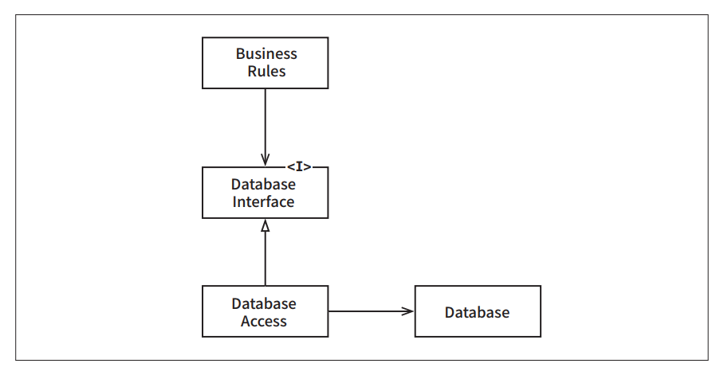
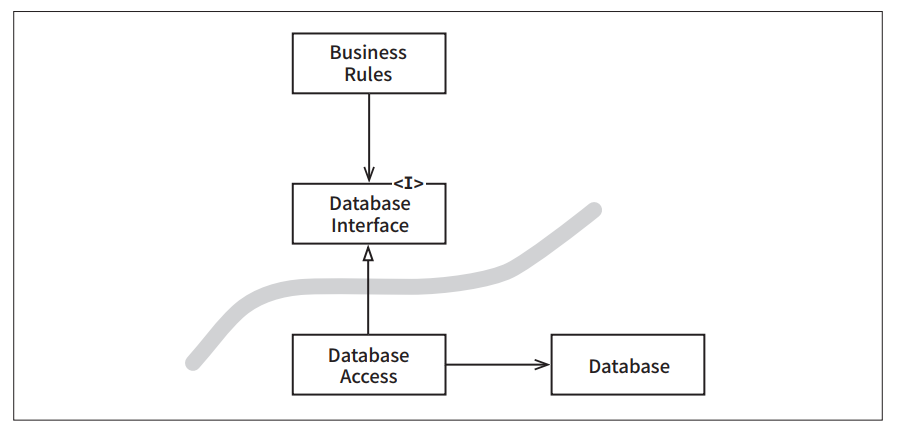
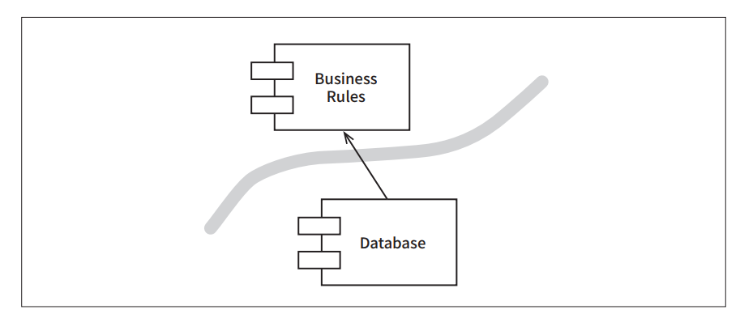
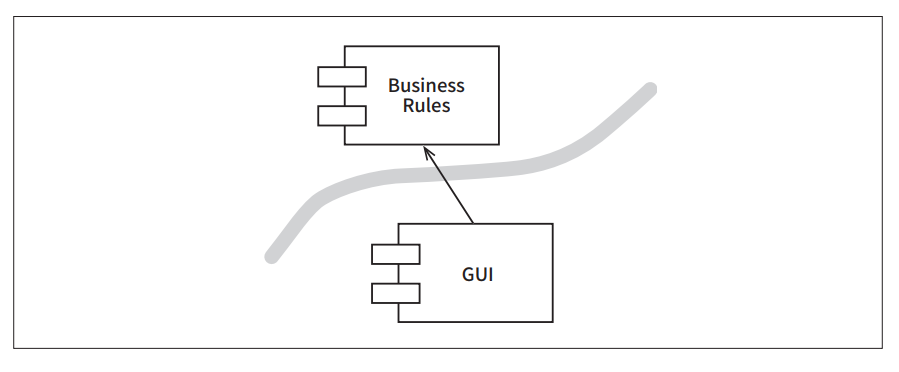
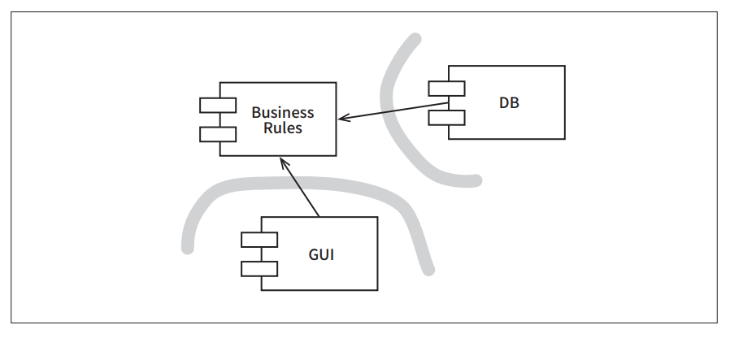
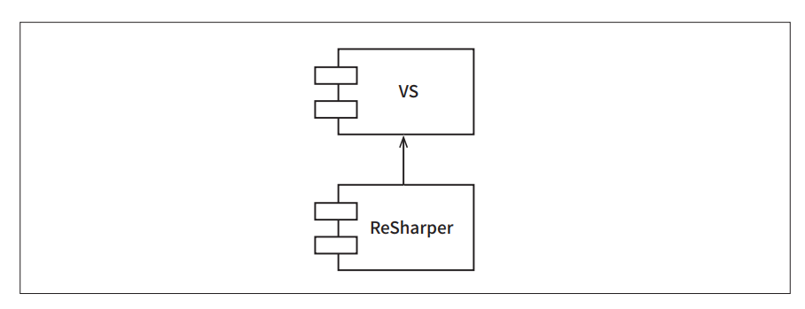

# **경계: 선 긋기**  
소프트웨어 아키텍처는 선을 긋는 기술이며 이러한 선을 경계(boundary)라고 부른다. 경계는 소프트웨어 요소를 서로 분리하고 경계 한편에 있는 요소가 
반대편에 있는 요소를 알지 못하도록 막는다. 이들 선 중 일부는 프로젝트 수명 중 아주 초기에, 심지어 코드가 전혀 작성되기도 전에 그어지며 어떤 선은 
매우 나중에 그어진다. 초기에 그어지는 선들은 가능한 한 오랫동안 결정을 연기시키기 위해, 그래서 이들 결정이 핵심적인 업무 로직을 오염시키지 못하게 
만드려는 목적으로 쓰인다.  
  
아키텍트의 목표는 필요한 시스템을 만들고 유지하는 데 드는 인적 자원을 최소화하는 것이라는 사실을 상기하자. 그렇다면 인적 자원의 효율을 떨어뜨리는 
요인은 무엇일까? 바로 결합(coupling)이다. 특히 너무 일찍 내려진 결정에 따른 결합이다.  
  
어떤 종류의 결정이 이른 결정일까? 바로 시스템의 업무 요구사항, 즉 유스케이스와 아무런 관련이 없는 결정이다. 프레임워크, 데이터베이스, 웹 서버, 
유틸리티 라이브러리, 의존성 주입에 대한 결정 등이 여기 포함된다. 좋은 시스템 아키텍처란 이러한 결정이 부수적이며 결정을 연기할 수 있는 아키텍처다. 
좋은 시스템 아키텍처는 이런 결정에 의존하지 않는다. 좋은 시스템 아키텍처는 이러한 결정을 가능한 한 최후의 순간에 내릴 수 있게 해주며 결정에 따른 
영향이 크지 않게 만든다.  
  
# **두 가지 슬픈 이야기**  
너무 이른 결정에는 위험이 따른다는 경고를 하기 위해 P 회사에 대한 예시를 보자. 1980년대에 P사의 창립자들은 간단한 모노리틱 데스크톱 애플리케이션을 
만들었다. 이들은 큰 성공을 거두었고 1990년대에 걸쳐서 이 제품을 대중적이며 성공적인 데스크톱 GUI 애플리케이션으로 성장시켰다.  
  
그러나 1990년대 후반이 되자 웹이 대세가 되기 시작했다. 갑자기 모두가 웹 솔루션을 확보해야만 했고 P사도 예외는 아니었다. P사의 고객들은 웹 기반 
버전을 강하게 요구했다. 이 요구를 충족시키기 위해 P사는 잘나가는 20대 자바 프로그래머를 다수 고용했고, 자사 제품을 웹 버전으로 변환하는 프로젝트에 
착수했다.  
  
자바 진영 사람은 머릿속에서 서버 팜(server farm)이 춤추는 이상을 꿈꾸었기에 3-티어(3-티어는 아키텍처가 아니다. 3-티어는 사실 망 구성방식[topology]이다. 
좋은 아키텍처라면 틀림없이 미루기 위해 고군분투해야만 하는 종류의 결정이다) 아키텍로 구성된 리치(rich) 아키텍처를 채택했고 서버 팜을 통해 분산하고자 
했다. 서버 팜에는 GUI를 위한 서버, 미들웨어 서버, 데이터베이스 서버가 있었을 것이다.  
  
이들 프로그래머는 모든 도메인 객체가 세 가지 인스턴스를 가져야 한다고 너무 이른 결정을 내렸다. 하나는 GUI 티어를 위해, 또 하나는 미들웨어 티어를 
위해, 나머지 하나는 데이터베이스 티어를 위해서다. 이들 인스턴스는 서로 다른 머신에 상주했기 때문에 프로세서 간 그리고 티어 간 통신이 필요했고 결국 
리치 시스템이 구성되었다. 티어 간 메서드 호출은 객체로 변환하여 직렬화 한 후 회선을 통해 마샬링(marshaling)되었다.  
  
이제 기존 레코드에 새로운 필드를 추가하는 것과 같이 간단한 기능을 구현할 때 무슨 일을 해야 하는지 상상해 보자. 해당 필드를 세 티어에 있는 클래스 
모두와 티어 간 메시지 다수에 추가해야 한다. 데이터는 양방향으로 이동하므로 메시지 프로토콜은 반드시 네 개를 설계해야 한다. 각 프로토콜은 송신부와 
수신부를 가지므로 프로토콜 핸들러는 총 여덟 개가 필요하다. 세 개의 실행 파일이 빌드되어야 하며 각 실행 파일은 변경된 세 개의 업무 객체와 네 개의 새로운 
메시지, 그리고 여덟 개의 새로운 핸들러를 포함한다.  
  
이번에는 가장 간단한 기능을 수행할 때 이 실행 파일들이 해야만 하는 일을 생각해 보자. 모든 객체의 초기화, 이 모든 직렬화, 이 모든 마샬링과 언마샬링, 
이 모든 메시지에 대한 구성 및 파싱, 이 모든 소켓 통신들, 타임아웃 관리, 재시도 시나리오, 그리고 이 간단한 일 하나를 마무리하기 위해 해야만 하는 또 
다른 모든 추가적인 일들을 생각해 보라.  
  
물론 개발하는 동안 그 프로그래머들은 서버 팜을 확보할 수 없었다. 오히려 세 개의 실행 파일 모두를 단일 장비에서, 세 개의 서로 다른 프로세스로 실행했다. 
이들은 이러한 방식으로 수년간 개발했다. 그러나 자신의 아키텍처가 옳다고 확신했다. 그래서 단일 장비에서 실행하고 있음에도 이 모든 직렬화, 마샬링과 
언마샬링, 메시지 구성 및 파싱, 소켓 통신들, 그리고 또 다른 추가 작업들을 단일 머신에서 실행하는 일을 지속했다.  
  
역설적이게도 P사는 서버 팜을 필요로 하는 시스템을 한 번도 판매하지 못했다. 배포했던 시스템은 모두 단일 서버였다. 그리고 단일 서버에서 세 실행 파일은 
객체 초기화, 직렬화, 마샬링과 언마샬링, 메시지 구성과 파싱, 소켓 통신들과 추가 작업들을 지속했다. 존재한 적도 없고 존재하지 않을 서버 팜을 기대하면서 
말이다.  
  
이 비극은 아키텍트가 너무 이르게 결정을 내림으로써 개발 비용을 엄청나게 가중시킨 사례다.  
  
P사의 이야기는 별천지 이야기가 아니다.  
  
P사보다 더한 운명도 있다.  
  
일련의 회사 차량을 관리해주는 지역 기업인 W사를 살펴보자. 최근 이들은 아키텍트를 고용해서 오합지졸 같은 소프트웨어 작업을 통제하에 두고자 했다. 
그는 이 작은 기업에는 모든 특성이 구비된 엔터프라이즈급의 서비스 지향 아키텍처가 필요하다는 사실을 재빠르게 파악했다. 그는 업무와 관련된 서로 다른 
모든 객체들로 구성된 거대한 도메인 모델을 생성했고 이들 도메인 객체를 관리하기 위한 서비스들의 묶음을 설계했으며 모든 개발자를 지옥의 길로 밀어 넣았다. 
간단한 예로 판매 레코드에 연락 담당자의 이름, 주소, 전화번호를 추가한다고 가정해 보자. 먼저 ServiceRegistory에 가서 ContactService의 서비스 ID를 
요청해야 한다. 그런 후 CreateContact 메시지를 ContactService로 전송해야 한다. 물론 이 메시지에는 수십 개의 필드가 있고 각 필드는 유효한 데이터를 
포함하고 있어야 한다. 하지만 프로그래머가 가진 데이터는 이름, 주소, 전화번호가 전부였기 때문에 이들 데이터에 접근할 수 없었다. 그래서 데이터를 
가짜로 채운 후 프로그래머는 새롭게 생성된 연락 담장자의 ID를 판매 레코드에 밀어 넣은 다음 UpdateContact 메시지를 SaleRecordService로 전송해야 했다.  
  
당연하지만 무언가를 테스트하려면 필요한 서비스들을 하나씩 구동시키고 메시지 버스와 BPel(Business Process Execution Language)서버 등을 작동시켜야 한다. 
그리고 메시지들은 서비스에서 서비스로 이동하고 각 서비스의 큐 안에서 대기하게 되므로 전달 지연도 발생하게 된다.  
  
그런데 새로운 기능을 추가하려면 어떨까? 이들 모든 서비스 사이의 결합으로 인해 엄청난 양의 WSDL(Web Services Description Language)을 변경해야 하며 
변경에 영향받는 모든 것을 다시 배포해야 할 것이다.  
  
서비스를 중심으로 구조화된 소프트웨어 시스템이 본질적으로 잘못된 것은 아니다. W사의 실수는 SOA를 약속하는 일려늬 도구들을 너무 일찍 채택하여 적용했다는 
사실이다. 즉 거대한 일련의 도메인 객체 서비스를 너무 이른 시기에 채택했다. 이러한 실수로 인적 시간, 그것도 엄청난 양의 인적 시간에 따른 비용이 SOA의 
소용돌이에 휩쓸려 떠내려갔다.  
  
# **FitNesse**  
성공 사례를 하나 이야기해 보자.  
  
저자는 2001년에 FitNesse를 만들기 시작했다. 워드 커닝햄이 인수 테스트 작성을 위해 만든 FIT 도구를 기반으로 하는 간단한 위키 페이지를 만들려는 
생각이었다.  
  
이때는 메이븐이 등장하여 jar 파일 문제를 해결하기 전이었다. 개발자가 만든 어떤 것도 jar 파일을 둘 이상 다운로드하도록 만들어서는 안 된다는 점에서 
단호했다.(의존성 관리) 저자는 이 원칙을 다운로드 후 바로 실행이라고 불렀고 이 원칙은 개발자가 내린 많은 결정에 영향을 주었다.  
  
초기에 내린 결정 중 하나는 FitNesse의 요구에 특화된 우리만의 웹 서버를 직접 작성하자는 것이었다. 2001년에도 수많은 웹 서버가 오픈소스로 나와 
있었기에 오픈 소스를 사용할 수도 있었다. 하지만 우리만의 웹 서버를 직접 작성하기로 한 일은 결국 옳은 결정이었다. 왜냐하면 기본 뼈대만 갖춘 웹 서버는 
단순한 단일 소프트웨어이기에 구현이 간단할 뿐만 아니라 어떤 웹 프레임워크를 사용할지에 대한 결정을 훨씬 나중으로 연기할 수 있도록 해주었기 때문이다.  
  
초기에 내린 또 다른 결정은 데이터베이스에 대해 고민하지 말자는 것이었다. 우리는 내심 MySQL을 염두에 두고 있었지만 어떤 데이터베이스를 사용하더라도 
상관없는 형태로 설계함으로써 의도적으로 데이터베이스에 대한 결정을 미루었다. 우리는 모든 데이터 접근 영역과 데이터 저장소 영역 사이에 인터페이스를 
추가하는 간단한 설계 방식을 사용했다.  
  
우리는 데이터 접근 메서드들을 WikiPage라는 이름의 인터페이스에 두었다. 이들 메서드는 페이지를 찾고, 데이터를 가져오며, 저장하는 데 필요한 모든 기능을 
제공했다. 물론 처음에는 이들 메서드를 구현하지 않았다. 데이터를 가져오고 저장하는 일과는 관련 없는 기능을 구현하는 동안에는 이들 메서드를 단순히 
스텁으로 만들었다.  
  
실제로 석 달 동안 우리는 그저 위키 텍스트를 HTML로 변환하는 작업만을 진행했다. 이 작업에서는 데이터 저장소가 전혀 필요하지 않았기에 MockWikiPage라는 
이름의 클래스를 만들고 그 안의 데이터 접근 메서드들은 단순히 스텁으로 남겨 두었다.  
  
마침내 작성하려고 하는 기능에서 스텁만으로는 충분하지 않게 되었다. 스텁이 아니라 실제로 데이터에 접근해야 했다. 그래서 WikiPage의 파생 클래스를 
InMemoryPage라는 이름으로 새롭게 만들었다. 이 파생 클래스는 위키 페이지의 해시 테이블을 관리하는 형태로 데이터 접근 메서드를 구현했고 이 해시 
테이블은 RAM에 유지되었다.  
  
이 덕분에 우리는 일 년 내내 기능들을 차례대로 작성할 수 있었다. 실제로 우리는 이러한 형태로 완전하게 동작하는 FitNesse의 최초 버전을 내놓았다. 모든 기능을 
찾웄다. 작업한 내용을 저장하는 일만 구현하지 못했을 뿐이었다.  
  
영속성을 구현해야 하는 시점이 되자 우리는 MySQL을 다시 한번 고민했지만 단기적으로는 필요하지 않다는 결정을 내렸다. 왜냐하면 해시 테이블을 플랫 파일에 
저장하도록 구현하는 일은 정말이지 쉬운 일이었기 때문이었다. 그래서 우리는 FileSystemWikiPage를 구현했다. 이 클래스는 데이터 접근 관련 기능들을 
단순히 플랫 파일을 기반으로 구현한 것에 지나지 않았다. 그런 후 우리는 또 다른 기능들을 계속해서 개발했다.  
  
석 달이 지난 후 우리는 플랫 파일을 사용한 해결책이 적합했다는 결론에 도달했다. 다시 말해 MySQL과 관련된 아이디어는 완전히 폐기하기로 했다. 애초에 
연기하기로 했던 그 결정 자체를 아예 없던 것처럼 치부했고 다시는 되돌아보지 않았다.  
  
이 이야기는 고객 한 명이 자신은 위키를 MySQL에 저장해야 한다고 말하지 않았다면 여기서 끝났을지도 모른다. 우리는 데이터베이스에 대한 결정을 연기할 
수 있게 만들어 준 WikiPage의 아키텍처를 그에게 보여주었다. 그는 단 하루 만에 전체 시스템이 MySQL 위에서 도앚ㄱ하도록 만들어서 가져왔다. 그는 
단순히 MySqlWikiPage라는 파생 클래스를 하나 작성해서 전체 시스템이 동작하게 만들었다.  
  
우리는 FitNesse에 선택사항으로 MySQL을 추가했지만 아무도 사용하지 않았고 결국 우리는 이 선택사항을 없앴다. 심지어 해당 파생 클래스를 작성한 
고객조차 이 선택사항을 사용하지 않았다.  
  
FitNesse 개발 초기에 우리는 업무 규칙과 데이터베이스 사이에 경계선을 그었다. 이 경계선을 통해 업무 규칙은 데이터 접근 메서드 외에는 데이터베이스에 
관해서 어떤 것도 알지 못하게 되었다. 이러한 결정으로 일 년이 훨씬 넘는 기간 동안 데이터베이스를 선택하고 구현하는 일을 연기할 수 있었다. 이 결정으로 
우리는 파일 시스템을 선택하여 시도해볼 수도 있었고 더 나은 해결책이 보이면 방향을 바꿀 수도 있었다. 더군다나 누군가가 애초의 방향(MySQL)으로 
가기를 원할 때 방해가 되거나 지연이 되지도 않았다.  
  
자그만치 18개월이라는 기간 동안 운영할 데이터베이스가 없다는 사실은 스키마와 관련된 문제들, 쿼리 문제들, 데이터베이스 서버 문제들, 패스워드 문제들, 
접속 시간과 관련된 문제들, 그리고 데이터베이스를 작동시킬 때 추하게 고개를 드는 여타 모든 고약한 문제가 없었다는 사실을 뜻한다. 또한 테스트를 
느리게 만드는 데이터베이스가 없으니 테스트를 더 빨리 돌릴 수 있다는 뜻이기도 하다.  
  
간단히 말해서 경계선을 긋는 행우는 결정을 늦추고 연기하는 데 도움이 되었고 궁극적으로는 시간을 엄청나게 절약해주었으며 골치를 썩지 않게 해주었다. 
이것이 바로 좋은 아키텍처라면 반드시 해야 하는 일이다.  
  
# **어떻게 선을 그을까? 그리고 언제 그을까?**  
관련이 있는 것과 없는 것 사이에 선을 긋는다. GUI는 업무 규칙과는 관련 없기 때문에 이 둘 사이에는 반드시 선이 있어야 한다. 데이터베이스는 GUI와는 
관련이 없으므로 이 둘 사이에도 반드시 선이 있어야 한다. 데이터베이스는 업무 규칙과 관련이 없으므로 이 둘 사이에도 선이 있어야 한다.  
  
이 모두에 동의하지 않는 개발자도 있을 수 있다. 특히 업무 규칙이 데이터베이스에 신경 쓰지 않아야 한다는 부분에서 그럴 것이다. 데이터베이스는 업무 
규칙과 서로 떼어놓을 수 없는 관계라고 배운 사람이 많다. 심지어 업무 규칙이 구체화된 것이 바로 데이터베이스라고 확신하는 사람도 더러 있다.  
  
이는 잘못된 생각이다. 데이터베이스는 업무 규칙이 간접적으로 사용할 수 있는 도구다. 업무 규칙은 스키마, 쿼리 언어, 또는 데이터베이스와 관련된 나머지 
세부사항에 대해 어떤 것도 알아서는 안 된다. 업무 규칙이 알아야 할 것은 데이터를 가져오고 저장할 때 사용할 수 있는 함수 집합이 있다는 사실이 전부다. 
이러한 함수 집합을 통해서 우리는 데이터베이스를 인터페이스 뒤로 숨길 수 있다.  
  
  
  
위 그림에서 이 점을 분명하게 볼 수 있다. BusinessRules는 DatabaseInterface를 사용하여 데이터를 로드하고 저장한다. DatabaseAccess는 DatabaseInterface를 
구현하며 Database를 실제로 조작하는 일을 맡는다.  
  
이 도표에서 클래스와 인터페이스는 상징적이다. 실제 애플리케이션에서는 업무 규칙과 관련된 수많은 클래스들,데이터베이스 인터페이스와 관련된 수많은 
클래스들, 그리고 데이터베이스 접근을 구현한 수많은 구현체가 존재한다. 그렇더라도 이 모두는 이 패턴을 거의 동일하게 따른다.  
  
경계선은 어디에 있는가? 경계선은 상속 관계를 횡단하면서 DatabaseInterface 바로 아래에 그어진다.  
  
  
  
DatabaseAccess에서 출발하는 두 화살표에 주목하자. 이들 두 화살표는 DatabaseAccess 클래스로부터 바깥쪽으로 향한다. 즉 이 도표에서 DatabaseAccess가 
존재한다는 사실을 알고 있는 클래스는 없다는 뜻이다.  
  
이제 조금 물러나서 보자. 많은 업무 규칙이 포함된 컴포넌트, 데이터베이스와 데이터베이스 접근 클래스를 포함하는 컴포넌트를 살펴보려 한다. (아래 그림)  
  
  
  
화살표의 방향에 주목하자. Database는 BusinessRules에 대해 알고 있다. BusinessRules는 Database에 관해 알지 못한다. 이는 DatabaseInterface 클래스는 
BusinessRules 컴포넌트에 속하며 DatabaseAccess 클래스는 Database 컴포넌트에 속한다는 사실을 의미한다.  
  
이 선의 방향이 중요하다. BusinessRules에게 있어 Database는 문제가 되지 않지만 Database는 BusinessRules 없이는 존재할 수 없다는 사실을 
이 방향을 통해 알 수 있다.  
  
이러한 사실이 이상하게 보인다면 하나만 기억하자. Database 컴포넌트는 BusinessRules가 만들어 낸 호출을 데이터베이스의 쿼리 언어로 변환하는 코드를 
담고 있다. BusinessRules에 대해 알고 있는 코드는 바로 이 변환 코드다.  
  
두 컴포넌트 사이에 이러한 경계선을 그리고 화살표의 방향이 BusinessRules를 향하도록 만들었으므로 BusinessRules에서는 어떤 종류의 데이터베이스도 
사용할 수 있음을 알 수 있다. Database 컴포넌트는 다양한 구현체로 교체될 수 있으며 BusinessRules는 조금도 개의치 않는다.  
  
데이터베이스는 오라클, MySQL, 카우치, Atomic 등으로 구현할 수 있고 심지어 플랫 파일로도 구현할 수 있다. 업무 규칙은 전혀 개의치 않는다. 그리고 
이 같은 사실은 데이터베이스에 대한 결정은 연기할 수 있으며 데이터베이스를 결정하기에 앞서 업무 규칙을 먼저 작성하고 테스트하는 데 집중할 수 있음을 
의미한다.  
  
# **입력과 출력은?**  
개발자와 고객은 종종 시스템이 무엇인지에 대해 혼란스러워한다. GUI를 보고선 GUI가 시스템이라고 생각하곤 한다. 이들은 시스템을 GUI 측면에서 정의하므로 
처음부터 GUI가 동작하는 모습을 반드시 볼 수 있어야 한다고 믿는다. 이들은 매우 중요한 원칙을 깨닫지 못했다. 입력과 출력은 중요하지 않다는 사실이다.  
  
이 원칙은 처음에는 이해하기 힘들다. 우리는 시스템의 행위를 입출력이 지닌 행위적 측면에서 생각하는 경향이 있다. 예를 들어 비디오 게임을 생각해 보자. 
이 경우 사용자 경험은 인터페이스에 의해 좌우된다. 화면, 마우스, 버튼, 음향이 바로 그 인터페이스다. 이러한 인터페이스 뒤에는 인터페이스를 조작하는 
모델(데이터 구조와 함수로 구성된 정교한 집합)이 존재한다는 사실을 잊어버린다. 더 중요한 사실은 모델은 인터페이스를 전혀 필요로 하지 않는다는 점이다. 
게임이 화면에 전혀 출력되지 않더라도 모델은 게임에서 발생되는 모든 이벤트를 모델링하면서 주어진 역할을 충실하게 수행한다. 인터페이스는 모델에게 있어 
중요하지 않다. 중요한 것은 업무 규칙이다.  
  
따라서 이번에도 마찬가지로 GUI와 BusinessRules 컴포넌트가 경계선에 의해 분할된다는 사실을 볼 수 있다.  
  
  
  
관련성이 낮은 컴포넌트가 관련성이 높은 컴포넌트에 의존한다는 사실을 다시 한번 볼 수 있다. 화살표는 어느 컴포넌트가 어떤 컴포넌트를 알고 있는지를, 
그래서 어느 컴포넌트가 어느 컴포넌트를 신경 쓰는지를 보여준다. GUI가 BusinessRules를 신경쓴다.  
  
경계와 화살표를 이와 같이 그릴 수 있으므로 GUI는 다른 종류의 인터페이스로 얼마든지 교체할 수 있으며 BusinessRules는 전혀 개의치 않는다는 사실을 
알 수 있다.  
  
# **플러그인 아키텍처**  
데이터베이스와 GUI에 대해 내린 두 가지 결정을 하나로 합쳐서 보면 컴포넌트 추가와 관련한 일종의 패턴이 만들어진다. 이 패턴은 시스템에서 서드 파티 
플러그인을 사용할 수 있게 한 바로 그 패턴과 동일하다.  
  
사실 소프트웨어 개발 기술의 역사는 플러그인을 손쉽게 생성하여 확장 가능하며 유지보수가 쉬운 시스템 아키텍처를 확립할 수 있게 만드는 방법에 대한 이야기다. 
선택적이거나 또는 수많은 다양한 형태로 구현될 수 있는 나머지 컴포넌트로부터 핵심적인 업무 규칙은 분리되어 있고 또한 독립적이다.(아래 그림)    
  
  
  
이 설계에서 사용자 인터페이스는 플러그인 형태로 고려되었기에 수많은 종류의 사용자 인터페이스를 플러그인 형태로 연결할 수 있게 된다. 웹 기반일 
수도 있고, 클라이언트/서버 기반이거나 SOA나 콘솔 기반, 또는 임의의 어떤 사용자 인터페이스 기술이라도 가능하다.  
  
데이터베이스에도 동일하게 적용할 수 있다. 데이터베이스를 플러그인으로 다루기로 결정했기 때문에 임의의 다양한 SQL 데이터베이스, NoSQL 데이터베이스, 
파일 시스템 기반 데이터베이스, 또는 미래에 필요하리라 생각되는 임의의 어떤 종류의 데이터베이스 기술로도 대체할 수 있다.  
  
이러한 교체 작업은 사소한 일은 아닐 것이다. 시스템의 초기 배포본이 웹 기반이었다면 클라이언트-서버 UI용 플러그인을 작성하는 것은 쉽지 않은 일이 될 
수 있다. 업무 규칙과 이 새로운 UI 간의 통신 일부는 재작업해야 할 가능성이 높다. 그렇다 하더라도 플러그인 구조를 가정한 채 시작함으로써 최소한 우리는 
이러한 변경 작업을 현실성 있도록 만들었다.  
  
# **플러그인에 대한 논의**  
ReSharper와 비주얼 스튜디오의 관계를 생각해 보자. 이 두 컴포넌트는 완전히 다른 회사의 완전히 다른 개발팀에 의해 만들어졌다. 실제로 ReShaper 개발사인 
젯브레인즈는 러시아에 자리 잡고 있다. 마이크로소프트는 워싱턴주의 레드몬드에 위치한다. 이 두 팀보다 더 멀리 떨어져 있는 개발팀을 상상하기란 쉽지 않다.  
  
어느 팀이 다른 팀을 위험하게 만들 수 있을까? 어느 팀이 다른 팀에 의한 영향을 안 받게 될까? 의존성 구조가 답해준다.  
  
  
  
ReSharper의 소스 코드는 비주얼 스튜디오의 소스 코드에 의존한다. 따라서 ReSharper 팀은 절대로 비주얼 스튜디오 팀을 건드릴 수 없다. 하지만 비주얼 
스튜디오 팀은 원한다면 언제든지 ReSharper 팀을 완전히 무력화할 수 있다.  
  
이 관계는 상당히 비대칭적이며 우리가 시스템에서 갖추고자 하는 바로 그런 관계에 해당한다. 우리는 특정 모듈이 나머지 모듈에 영향받지 않기를 바란다. 
예를 들어 누군가가 웹 페이지의 포맷을 변경하거나 데이터베이스 스키마를 변경하더라도 업무 규칙은 깨지지 않기를 바란다. 마찬가지로 시스템에서 한 
부분이 변경되더라도 관련 없는 나머지 부분이 망가지길 원치 않는다. 개발 중인 시스템에서 이러한 종류의 취약성이 드러나지 않기를 바란다.  
  
시스템을 플러그인 아키텍처로 배치함으로써 변경이 전파될 수 없는 방화벽을 생성할 수 있다. GUI가 업무 규칙에 플러그인 형태로 연결되면 GUI에서 발생한 
변경은 절대로 업무 규칙에 영향을 미칠 수 없다.  
  
경계는 변경의 축이 있는 지점에 그어진다. 경계의 한쪽에 위치한 컴포넌트는 경계 반대편의 컴포넌트와는 다른 속도로 그리고 다른 이유로 변경된다.  
  
GUI는 업무 규칙과는 다른 시점에 다른 속도로 변경되므로 둘 사이에는 반드시 경계가 필요하다. 업무 규칙은 의존성 주입 프레임워크와는 다른 시점에 
그리고 다른 이유로 변경되므로 둘 사이에도 반드시 경계가 필요하다.  
  
이 역시도 순전히 단일 책임 원칙에 해당한다. 단일 책임 원칙은 어디에 경계를 그어야 할지를 알려준다.  
  
# **결론**  
소프트웨어 아키텍처에서 경계선을 그리려면 먼저 시스템을 컴포넌트 단위로 분할해야 한다. 일부 컴포넌트는 핵심 업무 규칙에 해당한다. 나머지 컴포넌트는 
플러그인으로 핵심 업무와는 직접적인 관련이 없지만 필수 기능을 포함한다. 그런 다음 컴포넌트 사이의 화살표가 특정 방향, 즉 핵심 업무를 향하도록 이들 
컴포넌트의 소스를 배치한다.  
  
이는 의존성 역전 원칙과 안정된 추상화 원칙을 응용한 것임을 눈치챌 수 있어야 한다. 의존성 화살표는 저수준 세부사항에서 고수준의 추상화를 향하도록 배치된다.  
  
