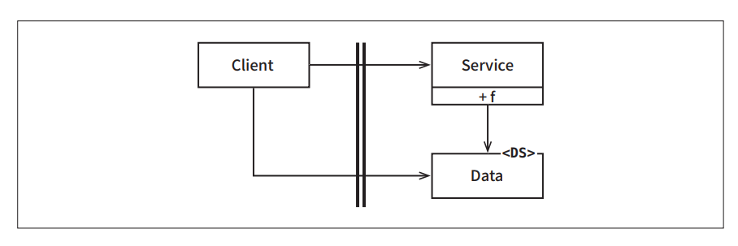

# **경계 해부학**  
시스템 아키텍처는 일련의 소프트웨어 컴포넌트와 그 컴포넌트들을 분리하는 경계에 의해 정의된다. 이러한 경계는 다양한 형태로 나타난다.  
  
# **경계 횡단하기**  
'런타임에 경계를 횡단한다'함은 그저 경계 한쪽에 있는 기능에서 반대편 기능을 호출하여 데이터를 전달하는 일에 불과하다. 적절한 위치에서 경계를 횡단하게 
하는 비결은 소스 코드 의존성 관리에 있다.  
  
왜 소스 코드일까? 왜냐하면 소스 코드 모듈 하나가 변경되면 이에 의존하는 다른 소스 코드 모듈도 변경하거나 다시 컴파일해서 새로 배포해야 할지도 
모르기 떄문이다. 경계는 이러한 변경이 전파되는 것을 막는 방화벽을 구축하고 관리하는 수단으로써 존재한다.  
  
# **두려운 단일체**  
아키텍처 경계 중에서 가장 단순하며 가장 흔한 형태는 물리적으로 엄격하게 구분되지 않는 형태다. 이 형태에서는 함수와 데이터가 단일 프로세서에서 같은 
주소 공간을 공유하며 그저 나름의 규칙에 따라 분리되어 있을 뿐이다. 이전 장에서 이를 소스 수준 분리 모드라고 불렀다.  
  
배포 관점에서 보면 이는 소위 단일체(monolith)라고 불리는 단일 실행 파일에 지나지 않는다. 이 파일은 정적으로 링크된 C나 C++ 프로젝트이거나 실행 
가능한 jar 파일로 묶인 일련의 자바 클래스 파일이거나 단일 .EXE 파일로 묶인 일련의 .NET 바이너리 등일 것이다.  
  
이처럼 배포 관점에서 볼 때 단일체는 경계가 드러나지 않는다. 그렇다고 해서 단일체에는 경계가 실제로 존재하지 않거나 경계 자체가 무의미하다는 뜻은 
아니다. 최종적으로는 정적으로 링크된 단일 실행 파일을 만들더라도 그 안에 포함된 다양한 컴포넌트를 개발하고 바이너리로 만드는 과정을 독립적으로 
수행할 수 있게 하는 일은 대단히 가치 있는 일이다.  
  
이러한 아키텍처는 거의 모든 경우에 특정한 동적 다형성에 의존하여 내부 의존성을 관리한다. 바로 이 떄문에 최근 수십 년 동안 객체 지향 개발이 아주 
중요한 패러다임이 될 수 있었다. 객체 지향이 없었다면 또는 다형성에 해당하는 메커니즘이 없었다면 아키텍트는 결합도를 적절히 분리하기 위해 함수를 가리키는 
포인터라는 위험한 옛 관행에 기대야만 했을 것이다. 그리고 대다수의 아키텍트는 함수 포인터를 과도하게 사용하는 방식이 너무 위험함을 알기 때문에 
컴포넌트를 분리하려는 어떤 종류의 시도도 결국 포기했을 것이다.  
  
가장 단순한 형태의 경계 횡단은 저수준 클라이언트에서 고수준 서비스로 향하는 함수 호출이다. 이 경우 런타임 의존성과 컴파일타임 의존성은 모두 같은 방향, 
즉 저수준 컴포넌트에서 고수준 컴포넌트로 향한다.  
  
  
  
위 그림에서 제어흐름은 왼쪽에서 오른쪽으로 경계를 횡단한다. Client는 Service의 함수 f()를 호출한다. 이때 Client는 Data 인스턴스를 전달한다. 
<DS>는 단순히 데이터 구조임을 나타내는 표시다. Data는 함수의 인자로 전달할 수도 있고 더 정교한 다른 기법을 통해 전달할 수도 있다. 주목할 점은 
경계에서 호출되는 쪽에 Data에 대한 정의가 위치한다는 사실이다.  
  
고수준 클라이언트가 저수준 서비스를 호출해야 한다면 동적 다형성을 사용하여 제어흐름과는 반대 방향으로 의존성을 역전시킬 수 있다. 이렇게 하면 런타임 
의존성은 컴파일타임 의존성과는 반대가 된다.  
  
