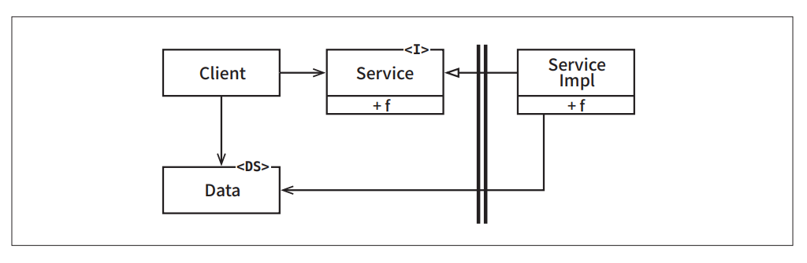

# **경계 해부학**  
시스템 아키텍처는 일련의 소프트웨어 컴포넌트와 그 컴포넌트들을 분리하는 경계에 의해 정의된다. 이러한 경계는 다양한 형태로 나타난다.  
  
# **경계 횡단하기**  
'런타임에 경계를 횡단한다'함은 그저 경계 한쪽에 있는 기능에서 반대편 기능을 호출하여 데이터를 전달하는 일에 불과하다. 적절한 위치에서 경계를 횡단하게 
하는 비결은 소스 코드 의존성 관리에 있다.  
  
왜 소스 코드일까? 왜냐하면 소스 코드 모듈 하나가 변경되면 이에 의존하는 다른 소스 코드 모듈도 변경하거나 다시 컴파일해서 새로 배포해야 할지도 
모르기 떄문이다. 경계는 이러한 변경이 전파되는 것을 막는 방화벽을 구축하고 관리하는 수단으로써 존재한다.  
  
# **두려운 단일체**  
아키텍처 경계 중에서 가장 단순하며 가장 흔한 형태는 물리적으로 엄격하게 구분되지 않는 형태다. 이 형태에서는 함수와 데이터가 단일 프로세서에서 같은 
주소 공간을 공유하며 그저 나름의 규칙에 따라 분리되어 있을 뿐이다. 이전 장에서 이를 소스 수준 분리 모드라고 불렀다.  
  
배포 관점에서 보면 이는 소위 단일체(monolith)라고 불리는 단일 실행 파일에 지나지 않는다. 이 파일은 정적으로 링크된 C나 C++ 프로젝트이거나 실행 
가능한 jar 파일로 묶인 일련의 자바 클래스 파일이거나 단일 .EXE 파일로 묶인 일련의 .NET 바이너리 등일 것이다.  
  
이처럼 배포 관점에서 볼 때 단일체는 경계가 드러나지 않는다. 그렇다고 해서 단일체에는 경계가 실제로 존재하지 않거나 경계 자체가 무의미하다는 뜻은 
아니다. 최종적으로는 정적으로 링크된 단일 실행 파일을 만들더라도 그 안에 포함된 다양한 컴포넌트를 개발하고 바이너리로 만드는 과정을 독립적으로 
수행할 수 있게 하는 일은 대단히 가치 있는 일이다.  
  
이러한 아키텍처는 거의 모든 경우에 특정한 동적 다형성에 의존하여 내부 의존성을 관리한다. 바로 이 떄문에 최근 수십 년 동안 객체 지향 개발이 아주 
중요한 패러다임이 될 수 있었다. 객체 지향이 없었다면 또는 다형성에 해당하는 메커니즘이 없었다면 아키텍트는 결합도를 적절히 분리하기 위해 함수를 가리키는 
포인터라는 위험한 옛 관행에 기대야만 했을 것이다. 그리고 대다수의 아키텍트는 함수 포인터를 과도하게 사용하는 방식이 너무 위험함을 알기 때문에 
컴포넌트를 분리하려는 어떤 종류의 시도도 결국 포기했을 것이다.  
  
가장 단순한 형태의 경계 횡단은 저수준 클라이언트에서 고수준 서비스로 향하는 함수 호출이다. 이 경우 런타임 의존성과 컴파일타임 의존성은 모두 같은 방향, 
즉 저수준 컴포넌트에서 고수준 컴포넌트로 향한다.  
  
  
  
위 그림에서 제어흐름은 왼쪽에서 오른쪽으로 경계를 횡단한다. Client는 Service의 함수 f()를 호출한다. 이때 Client는 Data 인스턴스를 전달한다. 
<DS>는 단순히 데이터 구조임을 나타내는 표시다. Data는 함수의 인자로 전달할 수도 있고 더 정교한 다른 기법을 통해 전달할 수도 있다. 주목할 점은 
경계에서 호출되는 쪽에 Data에 대한 정의가 위치한다는 사실이다.  
  
고수준 클라이언트가 저수준 서비스를 호출해야 한다면 동적 다형성을 사용하여 제어흐름과는 반대 방향으로 의존성을 역전시킬 수 있다. 이렇게 하면 런타임 
의존성은 컴파일타임 의존성과는 반대가 된다.  
  
  
  
위 그림에서 제어흐름은 이전과 마찬가지로 왼쪽에서 오른쪽으로 경계를 횡단한다. 고수준 Client는 Sercice 인터페이스를 통해 저수준인 ServiceImpl의 
함수 f()를 호출한다. 하지만 주목할 점은 경계를 횡단할 떄 의존성은 모두 오른쪽에서 왼쪽으로, 즉 고수준 컴포넌트를 향한다는 점이다. 또한 데이터 구조의 
정의가 호출하는 쪽에 있다는 점도 주목하자.  
  
정적 링크된 모노리틱 구조의 실행 파일이라도 이처럼 규칙적인 방식으로 구조를 분리하면 프로젝트를 개발, 테스트, 배포하는 작업에 큰 도움이 된다. 
팀들은 서로의 영역에 침범하지 않은 채 자신만의 컴포넌트를 독립적으로 작업할 수 있다. 고수준 컴포넌트는 저수준 세부사항으로부터 독립적으로 유지된다.  
  
단일체에서 컴포넌트 간 통신은 매우 빠르고 값싸다. 통신은 전형적인 함수 호출에 지나지 않기 때문이다. 결과적으로 소스 수준에서 결합이 분리되면 
경계를 가로지르는 통신은 상당히 빈번할 수 있다.  
  
단일체를 배포하는 일은 일반적으로 컴파일과 정적 링크 작업을 수반하므로 대체로 이러한 시스템에서 컴포넌트는 소스 코드 형태로 전달된다.  
  
# **배포형 컴포넌트**  
아키텍처의 경계가 물리적으로 드러날 수도 있는데 그중 가장 단순한 형태는 동적 링크 라이브러리다. .NET DLL, 자바 jar 파일, 루비 젬, 유닉스 공유 
라이브러리 등이 그 예다. 컴포넌트를 이 형태로 배포하면 따로 컴파일하지 않고 곧바로 사용할 수 있다. 대신 컴포넌트는 바이너리와 같이 배포 가능한 형태로 
전달된다. 이는 배포 수준 결합 분리 모드에 해당한다. 배포 작업은 단순히 이들 배포 가능한 단위를 좀 더 편리한 형태로 묶는 일에 지나지 않는다. 
예를 들어 WAR 파일이나 심지어 그냥 디렉토리 형태로 묶기도 한다.  
  
이러한 배포 과정에서만 차이가 날 뿐 배포 수준의 컴포넌트는 단일체와 동일하다. 일반적으로 모든 함수가 동일한 프로세서와 주소 공간에 위치하며 
컴포넌트를 분리하거나 컴포넌트 간 의존성을 관리하는 전략도 단일체와 동일하다.  
  
단일체와 마찬가지로 배포형 컴포넌트의 경계를 가로지르는 통신은 순전히 함수 호출에 지나지 않으므로 매우 값싸다. 동적 링크와 런타임 로딩으로 인해 
최초의 함수 호출은 오래 걸릴 수 있지만 대체로 이들 경계를 가로지르는 통신은 매우 빈번할 것이다.  
  
# **스레드**  
단일체와 배포형 컴포넌트는 모두 스레드를 활용할 수 있다. 스레드는 아키텍처 경계도 아니며 배포 단위도 아니다. 이보다 스레드는 실행 계획과 순서를 
체계화하는 방법에 가깝다. 모든 스레드가 단 하나의 컴포넌트에 포함될 수 있고 많은 컴포넌트에 걸쳐 분산될 수도 있다.  
  
# **로컬 프로세스**  
훨씬 강한 물리적 형태를 띠는 아키텍처 경계로는 로컬 프로세스가 있다. 로컬 프로세스는 주로 명령행이나 그와 유사한 시스템 호출을 통해 생성된다. 
로컬 프로세스들은 동일한 프로세서 또는 하나의 멀티코어 시스템에 속한 여러 프로세서들에서 실행되지만 각각이 독립된 주소 공간에서 실행된다. 종종 
공유 메모리 파티션을 사용하기도 하지만 일반적으로는 메모리 보호를 통해 프로세서들이 메모리를 공유하지 못하게 한다.  
  
대개의 경우 로컬 프로세스는 소켓이나 메일박스, 메시지 큐와 같이 운영체제에서 제공하는 통신 기능을 이용하여 서로 통신한다.  
  
각 로컬 프로세스는 정적으로 링크된 단일체이거나 동적으로 링크된 여러 개의 컴포넌트로 구성될 수 있다. 전자의 경우 여러 모노리틱 프로세스가 같은 
컴포넌트들을 가지고 있을 수 있다(컴파일하고 정적 링크하는 과정에서 각 컴포넌트의 바이너리가 단일체에 물리적으로 복사되어 들어가기 때문이다). 
반면 후자의 경우 동적으로 링크된 배포형 컴포넌트들을 서로 공유할 수 있다.  
  
로컬 프로세스를 일종의 최상위 컴포넌트라고 생각하자. 즉 로컬 프로세스는 컴포넌트 간 의존성을 동적 다형성을 통해 관리하는 저수준 컴포넌트로 
구성된다.  
  
로컬 프로세스 간 분리 전략은 단일체나 바이너리 컴포넌트의 경우와 동일하다. 소스 코드 의존성의 화살표는 단일체나 바이너리 컴포넌트와 동일한 방향으로 
경계를 횡단한다. 즉 항상 고수준 컴포넌트를 향한다.  
  
따라서 로컬 프로세스에서는 고수준 프로세스의 소스 코드가 저수준 프로세스의 이름, 물리 주소, 레지스트리 조회 키를 절대로 포함해서는 안 된다. 
저수준 프로세스가 고수준 프로세스의 플러그인이 되도록 만드는 것이 아키텍처 관점의 목표라는 사실을 기억하자.  
  
로컬 프로세스 경계를 지나는 통신에는 운영체제 호출, 데이터 마샬링 및 언마샬링, 프로세스 간 문맥 교환 등이 있으며 이들은 제법 비싼 작업에 속한다. 
따라서 통신이 너무 빈번하게 이뤄지지 않도록 신중하게 제한해야 한다.  
  
# **서비스**  
물리적인 형태를 띠는 가장 강력한 경계는 바로 서비스다. 서비스는 프로세스로, 일반적으로 명령행 또는 그와 동등한 시스템 호출을 통해 구동된다. 
서비스는 자신의 물리적 위치에 구애받지 않는다. 서로 통신하는 두 서비스는 물리적으로 동일한 프로세서나 멀티코어에서 동작할 수 있고 아닐 수도 있다. 
서비스들은 모든 통신이 네트워크를 통해 이뤄진다고 가정한다.  
  
서비스 경계를 지나는 통신은 함수 호출에 비해 매우 느리다. 전체 소요 시간이 수십 밀리초에서 수 초까지 걸릴 수 있다. 따라서 주의를 기울여서 가능하다면 
빈번하게 통신하는 일을 피해야 한다. 이 수준의 통신에서는 지연(latency)에 따른 문제를 고수준에서 처리할 수 있어야 한다.  
  
이를 제외하고는 로컬 프로세스에 적용한 규칙이 서비스에도 그대로 적용된다. 저수준 서비스는 반드시 고수준 서비스에 플러그인되어야 한다. 고수준 서비스의 
소스 코드에는 저수준 서비스를 특정 짓는 어떤 물리적인 정보(예를 들면 URI)도 절대 포함해서는 안 된다.  
  
# **결론**  
단일체를 제외한 대다수의 시스템은 한 가지 이상의 경계 전략을 사용한다. 서비스 경계를 활용하는 시스템이라면 로컬 프로세스 경계도 일부 포함하고 
있을 수 있다. 실제로 서비스는 상호작용하는 일련의 로컬 프로세스 파사드(Facade)에 불과할 때가 많다. 또한 개별 서비스 또는 로컬 프로세스는 거의 
언제나 소스 코드 컴포넌트로 구성된 단일체이거나 혹은 동적으로 링크된 배포형 컴포넌트의 집합이다.  
  
즉 대체로 한 시스템 안에서도 통신이 빈번한 로컬 경계와 지연을 중요하게 고려해야 하는 경계가 혼합되어 있음을 의미한다.
  
