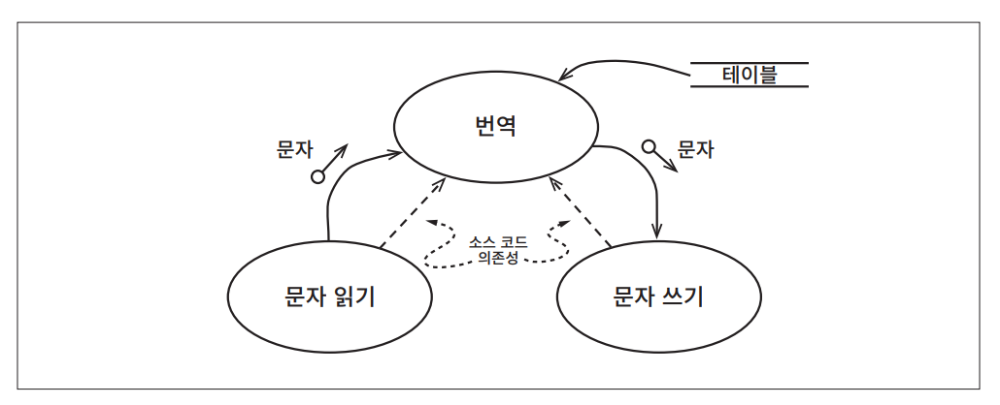
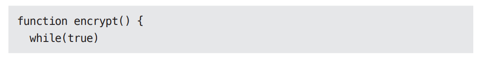
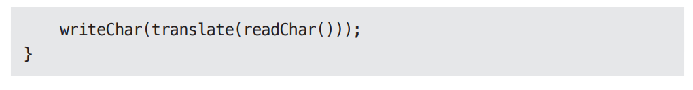
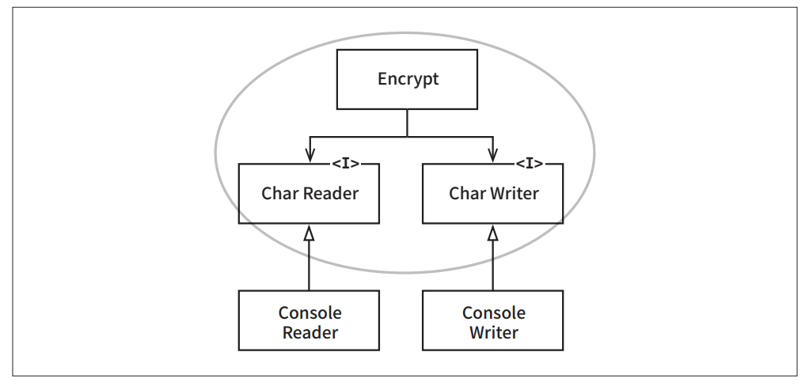
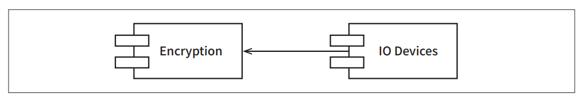

# **정책과 수준**  
소프트웨어 시스템이란 정책을 기술한 것이다. 실제로 컴퓨터 프로그램의 핵심부는 이게 전부다. 컴퓨터 프로그램은 각 입력을 출력으로 변환하는 정책을 
상세하게 기술한 설명서다.  
  
대다수의 주요 시스템에서 하나의 정책은 이 정책을 서술하는 여러 개의 조그만 정책들로 쪼갤 수 있다. 예를 들어 집계와 관련된 업무 규칙을 처리하는 
방식을 서술하는 조그만 정책이 있을 수 있다. 그리고 특정 보고서를 어떤 포맷으로 만들지를 서술하는 또 다른 정책이 있을 수 있다. 또한 입력 데이터를 
어떻게 검증할지를 서술하는 정책이 있을 수 있다.  
  
소프트웨어 아키텍처를 개발하는 기술에는 이러한 정책을 신중하게 분리하고 정책이 변경되는 양상에 따라 정책을 재편성하는 일도 포함된다. 동일한 
이유로 동일한 시점에 변경되는 정책은 동일한 수준에 위치하며 동일한 컴포넌트에 속해야 한다. 서로 다른 이유로, 혹은 다른 시점에 변경되는 정책은 
다른 수준에 위치하며 반드시 다른 컴포넌트로 분리해야 한다.  
  
흔히 아키텍처 개발은 재편성된 컴포넌트들을 비순환 방향 그래프(directed acyclic graph)로 구성하는 기술을 포함한다. 그래프에서 정점(node)은 
동일한 수준의 정책을 포함하는 컴포넌트에 해당한다. 방향이 있는 간선은 컴포넌트 사이의 의존성을 나타낸다. 간선은 다른 수준에 위치한 컴포넌트를 서로 
연결한다.  
  
이러한 의존성은 소스 코드, 컴파일타임의 의존성이다. 자바의 경우 import 구문에 해당한다. C#에서는 using 구문이다. 루비에서는 require 구문이다. 
이러한 의존성은 컴파일러가 제대로 동작하기 위해서 필요하다.  
  
좋은 아키텍처라면 각 컴포넌트를 연결할 때 의존성의 방향이 컴포넌트의 수준을 기반으로 연결되도록 만들어야 한다. 즉 저수준 컴포넌트가 고수준 컴포넌트에 
의존하도록 설계되어야 한다.  
  
# **수준**  
수준(level)을 엄밀하게 정의하자면 입력과 출력까지의 거리다. 시스템의 입력과 출력 모두로부터 멀리 위치할수록 정책의 수준은 높아진다. 입력과 
출력을 다루는 정책이라면 시스템에서 최하위 수준에 위치한다.  
  
  
  
위 그림에서의 데이터 흐름도는 간단한 암호화 프로그램을 그린 것으로 입력 장치에서 문자를 읽어서 테이블을 참조하여 문자를 번역한 후, 번역한 문자를 
출력 장치로 기록한다. 데이터 흐름은 굽은 실선 화살표로 표시했다. 프로그램을 제대로 설계했다면 소스 코드 의존성은 곧은 점선처럼 표시되어야 한다.  
  
번역 컴포넌트는 이 시스템에서 최고 수준의 컴포넌트인데 입력과 출력에서부터 가장 멀리 떨어져 있기 때문이다.  
  
주목할 점은 데이터 흐름과 소스 코드 의존성이 항상 같은 방향을 가리키지는 않는다는 사실이다. 다시 한번 말하지만 이것이 바로 소프트웨어 아키텍처가 
가진 예술 중 하나다. 소스 코드 의존성은 그 수준에 따라 결합되어야 하며 데이터 흐름을 기준으로 결합되어서는 안 된다.  
  
자칫하면 잘못된 아키텍처가 만들어지는데 예를 들어 암호화 프로그램을 다음처럼 작성한다면 그렇게 된다.  
  
  
  
  
이는 잘못된 아키텍처다. 고수준인 encrypt 함수가 저수준인 readChar와 writeChart 함수에 의존하기 때문이다.  
  
  
  
위 그림에서의 클래스 다이어그램은 이 시스템의 아키텍처를 개선해본 모습이다. 주목할 점은 Encrypt 클래스, CharWriter와 CharReader 인터페이스를 
둘러 싸고 있는 점선으로 된 경계다. 이 경계를 횡단하는 의존성은 모두 경계 안쪽으로 향한다. 이 경계로 묶인 영역이 이 시스템에서 최고 수준의 구성
요소다.  
  
여기에서 ConsoleReader와 ConsoleWriter는 클래스로 표현했다. 이들 클래스는 입력과 출력에 가깝기 때문에 저수준이다.  
  
이 구조에서 고수준의 암호화 정책을 저수준의 입력/출력 정책으로부터 분리시킨 방식에 주목하자. 이 방식 덕분에 암호화 정책을 더 넓은 맥락에서 사용할 
수 있다. 입력과 출력에 변화가 생기더라도 암호화 정책은 거의 영향을 받지 않기 때문이다.  
  
정책을 컴포넌트로 묶는 기준은 정책이 변경되는 방식에 달려있다는 사실을 상기하자. 단일 책임 원칙(SRP)과 공통 폐쇄 원칙(CCP)에 따르면 동일한 
이유로 동일한 시점에 변경되는 정책은 함께 묶인다. 고수준 정책, 즉 입력과 출력에서부터 멀리 떨어진 정책은 저수준 정책에 비해 덜 빈번하게 변경되고 
보다 중요한 이유로 변경되는 경향이 있다. 저수준 정책, 즉 입력과 출력에 가까이 위치한 정책은 더 빈번하게 변경되며 보다 긴급성을 요하며 덜 중요한 이유로 
변경되는 경향이 있다.  
  
예를 들어 대수롭지 않은 이 암호화 프로그램 예제에서도 입출력 장치가 변경될 가능성은 암호화 알고리즘이 변경될 가능성보다 훨씬 높아 보인다. 암호화 
알고리즘을 굳이 변경해야 한다면 입출력 장치를 변경해야 했던 이유보다는 더 실질적인 이유로 변경될 가능성이 높다.  
  
이처럼 모든 소스 코드 의존성의 방향이 고수준 정책을 향할 수 있도록 정책을 분리했다면 변경의 영향도를 줄일 수 있다. 시스템의 최저 수준에서 중요하지 
않지만 긴급한 변경이 발생하더라도 보다 높은 위치의 중요한 수주네 미치는 영향은 거의 없게 된다.  
  
이 논의는 저수준 컴포넌트가 고수준 컴포넌트에 플러그인되어야 한다는 관점으로 바라볼 수도 있다.  
  
  
  
위 그림의 컴포넌트 다이어그램이 이러한 배치를 보여준다. Encryption 컴포넌트는 IO Devices 컴포넌트를 전혀 알지 못한다. 반면 IO Devices는 
Encryption 컴포넌트에 의존적이다.  
  
# **결론**  
이 장에서 설명한 정책에 대한 논의는 단일 책임 원칙, 개방 폐쇄 원칙, 공통 폐쇄 원칙, 의존성 역전 원칙, 안정된 의존성 원칙, 안정된 추상화 원칙을 
모두 포함한다.