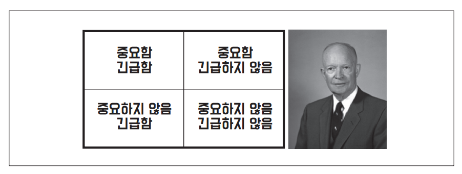

# **두 가지 가치에 대한 이야기**  
모든 소프트웨어 시스템은 이해관계자에게 서로 다른 두 가지 가치를 제공하는데 행위(behavior)와 구조(structure)가 바로 그것이다. 소프트웨어 개발자는 
두 가치를 모두 반드시 높게 유지해야 하는 책임을 진다. 불행하게도 개발자는 한 가지 가치에만 집중하고 나머지 가치는 배제하곤 한다. 더 안타까운 일은 
대체로 개발자가 둘 중 덜 중요한 가치에 집중하여 결국에는 소프트웨어 시스템이 쓸모없게 된다는 사실이다.  
  
# **행위**  
소프트웨어의 첫 번째 가치는 바로 행위다. 프로그래머를 고용하는 이유는 이해관계자를 위해 기계가 수익을 창출하거나 비용을 절약하도록 만들기 위해서다. 
이를 위해 프로그래머는 이해관계자가 기능 명세서나 요구사항 문서를 구체화할 수 있도록 돕는다. 그리고 이해관계자의 기계가 이러한 요구사항을 만족하도록 
코드를 작성한다.  
  
기계가 이러한 요구사항을 위반하면 프로그래머는 디버거를 열고 문제를 고친다.  
  
많은 프로그래머가 이러한 활동이 자신이 해야 할 일의 전부라고 생각한다. 이들은 요구사항을 기계에 구현하고 버그를 수정하는 일이 자신의 직업이라고 믿는다. 
슬픈 일이지만 그들은 틀렸다.  
  
# **아키텍처**  
소프트웨어의 두 번째 가치는 소프트웨어라는 단어와 관련이 있다. 소프트웨어라는 단어는 부드러운과 제품이라는 단어의 합성어다. 제품이라는 단어는 상품을 
뜻하며 부드러운이라는 단어는... 아마도 바로 이 단어에 두 번째 가치가 존재한다.  
  
소프트웨어는 부드러움을 지니도록 만들어졌다. 소프트웨어를 만든 이유는 기계의 행위를 쉽게 변경할 수 있도록 하기 위해서다. 만약 기계의 행위를 바꾸는 일을 
어렵게 만들고자 했다면 우리는 소프트웨어가 아니라 하드웨어라고 불렀을 것이다.  
  
소프트웨어가 가진 본연의 목적을 추구하려면 소프트웨어는 반드시 부드러워야 한다. 다시 말해 변경하기 쉬워야 한다. 이해관계자가 기능에 대한 생각을 바꾸면 
이러한 변경사항을 간단하고 쉽게 적용할 수 있어야 한다. 이러한 변경사항을 적용하는 데 드는 어려움은 변경되는 범위(scope)에 비례해야 하며 변경사항의 
형태(shape)와는 관련이 없어야 한다.  
  
소프트웨어 개발 비용의 증가를 결정짓는 주된 요인은 바로 이 변경사항의 범위와 형태의 차이에 있다. 바로 이 떄문에 개발 비용은 요청된 변경사항의 크기에 
비례한다. 또한 개발 첫 해가 다음 해보다 비용이 덜 들고 다음 해에는 그다음 해보다 비용이 적게 드는 이유도 이 때문이다.  
  
이해관계자는 범위가 비슷한 일련의 변경사항을 제시할 뿐이지만 개발자 입장에서는 복잡도가 지속적으로 증가하는 퍼즐 판 위에서 이해관계자가 계속해서 
퍼즐 조각을 맞추라는 지시를 하는 것처럼 느껴진다. 새로운 요청사항이 발생할 때마다 바로 이전의 변경사항을 적용하는 것보다 조금 더 힘들어지는데 시스템의 
형태와 요구사항의 형태가 서로 맞지 않기 떄문이다.  
  
문제는 당연히 시스템의 아키텍처다. 아키텍처가 특정 형태를 다른 형태보다 선호하면 할수록 새로운 기능을 이 구조에 맞추는 게 더 힘들어진다. 따라서 
아키텍처는 형태에 독립적이어야 하고 그럴수록 더 실용적이다.  
  
# **더 높은 가치**  
기능인가 아니면 아키텍처인가? 둘 중 어느 것의 가치가 더 높은가?  
  
업무 관리자에게 묻는다면 소프트웨어 시스템이 동작하는 것이 더 중요하다고 대다수가 대답할 것이다. 이어서 개발자에게 묻는다면 업무 관리자의 의견에 대체로 
동조하는 태도를 취하게 된다. 하지만 이는 잘못된 태도다. 단순한 논리 기법인 양 극단의 사례를 검토하는 방식으로 이 의견을 반박할 수 있다.  
  
- 완벽하게 동작하지만 수정이 아예 불가능한 프로그램을 개발자에게 준다면 이 프로글매은 요구사항이 변경될 때 동작하지 않게 되고 결국 프로그램이 돌아가도록 
만들 수 없게 된다. 따라서 이러한 프로그램은 거의 쓸모가 없다.  
- 동작은 하지 않지만 변경이 쉬운 프로그램을 개발자에게 준다면 개발자는 프로그램이 돌아가도록 만들 수 있고 변경사항이 발생하더라도 여전히 동작하도록 유지보수할 
수 있다. 따라서 이러한 프로그램은 앞으로도 계속 유용한 채로 남는다.  
  
물론 이러한 주장이 설득력이 떨어진다고 생각할 수도 있다. 어쨌든 변경이 완전히 불가능한 프로그램이란 존재하지 않기 떄문이다. 하지만 수정이 현실적으로 
불가능한 시스템은 존재하기 마련인데 변경에 드는 비용이 변경으로 창출되는 수익을 초과하는 경우다. 기능 또는 설정 측면에서 많은 시스템이 이처럼 수정이 
현실적으로 불가능해지는 상황에 빠지게 된다.  
  
업무 관리자에게 변경이 가능한 시스템을 원하는지 묻는다면 당연히 그렇다고 답할 것이다. 물론 현재 기능의 동작 여부가 미래의 유연성보다 더 중요하다는 언급을 
빼놓지는 않을 것이다. 하지만 추후 업무 관리자의 변경 요청에 "변경 비용이 너무 커서 현실적으로 적용할 수 없다"라고 대답하면 "실질적으로 변경이 불가능한 
상태에 처할 때까지 시스템을 방치했다"며 개발자에게 화를 낼 가능성이 높다.  
  
# **아이젠하워 매트릭스**  
드와이트 D. 아이젠하워 미국 대통령이 고안한 중요성과 긴급성에 관한 아이젠하워 매트릭스를 살펴보자.  
  
  
  
- 내겐 두 가지 유형의 문제가 있습니다. 하나는 긴급하며 다른 하나는 중요합니다. 긴급한 문제는 중요하지 않으며 중요한 문제는 절대 긴급하지 않습니다.  
  
이 격언에는 엄청나게 중요한 진실이 담겨 있다. 긴급한 문제가 아주 중요한 문제일 경우는 드물고 중요한 문제가 몹시 긴급한 경우는 거의 없다는 사실이다.  
  
소프트웨어의 첫 번째 가치인 행위는 긴급하지만 매번 높은 중요도를 가지는 것은 아니다.  
  
소프트웨어의 두 번째 가치인 아키텍처는 중요하지만 즉각적인 긴급성을 필요로 하는 경우는 절대 없다.  
  
물론 어떤 일은 긴급하면서도 중요할 수 있다. 긴급하지도 않고 중요하지조차 않은 일도 있다. 최종적으로는 이들 네 가지 경우에 다음과 같이 우선순위를 
매길 수 있다.  
  
1. 긴급하고 중요한  
2. 긴급하지는 않지만 중요한  
3. 긴급하지만 중요하지 않은  
4. 긴급하지도 중요하지도 않은  
  
아키텍처, 즉 중요한 일은 이 항목의 가장 높은 두 순위를 차지하는 반면 행위는 첫 번째와 세 번째에 위치한다는 점을 주목하자.  
  
업무 관리자와 개발자가 흔하게 저지르는 실수는 세 번째에 위치한 항목을 첫 번째로 격상시켜 버리는 일이다. 다시 말해 긴급하지만 중요하지 않은 기능과 
진짜로 긴급하면서 중요한 기능을 구분하지 못한다. 이러한 실패로 인해 시스템에서 중요도가 높은 아키텍처를 무시한 채 중요도가 떨어지는 기능을 선택하게 된다.  
  
업무 관리자는 보통 아키텍처의 중요성을 평가할 만한 능력을 겸비하지 못하기 떄문에 개발자는 딜레마에 빠진다. 소프트웨어 개발자를 고용하는 이유는 바로 
이 딜레마를 해결하기 위해서다. 따라서 기능의 긴급성이 아닌 아키텍처의 중요성을 설득하는 일은 소프트웨어 개발팀이 마땅히 책임져야 한다.  
  
