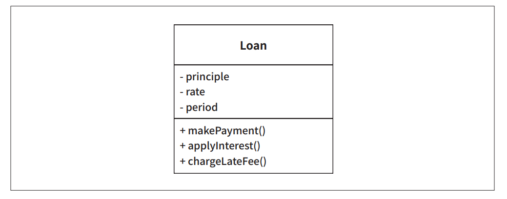
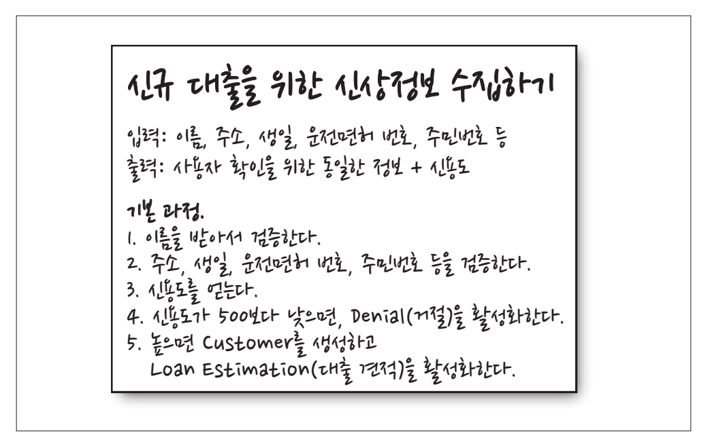

# **업무 규칙**  
애플리케이션을 업무 규칙과 플러그인으로 구분하려면 업무 규칙이 실제로 무엇인지를 잘 이해해야만 한다. 업무 규칙에는 여러 가지가 있다.  
  
엄밀하게 말하면 업무 규칙은 사업적으로 수익을 얻거나 비용을 줄일 수 있는 규칙 또는 절차다. 더 엄밀하게 말하면 컴퓨터상으로 구현했는지와 상관없이 
업무 규칙은 사업적으로 수익을 얻거나 비용을 줄일 수 있어야 한다. 심지어 사람이 수동으로 직접 수행하더라도 마찬가지다.  
  
대출에 N%의 이자를 부과한다는 사실은 은행이 돈을 버는 업무 규칙이다. 이러한 사실은 컴퓨터 프로그램으로 이자를 계산하든 또는 직원이 주판을 튕겨 
계산하든 하등의 관계가 없다.  
  
이러한 규칙을 핵심 업무 규칙(Critical Business Rule)이라고 부를 것이다. 왜냐하면 이들 규칙은 사업 자체에 핵심적이며 규칙을 자동화하는 시스템이 
없더라도 업무 규칙은 그대로 존재하기 떄문이다.  
  
핵심 업무 규칙은 보통 데이터를 요구한다. 예를 들어 대출에는 대출 잔액, 이자율, 지급 일정이 필요하다.  
  
우리는 이러한 데이터를 핵심 업무 데이터(Critical Business Data)라고 부르겠다. 심지어 이러한 데이터는 시스템으로 자동화되지 않은 경우에도 
존재하는 그런 데이터다.  
  
핵심 규칙과 핵심 데이터는 본질적으로 결합되어 있기 때문에 객체로 만들 좋은 후보가 된다. 우리는 이러한 유형의 객체를 엔티티(Entity)라고 하겠다.  
  
# **엔티티**  
엔티니는 컴퓨터 시스템 내부의 객체로서, 핵심 업무 데이터를 기반으로 동작하는 일련의 조그만 핵심 업무 규칙을 구체화한다. 엔티티 객체는 핵심 업무 데이터를 
직접 포함하거나 핵심 업무 데이터에 매우 쉽게 접근할 수 있다. 엔티티의 인터페이스는 핵심 업무 데이터를 기반으로 동작하는 핵심 업무 규칙을 구현한 
함수들로 구성된다.  
  
  
  
예를 들어 위 그림은 대출을 뜻하는 Loan 엔티티가 UML 클래스로 어떻게 표현되는지 보여준다. Loan 엔티티는 세 가지의 핵심 업무 데이터를 포함하며 
데이터와 관련된 세 가지 핵심 업무 규칙을 인터페이스로 제공한다.  
  
우리는 이러한 종류의 클래스를 생성할 때 업무에서 핵심적인 개념을 구현하는 소프트웨어는 한데 모으고 구축 중인 자동화 시스템의 나머지 모든 고려사항과 
분리시킨다. 이 클래스는 업무의 대표자로서 독립적으로 존재한다. 이 클래스는 데이터베이스, 사용자 인터페이스, 서드파티 프레임워크에 대한 고려사항들로 
인해 오염되어서는 절대 안 된다. 이 클래스는 어떤 시스템에서도 업무를 수행할 수 있으며 시스템의 표현 형식이나 데이터 저장 방식, 그리고 해당 시스템에서 
컴퓨터가 배치되는 방식과도 무관하다. 엔티티는 순전히 업무에 대한 것이며 이외의 것은 없다.  
  
엔티티를 클래스라고 불러서 우려하는 독자가 있을 것이다. 걱정 말라. 엔티티를 만드는 데 꼭 객체 지향 언어를 사용할 필요는 없다. 유일한 요구조건은 
핵심 업무 데이터와 핵심 업무 규칙을 하나로 묶어서 별도의 소프트웨어 모듈로 만들어야 한다는 것이다.  
  
# **유스케이스**  
모든 업무 규칙이 엔티티처럼 순수한 것은 아니다. 자동화된 시스템이 동작하는 방법을 정의하고 제약함으로써 수익을 얻거나 비용을 줄이는 업무 규칙도 
존재한다. 이러한 규칙은 자동화된 시스템의 요소로 존재해야만 의미가 있으므로 수동 환경에서는 사용될 수 없다.  
  
예를 들어 은행 직원이 신규 대출을 생성할 때 사용하는 애플리케이션을 상상해 보자. 은행에서 대출 담다자가 신청자의 신상정보를 수집하여 검증한 후 
신청자의 신용도가 500보다 낮다면 대출 견적을 제공하지 않기로 결정했다고 해 보자. 따라서 시스템에서 신상정보 화면을 모두 채우고 검증한 후 신용도가 
하한선보다 높은지가 확인된 이후에 대출 견적 화면으로 진행되어야 한다는 식으로 은행에서 업무 요건을 기술했다고 해 보자.  
  
바로 이것이 유스케이스(use case)다. 유스케이스는 자동화된 시스템이 사용되는 방법을 설명한다. 유스케이스는 사용자가 제공해야 하는 입력, 사용자에게 
보여줄 출력, 그리고 해당 출력을 생성하기 위한 처리 단계를 기술한다. 엔티티 내의 핵심 업무 규칙과는 반대로 유스케이스는 애플리케이션에 특화된 업무 
규칙을 설명한다.  
  
  
  
위 그림은 이러한 유스케이스의 예다. 마지막 줄에서 Customer를 언급한다는 점에 주목하자. 이는 Customer 엔티티에 대한 참조이며 은행과 고객의 
관계를 결정짓는 핵심 업무 규칙은 바로 이 Customer 엔티티에 포함된다.  
  
유스케이스는 엔티티 내부의 핵심 업무 규칙을 어떻게, 그리고 언제 호출할지를 명시하는 규칙을 담는다. 엔티티가 어떻게 춤을 출지를 유스케이스가 
제어하는 것이다.  
  
주목할 또 다른 사실은 인터페이스로 돌아오는 데이터와 인터페이스에서 되돌려주는 데이터를 형식 없이 명시한다는 점만 빼면 유스케이스는 사용자 
인터페이스를 기술하지 않는다는 점이다. 유스케이스만 봐서는 이 애플리케이션이 웹을 통해 전달되는지, 리치 클라이언트인지, 콘솔 기반인지, 아니면 
순수한 서비스인지를 구분하기란 불가능하다.  
  
이 점은 매우 중요하다. 유스케이스는 시스템이 사용자에게 어떻게 보이는지를 설명하지 않는다. 이보다는 애플리케이션에 특화된 규칙을 설명하며 이를 
통해 사용자와 엔티티 사이의 상호작용을 규정한다. 시스템에서 데이터가 들어오고 나가는 방식은 유스케이스와는 무관하다.  
  
유스케이스는 객체다. 유스케이스는 애플리케이션에 특화된 업무 규칙을 구현하는 하나 이상의 함수를 제공한다. 또한 유스케이스는 입력 데이터, 출력 데이터, 
유스케이스가 상호작용하는 엔티티에 대한 참조 데이터 등의 데이터 요소를 포함한다.  
  
엔티티는 자신을 제어하는 유스케이스에 대해 아무것도 알지 못한다. 이는 의존성 역전 원칙을 준수하는 의존성 방향에 대한 또 다른 예다. 엔티티와 같은 
고수준 개념은 유스케이스와 같은 저수준 개념에 대해 아무것도 알지 못한다. 반대로 저수준인 유스케이스는 고수준인 엔티티에 대해 알고 있다.  
  
왜 엔티티는 고수준이며 유스케이스는 저수준일까? 왜냐하면 유스케이스는 단일 애플리케이션에 특화되어 있으며, 따라서 해당 시스템의 입력과 출력에 보다 
가깝게 위칙하기 떄문이다. 엔티티는 수많은 다양한 애플리케이션에서 사용될 수 있도록 일반화된 것이므로 각 시스템의 입력이나 출력에서 더 멀리 
떨어져 있다. 유스케이스는 엔티티에 의존한다. 반면 엔티티는 유스케이스에 의존하지 않는다.  
  
# **요청 및 응답 모델**  
유스케이스는 입력 데이터를 받아서 출력 데이터를 생성한다. 그런데 제대로 구성된 유스케이스 객체라면 데이터를 사용자나 또 다른 컴포넌트와 주고 받는 
방식에 대해서는 전혀 눈치챌 수 없어야 한다. 우리는 유스케이스 클래스의 코드가 HTML이나 SQL에 대해 알게 되는 일을 절대로 원치 않는다.  
  
유스케이스는 단순한 요청 데이터 구조를 입력으로 받아들이고 단순한 응답 데이터 구조를 출력으로 반환한다. 이들 데이터 구조는 어떤 것에도 의존하지 않는다. 
이들 데이터 구조는 HttpRequest나 HttpResponse 같은 표준 프레임워크 인터페이스로부터 파생되지 않는다. 마찬가지로 웹에 대해서도 알지 못한다. 
웹뿐만 아니라 그 어떤 사용자 인터페이스에도 종속되는 게 아무것도 없다.  
  
이처럼 의존성을 제거하는 일은 매우 중요하다. 요청 및 응답 모델이 독립적이지 않다면 그 모델에 의존하는 유스케이스도 결국 해당 모델이 수반하는 
의존성에 간접적으로 결합되어 버린다.  
  
엔티티 객체를 가리키는 참조를 요청 및 응답 데이터 구조에 포함하려는 유혹을 받을 수도 있다. 엔티티와 요청/응답 모델은 상당히 많은 데이터를 공유하므로 
이러한 방식이 적합해 보일 수도 있다. 하지만 이 유혹을 떨쳐내라. 이들 두 객체의 목적은 완전히 다르다. 시간이 지나면 두 객체는 완전히 다른 이유로 
변경될 것이고 따라서 두 객체를 어떤 식으로든 함께 묶는 행위는 공통 폐쇄 원칙과 단일 책임 원칙을 위배하게 된다. 결국 코드에는 수많은 떠돌이 데이터
(해당 데이터를 실제로 사용할 함수로 전달하기 위해 함수에서 함수로 전달되는 데이터, 전달 경로의 앞쪽 함수에서는 해당 데이터를 전혀 사용하지 않는다)
수많은 조건문이 추가되어 버린다.