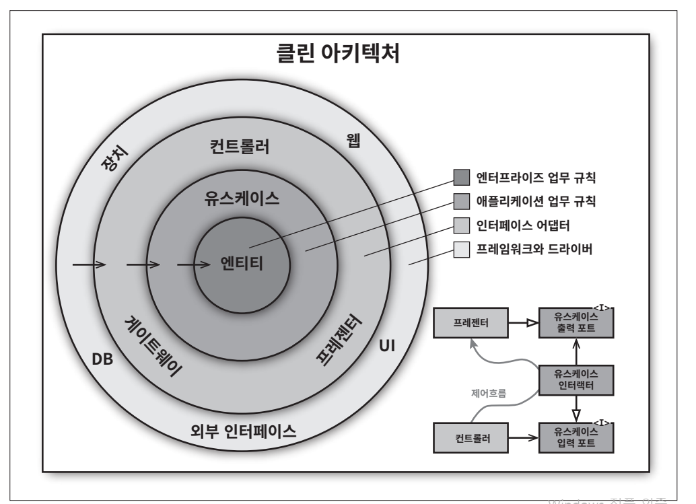

# **클린 아키텍처**  
지난 수십 년간 우리는 시스템 아키텍처와 관련된 여러 가지 아이디어를 봐 왔다. 다음의 내용도 여기에 포함된다.  
  
- 육각형 아키텍처(Hexagonal Architecture): 포트와 어댑터(Ports and Adapters)라고도 알려졌으며 앨리스터 코오번이 개발했다.  
- DCI(Data, Context and Interaction): 제임스 코플리언과 트리그베 린스쿠주가 만들었다.  
- BCF(Boundary-Control-Entity): 이바 야콥슨이 자신의 저서에서 소개했다.  
  
이들 아키텍처는 모두 세부적인 면에서는 다소 차이가 있더라도 그 내용은 상당히 비슷하다. 이들의 목표는 모두 같은데 바로 관심사의 분리(separation of concerns)다. 
이들은 모두 소프트웨어를 계층으로 분리함으로써 관심사의 분리라는 목표를 달성할 수 있었다. 각 아키텍처는 최소한 업무 규칙을 위한 계층 하나와 
사용자와 시스템 인터페이스를 위한 또 다른 계층 하나를 반드시 포함한다.  
  
이들 아키텍처는 모두 시스템이 다음과 같은 특징을 지니도록 만든다.  
  
- 프레임워크 독립성: 아키텍처는 다양한 기능의 라이브러리를 제공하는 소프트웨어, 즉 프레임워크의 존재 여부에 의존하지 않는다. 이를 통해 이러한 
프레임워크를 도구로 사용할 수 있으며 프레임워크가 지닌 제약사항 안으로 시스템을 욱여 넣도록 강제하지 않는다.  
- 테스트 용이성: 업무 규칙은 UI, 데이터베이스, 웹 서버, 또는 여타 외부 요소가 없이도 테스트할 수 있다.  
- UI 독립성: 시스템의 나머지 부분을 변경하지 않고도 UI를 쉽게 변경할 수 있다. 예를 들어 업무 규칙을 변경하지 않은 채 웹 UI를 콘솔 UI로 대체할 
수 있다.  
- 데이터베이스 독립성: 오라클이나 MS SQL 서버를 몽고DB, 빅테이블, 카우치DB 등으로 교체할 수 있다. 업무 규칙은 데이터베이스에 결합되지 않는다.  
- 모든 외부 에이전시에 대한 독립성: 실제로 업무 규칙은 외부 세계와의 인터페이스에 대해 전혀 알지 못한다.  
  
  
  
위 그림의 다이어그램은 이들 아키텍처 전부를 싱행 가능한 하나의 아이디어로 통합하려는 시도다.  
  
# **의존성 규칙**  
보통 위 그림에서 각각의 동심원은 소프트웨어에서 서로 다른 영역을 표현한다. 보통 안으로 들어갈수록 고수준의 소프트웨어가 된다. 바깥쪽 원은 메커니즘이고 
안쪽 원은 정책이다.  
  
이러한 아키텍처가 동작하도록 하는 가장 중요한 규칙은 의존성 규칙이다.  
  
- 소스 코드 의존성은 반드시 안쪽으로, 고수준의 정책을 향해야 한다.  
  
내부의 원에 속한 요소는 외부의 원에 속한 어떤 것도 알지 못한다. 특히 내부의 원에 속한 코드는 외부의 원에 선언된 어떤 것에 대해서도 그 이름을 
언급해서는 절대 안 된다. 여기에는 함수, 클래스, 변수, 그리고 소프트웨어 엔티티로 명명되는 모든 것이 포함된다.  
  
같은 이유로 외부의 원에 선언된 데이터 형식도 내부의 원에서 절대로 사용해서는 안 된다. 특히 그 데이터 형식이 외부의 원에 있는 프레임워크가 생성한 
것이라면 더더욱 사용해서는 안 된다. 우리는 외부 원에 위치한 어떤 것도 내부의 원에 영햐을 주지 않기를 바란다.  
  
# **엔티티**  
엔티티는 전사적인 핵심 업무 규칙을 캡슐화한다. 엔티티는 메서드를 가지는 객체이거나 일련의 데이터 구조와 함수의 집합일 수도 있다. 기업의 다양한 
애플리케이션에서 엔티티를 재사용할 수만 있다면 그 형태는 그다지 중요하지 않다.  
  
전사적이지 않은 단순한 단일 애플리케이션을 작성하고 있다면 엔티티는 해당 애플리케이션의 업무 객체가 된다. 이 경우 엔티티는 가장 일반적이며 
고수준인 규칙을 캡슐화한다. 외부의 무언가가 변경되더라도 엔티티가 변경될 가능성은 지극히 낮다. 예를 들어 페이지 네비게이션이나 보안과 관련된 
변경이 발생하더라도 업무 객체가 영향을 받지는 않을 것이다. 운영 관점에서 특정 애플리케이션에 무언가 변경이 필요하더라도 엔티티 계층에는 절대로 
영향을 주어서는 안 된다.  
  
# **유스케이스**  
유스케이스 계층의 소프트웨어는 애플리케이션에 특화된 업무 규칙을 포함한다. 또한 유스케이스 계층의 소프트웨어는 시스템의 모든 유스케이스를 캡슐화하고 
구현한다. 유스케이스는 엔티티로 들어오고 나가는 데이터 흐름을 조정하며 엔티티가 자신의 핵심 업무 규칙을 사용해서 유스케이스의 목적을 달성하도록 
이끈다.  
  
이 계층에서 발생한 변경이 엔티티에 영향을 줘서는 안 된다. 또한 데이터베이스, UI, 또는 여타 공통 프레임워크와 같은 외부 요소에서 발생한 변경이 
계층에 영향을 줘서도 안 된다. 유스케이스 계층은 이러한 관심사로부터 격리되어 있다.  
  
하지만 운영 관점에서 애플리케이션이 변경된다면 유스케이스가 영향을 받으며 따라서 이 계층의 소프트웨어에도 영향을 줄 것이다. 유스케이스의 세부사항이 
변하면 이 계층의 코드 일부는 분명 영향을 받을 것이다.  
  
# **인터페이스 어댑터**  
인터페이스 어댑터(Interface Adaptor) 계층은 일련의 어댑터들로 구성된다. 어댑터는 데이터를 유스케이스와 엔티티에게 가장 편리한 형식에서 데이터베이스나 
웹 같은 외부 에이전시에게 가장 편리한 형식으로 변환한다. 이 계층은 예를 들어 GUI의 MVC 아키텍처를 모두 포괄한다. 프레젠터, 뷰, 컨트롤러는 
모두 인터페이스 어댑터 계층에 속한다. 모델은 그저 데이터 구조 정도에 지나지 않으며 컨트롤러에서 유스케이스로 전달되고 다시 유스케이스에서 프레젠터와 
뷰로 되돌아 간다.  
  
마찬가지로 이 계층은 데이터를 엔티티와 유스케이스에게 가장 편리한 형식에서 영속성용으로 사용 중인 임의의 프레임워크(즉, 데이터베이스)가 이용하기에 
가장 편리한 형식으로 변환한다. 이 원 안에 속한 어떤 코드도 데이터베이스에 대해 조금도 알아서는 안 된다. 예컨대 SQL 기반의 데이터베이스를 사용한다면 
모든 SQL은 이 계츠을 벗어나서는 안 된다. 특히 이 계층에서도 데이터베이스를 담당하는 부분으로 제한되어야 한다.  
  
또한 이 계층에는 데이터를 외부 서비스와 같은 외부적인 형식에서 유스케이스나 엔티티에서 사용되는 내부적인 형식으로 변환하는 또 다른 어탭터가 
필요하다.  
  
# **프레임워크와 드라이버**  
위 그림에서 가장 바깥쪽 계층은 일반적으로 데이터베이스나 웹 프레임워크 같은 프레임워크나 도구들로 구성된다. 일반적으로 이 계층에서는 안쪽 원과 
통신하기 위한 접합 코드 외에는 특별히 더 작성해야 할 코드가 그다지 많지 않다.  
  
프레임워크와 드라이버 계층은 모든 세부사항이 위치하는 곳이다. 웹은 세부사항이다. 데이터베이스는 세부사항이다. 우리는 이러한 것들을 모두 외부에 
위치시켜서 피해를 최소화한다.  
  
# **원은 네 개여야만 하나?**  
위 그림에 표시한 원들은 그저 개념을 설명하기 위한 하나의 예시일 뿐이다. 네 개보다 더 많은 원이 필요할 수도 있다. 항상 네 개만 사용해야 한다는 
규칙은 없다. 하지만 어떤 경우에도 의존성 규칙은 적용된다. 소스 코드 의존성은 항상 안쪽을 향한다. 안쪽으로 이동할수록 추상화와 정책의 수준은 
높아진다. 가장 바깥쪽 원은 저수준의 구체적인 세부사항으로 구성된다. 그리고 안쪽으로 이동할수록 소프트웨어는 점점 추상화되고 더 높은 수준의 정책들을 
캡슐화한다. 따라서 가장 안쪽 원은 가장 범용적이며 높은 수준을 가진다.  
  

