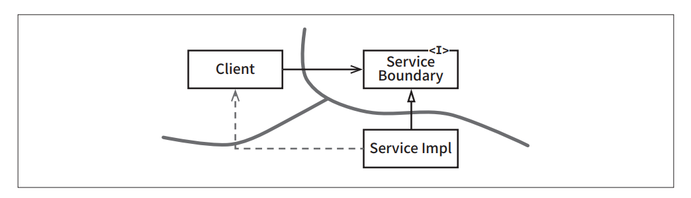

# **부분적 경게**  
아키텍처 경계를 완벽하게 만드는 데는 비용이 많이 든다. 쌍방향의 다형적 Boundary 인터페이스, Input과 Output을 위한 데이터 구조를 만들어야 할 
뿐만 아니라 두 영역을 독립적으로 컴파일하고 배포할 수 있는 컴포넌트로 격리하는 데 필요한 모든 의존성을 관리해야 한다. 이렇게 만들려면 엄청난 노력을 
기울여야 하고 유지하는 데도 또 엄청난 노력이 든다.  
  
많은 경우에 뛰어난 아키텍트라면 이러한 경계를 만드는 비용이 너무 크다고 판단하면서도 한편으로는 나중에 필요할 수도 있으므로 이러한 경계에 필요한 
공간을 확보하기 원할 수도 있다.  
  
애자일 커뮤니티에 속한 사람 중 많은 이가 이러한 종류의 선행적인 설계를 탐탁치 않게 여기는데 YAGNI(You Aren't Going to Need It)원칙을 위배하기 
때문이다. 하지만 아키텍트라면 이 문제를 검토하면서 "그래, 하지만 어쩌면 필요할지도."라는 생각이 들 수도 있다. 만약 그렇다면 부분적 경계를 
구현해볼 수 있다.  
  
# **마지막 단계를 건너뛰기**  
부분적 경계를 생성하는 방법 하나는 독립적으로 컴파일하고 배포할 수 있는 컴포넌트를 만들기 위한 작업은 모두 수행한 후 단일 컴포넌트에 그대로 모아만 
두는 것이다. 쌍방향 인터페이스도 그 컴포넌트에 있고, 입력/출력 데이터 구조도 거기에 있으며 모든 것이 완전히 준비되어 있다. 하지만 이 모두를 
단일 컴포넌트로 컴파일해서 배포한다.  
  
아무리 보아도 이처럼 부분적 경계를 만들려면 완벽한 경계를 만들 때 만큼의 코드량과 서전 설계가 필요하다. 하지만 다수의 컴포넌트를 관리하는 작업은 
하지 않아도 된다. 추적을 위한 버전 번호도 없으며 배포 관리 부담도 없다. 이 차이는 가볍지 않다.  
  
이는 FitNesse를 뒷받침했던 초기 전략이었다. FitNesses의 웹 서버 컴포넌트는 FitNesse의 위키나 테스트 영역과는 분리되도록 설계되었다. 새로운 
웹 기반 애플리케이션을 만들 때 해당 웹 컴포넌트를 재사용할 수도 있다고 생각했기 때문이었다. 이처럼 컴포넌트를 두 개로 분리했지만 사용자가 두 번 
다운로드하도록 만들고 싶지는 않았다. 우리의 설계 목표 중 하나가 "다운로드 후 바로 실행"이었다는 점을 상기하자. 우리는 사용자가 하나의 jar 파일을 
다운로드하면 또 다른 jar 파일을 찾아다니거나 버전 호환성을 해결하는 등의 작업을 하지 않고도 실행할 수 있게 만들고자 했다.  
  
FitNesse 이야기는 마지막 단계를 건너뛰는 이 접근법이 지닌 위험 역시 지적하고 있다. 시간이 흐르면서 별도로 분리한 웹 컴포넌트가 재사용될 가능성은 
전혀 없을 것임이 명백해지고 웹 컴포넌트와 위키 컴포넌트 사이의 구분도 약화되기 시작했다. 의존성은 잘못된 방향으로 선을 넘기 시작했다. 이 둘을 다시 
분리하는 작업은 따분한 일이 될 것이다.  
  
# **일차원 경계**  
완벽한 형태의 아키텍처 경계는 양방향으로 격리된 상태를 유지해야 하므로 쌍방향 Boundary 인터페이스를 사용한다. 양방향으로 격리된 상태를 유지하려면 
초기 설정할 때나 지속적으로 유지할 떄도 비용이 많이 든다.  
  
  
  
추후 완벽한 형태의 경계로 확장할 수 있는 공간을 확보하고자 할 때 활용할 수 있는 더 간단한 구조가 위 그림에 나와 있다. 이는 전통적인 전략(Strategy) 패턴을 
사용한 전형적인 사례다. ServiceBoundary 인터페이스는 클라이언트가 사용하며 ServiceImpl 클래스가 구현한다.  
  
이 방식이 미래에 필요할 아키텍처 경계를 위한 무대를 마련한다는 점은 명백하다. Client를 ServiceImpl로부터 격리시키는 데 필요한 의존성 역전이 
이미 적용되었기 때문이다. 또한 이 다이어그램의 위험천만한 점선 화살표에서 보듯이 이러한 분리는 매우 빠르게 붕괴될 수 있다는 점 역시 분명하다. 
쌍방향 인터페이스가 없고 개발자와 아키텍트가 근면 성실하고 제대로 훈련되어 있지 않다면 이 점섬과 같은 비밀 통로가 생기는 일을 막을 방법이 없다.  
  
