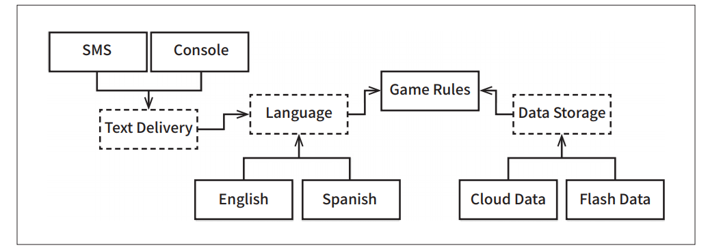

# **계층과 경계**  
시스템이 세 가지 컴포넌트(UI, 업무 규칙, 데이터베이스)로만 구성된다고 생각하기 쉽다. 몇몇 단순한 시스템에서는 이 정도로 충분하다. 하지만 대다수의 
시스템에서 컴포넌트의 개수는 이보다 훨씬 많다.  
  
# **움퍼스 사냥 게임**  
1972년에 발매된 모험 게임인 움퍼스 사냥이 있다. 텍스트를 기반으로 하는 이 게임은 GO EAST와 SHOOT WEST와 같은 매우 단순한 명령어를 사용한다. 
  
텍스트 기반 UI는 그대로 유지하되 게임 규칙과 UI를 분리해서 우리 제품을 여러 시장에서 다양한 언어로 발매할 수 있게 만든다고 가정해 보자. 게임 규칙은 
언어 독립적인 API를 사용해서 UI 컴포넌트와 통신할 것이고 UI는 API를 사람이 이해할 수 있는 언어로 변환할 것이다.  
  
  
  
위 그림처럼 소스 코드 의존성을 적절히 관리하면 UI 컴포넌트가 어떤 언어를 사용하더라도 게임 규칙을 재사용할 수 있다. 게임 규칙은 어떤 종류의 
인간 언어가 사용되는지 알지도 못할 뿐만 아니라 신경 쓸 이유도 없다.  
  
또한 게임의 상태를 영속적인 저장소에 유지한다고 가정해 보자. 그게 플래시 메모리나 클라우드, 혹은 단순히 RAM일 수도 있다. 어떤 경우라도 우리는 
게임 규칙이 이러한 세부사항을 알지 않기를 바란다. 따라서 이번에도 역시 API를 생성하여 게임 규칙이 데이터 저장소 컴포넌트와 통신할 때 사용하도록 
만든다.  
  
  
  
우리는 게임 규칙이 다양한 종류의 데이터 저장소에 대해 알지 않기를 원한다. 따라서 위 그림에서 보듯이 의존성 규칙을 준수할 수 있도록 의존성이 
적절한 방향을 가리키게 만들어야 한다.  
  
# **클린 아키텍처?**  
분명하게도 이 예제의 맥락이라면 클린 아키텍처 접근법을 적용해 유스케이스, 경계, 엔티티, 그리고 관련된 데이터 구조를 모두 만드는 일도 쉬운 일이다. 
그런데 중요한 아키텍처 경계를 정말로 모두 발견한 것일까?  
  
예를 들어 UI에서 언어가 유일한 변경의 축은 아니다. 이 밖에도 텍스트를 주고받는 메커니즘을 다양하게 만들고 싶을 수도 있다. 예를 들어 일반적인 
셸 창을 사용하고 싶을 때도 있고 텍스트 메시지나 채팅 애플리케이션을 사용하기를 원할 수도 있다. 여기에는 다양한 가능성이 존재한다.  
  
따라서 이 변경의 축에 의해 정의되는 아키텍처 경계가 잠재되어 있을 수도 있다. 아마도 해당 경계를 가로지르는, 그래서 언어를 통신 메커니즘으로부터 
격리하는 API를 생성해야 할 수도 있다.  
  
  
  
이러한 아이디어를 위 그림에서 볼 수 있다. 위 그림의 다이어그램은 더 복잡해졌지만 놀라울 것은 없다 점선으로 된 테두리는 API를 정의하는 추상 
컴포넌트를 가리키며 해당 API는 추상 컴포넌트 위나 아래의 컴포넌트가 구현한다.  
  
GameRules는 GameRules가 정의하고 Language가 구현하는 API를 이용해 Language와 통신한다. 마찬가지로 Language는 Language가 정의하고 TextDelivery가 
구현하는 API를 이용해 TextDelivery와 통신한다. API는 (구현하는 쪽이 아닌) 사용하는 쪽에 정의되고 소속된다.  
  
GameRules를 들여바 보면 GameRules 내부 코드에서 사용하고 Language 내부 코드에서 구현하는 다형적 Boundary 인터페이스를 발견할 수 있다. 
또한 Language에서 사용하고 GameRules 내부 코드에서 구현하는 다형적 Boundary 인터페이스도 발견할 수 있다. 또한 Language에서 사용하고 GameRules 
내부 코드에서 구현하는 다형적 Boundary 인터페이스도 발견할 수 있다.  
  
Language를 들여다 봐도 동일한 구조를 발견할 수 있다. 즉 TextDelivery 내부의 코드에서 구현하는 다형적 Boundary 인터페이스와 TextDelivery에서 
사용하고 Language가 구현하는 다형적 Boundary 인터페이스를 발견할 수 있을 것이다.  
  
이 모든 경우에 해당 Boundary 인터페이스가 정의하는 API는 의존성 흐름의 상위에 위치한 컴포넌트에 속한다.  
  
English, SMS, CloudData와 같은 변형들은 추상 API 컴포넌트가 정의하는 다형적 인터페이스를 통해 제공되고 실제로 서비스하는 구체 컴포넌트가 해당 
인터페이스를 구현한다. 예를 들어 Language가 정의하는 다형적 인터페이스는 English나 Spanish가 구현할 것이다.  
  
  
  
이러한 변형들은 모두 제거하고 순전히 API 컴포넌트만 집중하면 다이어그램을 단순화할 수 있다. 위 그림이 그 결과다.  
  
위 그림의 다이어그램은 모든 화살표가 위를 향하도록 맞춰졌다는 점에 주목하자. 그 결과 GameRules는 최상위에 놓인다. GameRules는 최상위 수준의 
정책을 가지는 컴포넌트이므로 이치에 맞는 배치이다.  
  
정보가 흐르는 방향을 생각해 보자. 모든 입력은 사용자로부터 전달받아 좌측 하단의 TextDelivery 컴포넌트로 전달된다. 이 정보는 Language 컴포넌트를 
거쳐서 위로 올라가며 GameRules에 적합한 명령어로 번역된다.  
  
GameRules는 사용자 입력을 처리하고 우측 하단의 DataStorage로 적절한 데이터를 내려 보낸다.  
  
그런 후 GameRules는 Language로 출력을 되돌려 보내고 Language는 API를 다시 적절한 언어로 번역한 후 번역된 언어를 TextDelivery를 통해 사용자에게 
전달한다.  
  
이 구성은 데이터 흐름을 두 개의 흐름으로 효과적으로 분리한다. (화살표는 데이터의 흐름의 방햐이 아니라 소스 코드 의존성의 방향이다) 왼쪽의 흐름은 
사용자와의 통신에 관여하며 오른쪽의 흐름은 데이터 영속성에 관여한다. 두 흐름은 상단의 GameRules에서 서로 만나며 GameRules는 두 흐름이 모두 거치게 
되는 데이터에 대한 최종적인 처리기가 된다.  
  
# **흐름 횡단하기**  
이 예제처럼 데이터 흐름은 항상 두 가지일까? 절대로 아니다. 훔퍼스 사냥 게임을 네트워크상에서 여러 사람이 함께 플레이할 수 있게 만든다고 해보자.  
  
  
  
이 경우 위 그림에서 보듯이 네트워크(Network) 컴포넌트를 추가해야 한다. 이 구성은 데이터 흐름을 세 개의 흐름으로 분리하며 이들 흐름은 모두 GameRules가 
제어한다.  
  
따라서 시스템이 복잡해질수록 컴포넌트 구조는 더 많은 흐름으로 분리될 것이다.  
  

