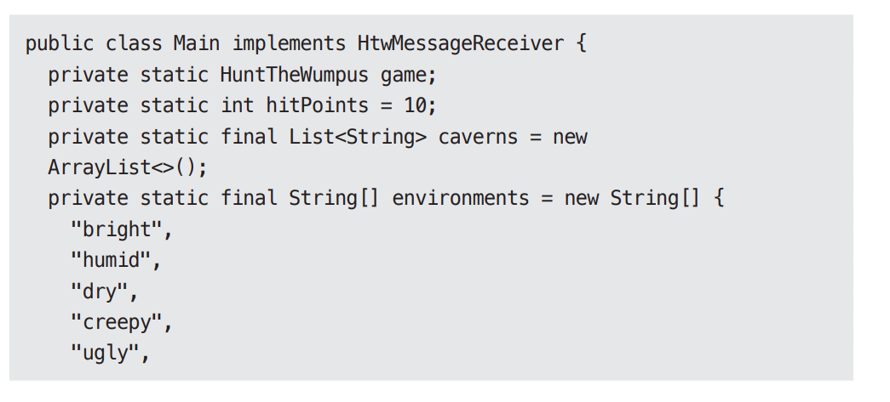
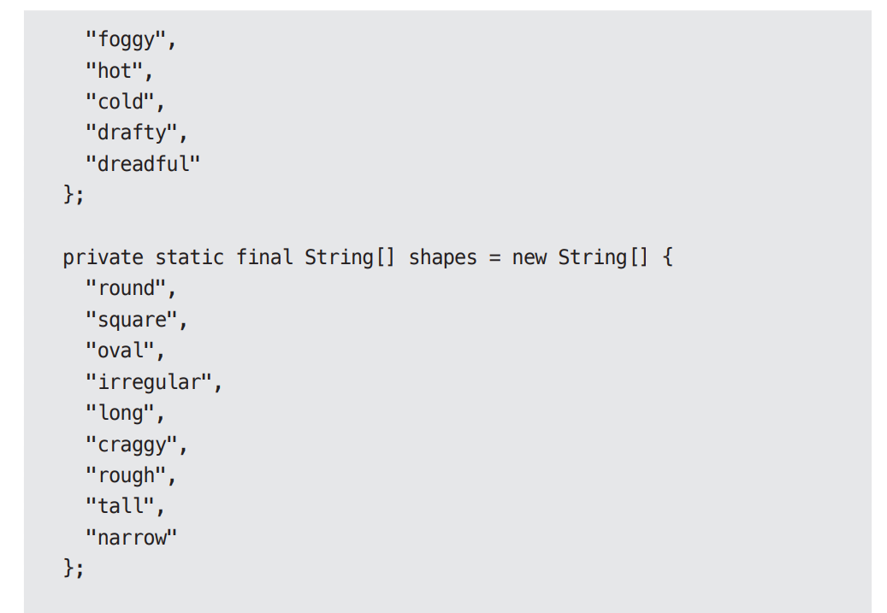
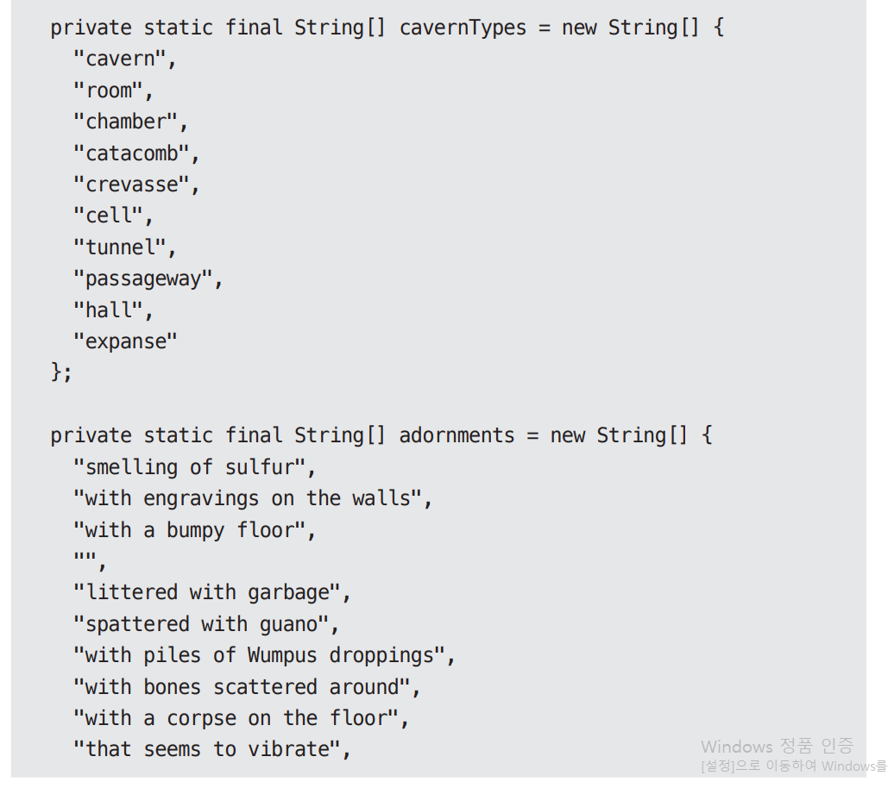
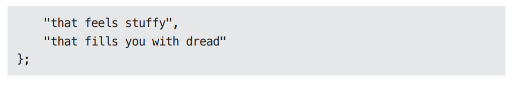
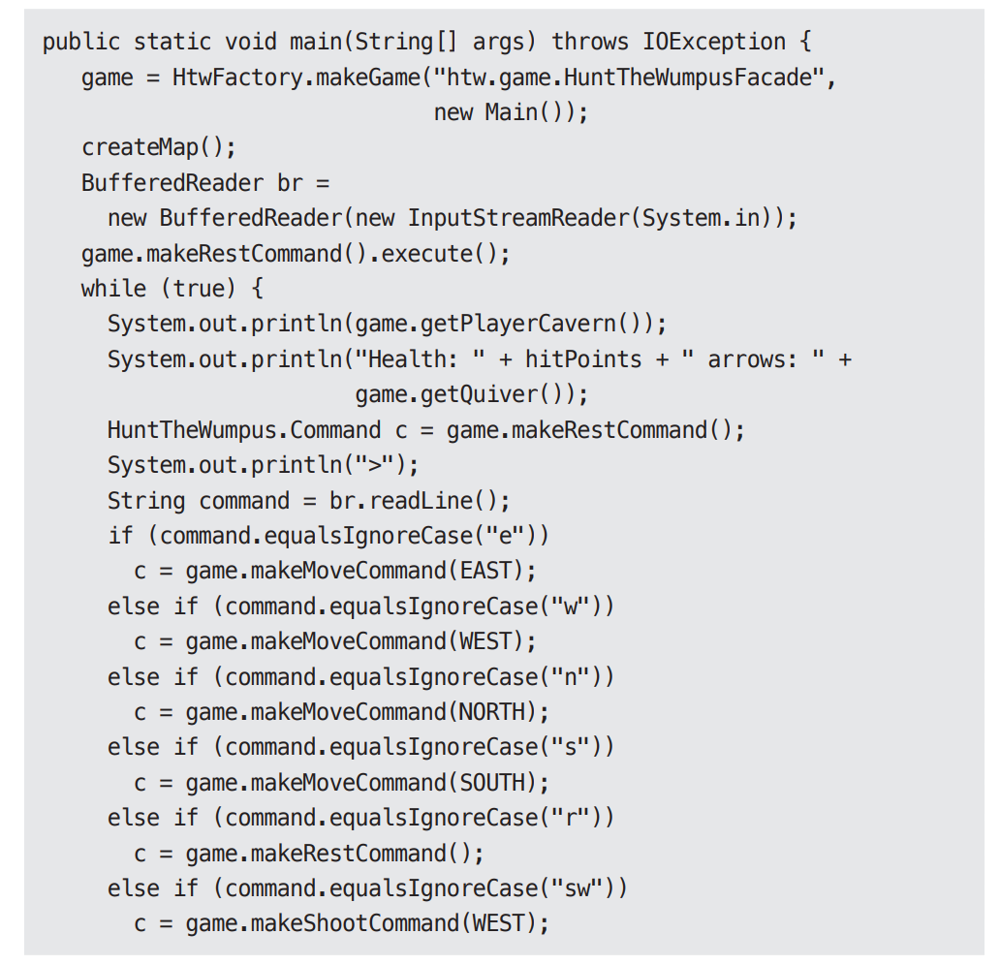
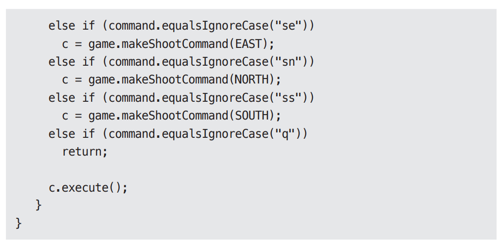
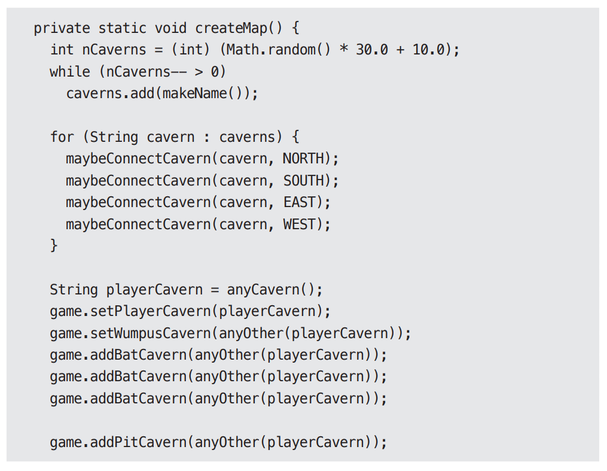
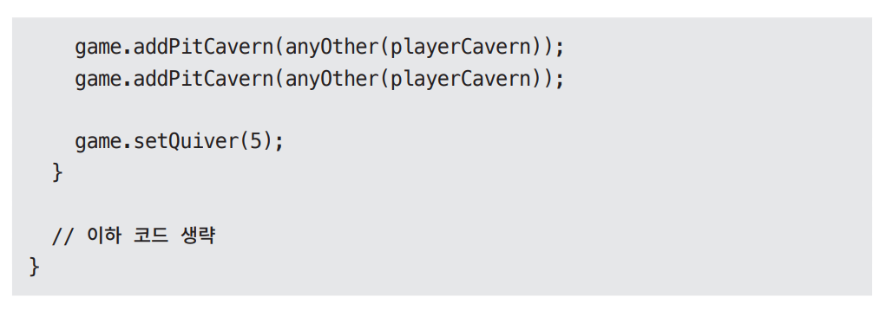

# **메인(Main) 컴포넌트**  
모든 시스템에는 최소한 하나의 컴포넌트가 존재하고 이 컴포넌트가 나머지 컴포넌트를 생성하고 조정하며 관리한다. 이 컴포넌트를 메인(Main)이라고 부른다.  
  
# **궁극적인 세부사항**  
메인 컴포넌트는 궁극적인 세부사항으로 가장 낮은 수준의 정책이다. 메인은 시스템의 초기 진입점이다. 운영체제를 제외하면 어떤 것도 메인에 의존하지 
않는다. 메인은 모든 팩토리와 전략, 그리고 시스템 전반을 담당하는 나머지 기반 설비를 생성한 후 시스템에서 더 높은 수준을 담당하는 부분으로 
제어권을 넘기는 역할을 맡는다.  
  
의존성 주입 프레임워크를 이용해 의존성을 주입하는 일은 바로 이 메인 컴포넌트에서 이뤄져야 한다. 메인에 의존성이 일단 주입되고 나면 메인은 의존성 
주입 프레임워크를 사용하지 않고도 일반적인 방식으로 의존성을 분배할 수 있어야 한다.  
  
메인을 지저분한 컴포넌트 중에서도 가장 지저분한 컴포넌트라고 생각하자.  
  
최신 버전의 움퍼스 사냥 게임의 메인 컴포넌트를 살펴보자. 주목할 부분은 문자열을 로드하는 방법으로 코드의 나머지 핵심 영역에서 구체적인 문자열을 
알지 못하도록 만들었다.  
  
  
  
  
  
  
이제 main 함수를 보자. HtwFactory를 사용하여 게임을 생성하는 방식을 주목하자. (클래스를 직접 참조하지 않도록 클래스 이름을 문자열 형태로 전달)
게임을 생성할 때 htw.game.HuntTheWumpusFacade라는 클래스 이름을 전달하는데 이 클래스는 메인보다도 더 지저분하기 때문이다. 이는 이 클래스에서 
변경이 생겨도 메인을 재컴파일/재배포하지 않아도 되게 하기 위함이다.(해당 클래스를 직접 생성하지 않았으므로 해당 클래스에 대한 소스 코드 의존성이 없다)  
  
  
  
  
main 함수에서 주목할 점이 더 있다. 바로 입력 스트림 생성 부분, 게임의 메인 루프 처리, 간단한 입력 명령어 해석 등은 main 함수에서 모두 처리하지만 
명령어를 실제로 처리하는 일은 다른 고수준 컴포넌트로 위임한다는 사실이다.  
  
마지막으로 지도 생성 역시 main에서 처리한다는 점도 주목하자.  
  
  
  
  
요지는 메인은 클린 아키텍처에서 가장 바깥 원에 위치하는, 지저분한 저수준 모듈이라는 점이다. 메인은 고수준의 시스템을 위한 모든 것을 로드한 후, 
제어권을 고수준의 시스템에게 넘긴다.  
  

