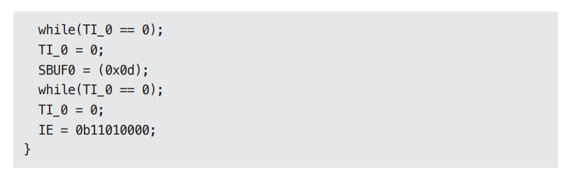

# **클린 임베디드 아키텍처**  
더그 슈미트의 블로그에서 "국방부가 사용하는 소프트웨어를 계속 뒷받침하는 일이 점점 중요해지다"라는 기사를 읽었다. 더그는 다음과 같이 주장했다.  
  
- "소프트웨어는 닳지 않지만 펌웨어와 하드웨어는 낡아 가므로 결국 소프트웨어도 수정해야 한다."  
  
무언가가 명쾌해지는 순간이었다. 더그는 뻔하다고 여겼던 (하지만 뻔하지 않을 수도 있던) 두 가지 용어를 언급했다. 소프트웨어는 긴 시간 유용하게 쓸 수 
있는 것인 반면 펌웨어는 하드웨어가 발전할수록 낡아 갈 것이다. 임베디드 시스템을 조금이라도 개발해 봤다면 하드웨어는 계속해서 발전하고 또 개선된다는 
사실을 알고 있을 것이다. 그와 동시에 '소프트웨어'에는 새로운 기능들이 추가되면서 복잡도가 계속해서 증가한다.  
  
그래서 더그의 주장에 다음과 같이 덧붙이고자 한다.  
  
- 소프트웨어는 닳지 않지만 펌웨어와 하드웨어에 대한 의존성을 관리하지 않으면 안으로부터 파괴될 수 있다.  
  
잠재적으로 오래 살아남을 수 있던 임베디드 소프트웨어가 하드웨어 의존성에 오염되는 바람에 짧게 삶을 마감하는 일은 드물지 않다.  
  
더그가 내린 펌웨어 정의가 마음에 들지만 또 다른 정의도 몇 가지가 있다.  
  
- "펌웨어는 ROM, EPROM 혹은 플래시 메모리 같은 비휘발성 메모리에 유지된다."  
- "펌웨어는 하드웨어 장치에 프로그래밍된 소프트웨어 프로그램 혹은 명령어 집합이다."  
- "펌웨어는 개별 하드웨어에 내장되는 소프트웨어다."  
- "펌웨어는 읽기 전용 메모리(ROM)에 쓰여진 소프트웨어(프로그램이나 데이터)다."  
  
더그의 표현은 통상적으로 받아들여지던 펌웨어에 대한 정의가 틀렸거나 최소한 한물갔다는 사실을 깨닫게 해 주었다. ROM에 상주하는 코드만이 펌웨어는 
아니다. 저장되는 위치가 펌웨어를 정의하지는 않는다. 이보다는 무엇에 의존하는지, 그리고 하드웨어 발전에 맞춰 수정하기가 얼마나 어려운지에 따라 
정의된다. 하드웨어는 발전할 수밖에 없고 그러한 현실을 염두에 두고 임베디드 코드를 구조화할 수 있어야 한다.  
  
우리가 정말로 원하는 건 펌웨어는 더 적게 만들고 소프트웨어는 더 많이 만드는 것이다.  
  
임베디드 엔지니어가 아닌 엔지니어들 또한 펌웨어를 작성한다. 임베디드 엔지니어가 아닌 당신도 코드에 SQl을 심어 놓거나 개발하는 코드 전반에 플랫폼 
의존성을 퍼뜨려 놓는다면 본질적으로 펌웨어를 작성하는 셈이다. 안드로이드 앱 개발자 역시 업무 로직을 안드로이드 API로부터 분리하지 않는다면 펌웨어를 
작성하는 셈이다.  
  
제품 코드(소프트웨어)가 제품의 하드웨어와 상호작용하는 코드(펌웨어)와 구분되지 않을 정도로 불분명한 경계에서 엄청난 노력을 들여왔다.  
  
엔지니어와 프로그래머에게 전하는 메시지는 분명하다. 펌웨어를 수없이 양산하는 일을 멈추고 코드에게 유효 수명을 길게 늘릴 수 있는 기회를 주어라. 
물론 단순히 요구한다고 해서 일이 성사되지는 않는다. 어떻게 하면 임베디드 소프트웨어 아키텍처를 깔끔하게 유지할 수 있는지, 그래서 소프트웨어가 
오랫동안 유용하게 살아남을 가능성을 높일 수 있는지를 살펴보자.  
  
# **앱-티튜드 테스트**  
왜 잠재적인 임베디드 소프트웨어는 그렇게도 많이 펌웨어로 변하는가? 임베디드 코드가 동작하게 만드는 데 대부분의 노력을 집중하고, 오랫동안 유용하게 
남도록 구조화하는 데는 그리 신경 쓰지 않기 때문으로 보인다. 켄트백은 소프트웨어를 구축하는 세 가지 활동을 다음과 같이 기술했다. (인용된 문장은 켄트가 한 
말이며 그 옆에 덧붙인 말은 저자의 해석이다).  
  
- "먼저 동작하게 만들어라". 소프트웨어가 동작하지 않는다면 사업은 망한다.  
- "그리고 올바르게 만들어라." 코드를 리팩토링해서 당신을 포함한 나머지 사람들이 이해할 수 있게 만들고 요구가 변경되거나 요구를 더 잘 이해하게 
되었을 때 코드를 개선할 수 있게 만들어라.  
- "그리고 빠르게 만들어라." 코드를 리팩토링해서 '요구되는' 성능을 만족시켜라.  
  
현장에서 지켜본 수많은 임베디드 시스템 소프트웨어는 "동작하게 하라"는 활동만을 염두에 두고 작성된 것처럼 보인다. 또는 아마도 "빠르게 만들어라"라는 
목표에도 집착하는데 이는 아주 세세한 최적화를 틈만 나면 수행해야 달성되는 목표다. 프렌드 브룩스는 맨먼스 미신에서 "버리기 위한 계획을 세우라"고 
제안했다. 켄트와 프레드는 사실상 똑같은 충고를 하고 있다. 동작하는 것을 배워라. 그리고 나서 더 나은 해결책을 만들어라.  
  
이러한 문제들은 임베디드 소프트웨어만 국한되지 않는다. 임베디드가 아닌 대다수의 앱들도 코드를 올바르게 작성해서 유효 수명을 길게 늘리는 데는 거의 
관심 없이 그저 동작하도록 만들어진다.  
  
앱이 동작하도록 만드는 것을 저자는 개발자용 앱-티튜트 테스트라고 부른다. 임베디드 전문인지와 관계없이, 프로그래머가 오직 앱이 동작하도록 만드는 
일만 신경 쓴다면 자신의 제품과 고용주에게 몹쓸 짓을 하는 것이다. 프로그래밍에는 단순히 앱이 동작하도록 만드는 것보다 중요한 것이 훨씬 많다.  
  
앱-티튜드 테스트를 통과하기 위해 작성된 코드의 예로 작은 임베디드 시스템의 한 파일에서 찾은 다음 함수들을 한번 보자.  
  
  
  
이 함수 목록은 소스 파일에서 발견한 순서 그대로다. 이제 이 함수를 분류해서 관련된 것끼리 묶을 것이다.  
  
- 도메인 로직을 포함하는 함수들  
  
  
- 하드웨어 플랫폼을 설정하는 함수들  
  
  
- 전원 버튼에 반응하는 함수들  
  
  
- 하드웨어로부터 A/D 입력을 읽어 들이는 함수  
  
  
- 영구 저장소에 값을 저장하는 함수들  
  
  
- 함수의 이름과 함수가 하는 일이 다른 함수  
  
  
이 애플리케이션에서 다른 파일 몇 개를 살펴보니 코드를 이해하는 데 방해가 되는 장애물이 많다는 사실을 발견했다. 또한 이 코드는 특정 임베디드 장치에서만 
테스트할 수 있음을 암시하는 파일 구조를 포함하고 있었다. 이 코드의 거의 모든 부분이 자신이 특수한 마이크로프로세서 아키텍처에서 동작한다는 사실을 
알고 있었다. 코드를 특정 툴 체인과 마이크로프로세서에 구속해 버리는 '확장된' C 언어 구조를 사용했기 떄문이다. 아 제품이 다른 하드웨어 환경으로 
이식될 가능성이 전혀 없다면 몰라도 이 코드는 유효 수명을 길게 유지할 길이 아예 없어 보였다.  
  
이 애플리케이션은 동작한다. 엔지니어는 앱-티튜드 테스트를 통과했다.  
  
하지만 이 애플리케이션이 클린 임베디드 아키텍처를 가진다고 말하기는 어렵다.  
  
# **타깃-하드웨어 병목현상**  
임베디드 개발자들은 임베디드가 아니었다면 다루지 않아도 될 특수한 관심사를 많이 가지고 있다. 예를 들면 제한된 메모리 공간, 실시간성 제약과 처리완료 
시간, 제한된 입출력, 특이한 사용자 인터페이스, 여러 센서와 실제 상호작용 등이다. 이러한 유형의 시스템을 개발하는 엔지니어에게는 개발 시점에 코드를 
실행할 대상조차 없을 수도 있다. 이 정도는 그리 나쁜 상황은 아니다. 심지어는 하드웨어가 준비되더라도 하드웨어 자체에 결함이 있을 가능성이 높고 그래서 
소프트웨어 개발은 평소보다 훨씬 느리게 진척된다.  
  
임베디드는 특별하다. 임베디드 엔지니어는 특별하다. 하지만 이 책에서 말하는 원칙을 임베디드 시스템에 적용 못할 정도로 특별하지는 않다.  
  
임베디드가 지닌 특수한 문제 중 하나는 타깃-하드웨어 병목현상(target-hardware bottleneck)이다. 임베디드 코드가 클린 아키텍처 원칙과 실천법을 
따르지 않고 작성된다면 대개의 경우 코드를 테스트할 수 있는 환경이 해당 특정 타깃으로 국한될 것이다. 그리고 그 타깃이 테스트가 가능한 유일한 장소라면 
타깃-하드웨어 병목현상이 발생하여 진척이 느려질 것이다.  
  
# **클린 임베디드 아키텍처는 테스트하기 쉬운 임베디드 아키텍처다**  
몇 가지 아키텍처 원칙을 임베디드 소프트웨어와 펌웨어에 적용하여 타깃-하드웨어 병목현상을 줄이는 방법을 살펴보자.  
  
# **계층**  
  
  
계층에는 여러 가지가 있다. 먼저 위 그림부에서 나타낸 세 개의 계층부터 시작하자. 맨 하단에는 하드웨어가 있다. 더그가 경고했듯이 하드웨어는 기술의 발전과 
무어의 법칙에 따라 변할 것이다. 부품은 낡게 되고 새로운 부품은 적은 전력을 사용하면서도 더 나은 성능을 제공하며 더 저렴할 것이다. 어떤 이유에서든 
이처럼 불가피하게 하드웨어를 변경해야 하는 시점이 마침내 닥쳤을 때 임베디드 엔지니어로서 필요 이상의 작업을 하기를 원치 않는다.  
  
  
  
최소한 하드웨어가 정의된 이후라면 하드웨어와 나머지 시스템 사이의 분리는 주어진다(위 그림). 이 상태에서 앱-티튜드 테스트를 해보면 대체로 문제가 발생한다. 
하드웨어 관련 정보가 코드 전체를 오염시키지 못하게 막을 방법이 전혀 없다. 무엇을 어디에 위치시킬지 그리고 한 모듈이 다른 모듈에 대해 어디까지 알게 
할지를 신중하게 처리하지 않는다면 완성된 코드는 변경하기가 매우 어렵게 된다. 하드웨어가 변경될 때만을 이야기하는 게 아니다. 사용자가 변경을 요청할 
때나 버그를 고쳐야 할 떄도 마찬가지다.  
  
소프트웨어와 펌웨어가 서로 섞이는 일은 안티 패턴이다. 이 안티 패턴을 보이는 코드는 변화에 저항하게 된다. 변경하기 어려울 뿐 아니라 변경하는 일 
자체가 위험을 수반하여 때로는 의도치 않은 결과를 불러온다.  
  
가벼운 변경에도 시스템 전체를 대상으로 회귀 테스트를 전부 실행해야 한다. 기기를 외부적으로 테스트할 수 있게 구성하지 않았다면 지루한 수동 테스트를 
비켜갈 방법이 없다. 그리고 새로운 버그 보고서가 다시 만들어질 것이다.  
  
# **하드웨어는 세부사항이다**  
  
  
위 그림에서 보듯이 소프트웨어와 펌웨어 사이의 경계는 코드와 하드웨어 사이의 경계와는 달리 잘 정의하기가 대체로 힘들다.  
  
  
  
임베디드 소프트웨어 개발자가 해야 할 일 하나는 이 경계를 분명하게 만드는 것이다. 소프트웨어와 펌웨어 사이의 경계는 하드웨어 추상화 계층(Hardware 
abstraction Layer, HAL) 이라고 부른다. (위 그림)  
  
HAL은 새로운 생각이 아니다. PC에는 윈도우가 있기 이전부터 HAL이 있었다.  
  
HAL은 자신보다 위에 있는 소프트웨어를 위해 존재하므로 HAL의 API는 소프트웨어의 필요에 맞게 만들어져야 한다. 한 가지 예로 펌웨어는 바이트 또는 바이트의 
배열을 플래시 메모리에 저장할 수 있다. 반대로 애플리케이션에서는 이름/값과 같이 쌍으로 된 데이터를 영속성 장치에 저장하거나 읽을 수 있어야 한다.  
  
# **HAL 사용자에게 하드웨어 세부사항을 드러내지 말라**  
클린 임베디드 아키텍처로 설계된 소프트웨어는 타깃 하드웨어에 관계없이 테스트가 가능하다. HAL을 제대로 만들었다면 HAL은 타깃에 상관없이 테스트할 수 있는 
경계층 또는 일련의 대체 지점을 제공한다.  
  
# **프로세서는 세부사항이다**  
임베디드 애플리케이션이 특수한 툴 체인을 사용한다면 이러한 툴 체인은 <i>도움<i>이 되는 헤더 파일을 제공할 때가 많다. 흔히 이런 툴 체인의 컴파일러는 
C 언어를 제멋대로 변경하여 해당 업체의 프로세서 기능에 접근할 수 있는 새로운 키워드를 제공하곤 한다. 그러헤 되면 이 코드는 C처럼 보이겠지만 더 이상 
C가 아니다.  
  
프로세서 제작 업체가 제공하는 C 컴파일러는 종종 전역 변수처럼 보이는 것들을 제공하여 프로세서 레지스터, 입출력 포트, 클럭 타이머, 입출력 비트, 
인터럽트 컨트롤러 및 프로세서 관련 나머지 함수들에 직접 접근하도록 해준다. 이러한 대상들에 쉽게 접근하는 데는 도움이 되겠지만 이 기능을 사용해 버리면 
그 코드는 더 이상 C가 아니라는 사실을 인식해야 한다. 다른 프로세서에서는 컴파일되지 않을 것이고 심지어는 동일한 프로세서라도 다른 컴파일러로는 컴파일하지 
못할 수도 있다.  
  
실리콘 칩이나 툴 제공 업체가 자신만의 이익을 생각하여 다른 제품들이 자신의 컴파일러에 종속되게 만들었다고 생각하고 싶지는 않다. 이들 제공 업체가 
진심으로 도우려 한다고 가정하고 일단 믿어 보기로 하자. 그러면 이제 어떻게 해야 미래를 망치지 않는 선에서 이들의 도움을 받을 수 있을지를 결정하는 일은 
당신의 몫이다. 당신은 C를 확장한 요소를 아는 파일을 제한해야 한다.  
  
애크미(ACME) 사의 DSP 제품군용으로 설계된 다음의 헤더 파일을 한번 보자  
  
  
  
  
acmetypes.h 헤더 파일은 절대로 직접 사용해서는 안 된다. 직접 사용하면 당신의 코드가 애크미의 DSP 중 하나에 종속되어 버린다. 애크미의 DSP를 
사용 중인데 대체 뭐가 잘못이냐고? 이 헤더 파일을 포함하지 않으면 당신의 코드를 컴파일할 수 없다. 이 헤더 파일을 사용해서 _ACME_X42나 _ACME_A42 
를 정의하면 타깃이 아닌 하드웨어에서 코드를 테스트할 때 정수 변수는 잘못된 크기를 가지게 될 것이다. 이 정도까지는 괜찮더라도 언젠가 애플리케이션을 
다른 프로세서로 이식하기를 원할 때 더 큰 문제가 터진다. 이식성을 고려하지 않고 애크미의 헤더를 사용하는 파일을 소수로 제한하지 않는다면 이식 작업이 
훨씬 어려워진다.  
  
acmetypes.h를 사용하기보다는 더 표준화된 방법인 stdint.h를 사용하려고 노력해야 한다. 하지만 타깃 컴파일러에서 stdint.h를 제공하지 않는다면? 
이 헤더 파일은 직접 작성할 수 있다. 타깃 하드웨어용으로 빌드하기 위해 작성한 stdint.h는 다음과 같이 acmetypes.h를 사용하여 타깃에서 컴파일할 수 
있도록 해준다.  
  
  
  
임베디드 소프트웨어와 펌웨어가 stdint.h를 사용하도록 만들면 깔끔하며 이식 가능한 코드를 만들고 유지하는 데 도움이 된다. 모든 소프트웨어는 반드시 
프로세서에 독립적이여야 함이 분명하지만 모든 펌웨어가 그럴 수는 없다. 다음의 토막 코드는 특수한 C 확장 기능을 활용하여 마이크로 컨트롤러 내부의 
주변장치에 접근한다. 당신의 제품은 이 마이크로 컨트롤러를 사용중일 가능성이 높으며 따라서 해당 컨트롤러의 통합된 주변장치를 사용할 수 있다. 
이 함수는 직렬 출력 포트에 "hi" 라는 한 줄을 출력한다.  
  
  
  
  
이 조그만 함수에도 수많은 문제가 있다. 눈에 금방 들어올 문제 하나는 0b11000000의 존재다. 이진 표기법은 멋지다. 그런데 C에서 사용할 수 있나? 
안타깝지만 불가능하다. 이 외에도 이 코드에는 C 확장 기능을 직접 사용해서 문제가 되는 부분이 몇 군데 더 있다.  
  
- IE: 인터럽트 활성화 비트  
- SBUF0: 직렬 출력 버퍼  
- TI_0: "직렬 송신 버퍼가 비어 있음"인터럽트. 1이 들어오면 버퍼가 비어 있음을 가리킨다.  
  
실제로 대문자 변수들은 마이크로 컨트롤러에 내장된 주변장치에 접근한다. 인터럽트와 출력 문자를 제어하고자 할 떄 반드시 이들 주변장치를 사용해야 한다. 
물론 이는 편리한 기능이다. 하지만 이 코드는 C가 아니다.  
  
클린 임베디드 아키텍처라면 이들 장치 접근 레지스터를 직접 사용하는 코드는 소수의, 순전히 펌웨어로만 한정시켜야 한다. 이들 레지스터를 알고 있는 것은 
모두 펌웨어가 되어야 하며 따라서 실리콘 칩에 종속된다. 코드를 프로세서와 직접적으로 묶어버리면 안정적인 하드웨어가 출시되기 이전에 코드를 실행시키고자 
할 때 어려움을 겪을 수 있다. 또한 임베디드 애플리케이션을 새로운 프로세서로 이식할 때도 곤란해질 것이다.  
  
이러한 마이크로 컨트롤러를 사용할 때 펌웨어가 저수준 함수들을 프로세서 추상화 계층(Processor Abstraction Layer, PAL)의 형태로 격리시켜줄 수 
있다. PAL 상위에 위치하는 펌웨어는 타깃-하드웨어에 관계없이 테스트할 수 있게 되어 펌웨어 자체도 덜 딱딱해(firm)질 수 있다.  
  
# **운영체제는 세부사항이다**  
HAL은 필수적이다. 하지만 HAL만으로 충분한가? 베어메탈(어떤 소프트웨어도 담겨 있지 않은 하드웨어 또는 하드웨어만을 구매할 수 있는 제품. 여기서는 
운영체제가 없는 임베디드 시스템을 뜻한다. bare-metal) 임베디드 시스템이라면 코드가 운영 환경에 깊숙이 종속되지 않도록 만드는 데 HAL만으로도 충분할 
것이다. 하지만 임베디드 시스템에서 실시간 운영체제를 사용하거나 임베디드 버전의 리눅스/윈도우를 사용한다면?  
  
작성한 코드의 수명을 늘리려면 무조건 운영체제를 세부사항으로 취급하고 운영체제에 의존하는 일을 막아야 한다.  
  

  
소프트웨어는 운영체제를 통해 운영 환경이 제공하는 서비스에 접근한다. OS는 소프트웨어를 펌웨어로부터 분리하는 계층이다. (위 그림) OS를 직접 사용하면 
문제가 된다. 예를 들어 RTOS 제공업체를 다른 기업에서 인수해버려서 OS 사용료가 오르거나 OS 품질이 낮아진다면? 요구사항이 달라졌는데 당장 필요한 
기능을 현재 사용 중인 RTOS에서 제공하지 않는다면? 수많은 코드를 변경해야 할 것이다. 새로운 OS의 API에 맞게 간단히 구문만 고치는 정도로 그치지 않는다. 
새로운 OS가 제공하는 이전 OS와는 다른 기능과 시스템 명령어에 맞게 그 의미 자체를 조정해야 할 가능성이 높다.  
  
  
  
클린 임베디드 아키텍처는 운영체제 추상화 계층(Operating System Abstraction Layer, OSAL)을 통해 소프트웨어를 운영체제로부터 격리시킨다. (위 그림) 
OSAL 구현은 함수 이름을 바꿔주는 정도로 단순할 수도 있다. 또는 여러 함수를 하나로 묶어야 할 수도 있다.  
  
소프트웨어를 특정 RTOS에서 다른 RTOS로 이식해봤다면 이 작업이 얼마나 고통스러운지도 알고 있을 것이다. 소프트웨어가 OS에 직접적으로 의존하는 대신 
OSAL에 의존한다면 이식 작업의 대부분은 기존 OSAL과 호환되도록 새로운 OSAL을 작성하는 데 소요될 것이다. 기존의 복잡한 코드 덩어리를 수정하는 일과 
정의된 인터페이스와 행위에 맞게 새로운 코드를 작성하는 일 중 어떤 일을 하고 싶은가? 답이 뻔한 질문이다.  
  
이제 코드 비대화(code bloat)문제가 염려되기 시작할 수도 있다. 실제로 OSAL은 OS를 사용하는 데 따른 수많은 중복이 격리되어 있는 장소다. 하지만 
이러한 중복이 그다지 큰 비용을 추가로 초래하지는 않는다. OSAL을 정의하는 일은 결국 애플리케이션에서도 공통 구조를 가지도록 힘쓰는 일이기도 하다. 
예를 들어 메시지 전달 메커니즘을 만들어 두어 모든 스레드가 동시성 모델을 일일이 처리하지 않도록 할 수도 있다.  
  
OSAL은 테스트 지점을 만드는 데 도움이 되며 그 덕분에 소프트웨어 계층의 귀중한 애플리케이션 코드를 타깃이나 OS에 관계없이 테스트할 수 있게 된다. 
클린 임베디드 아키텍처를 따른 소프트웨어는 타깃 운영체제에 관계없이 테스트할 수 있다. 제대로 만든 OSAL은 타깃과는 별개로 테스트할 수 있도록 해주는 
경계층 또는 일련의 대체 지점을 제공한다.  
  

