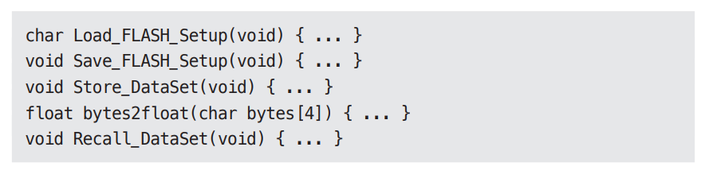

# **클린 임베디드 아키텍처**  
더그 슈미트의 블로그에서 "국방부가 사용하는 소프트웨어를 계속 뒷받침하는 일이 점점 중요해지다"라는 기사를 읽었다. 더그는 다음과 같이 주장했다.  
  
- "소프트웨어는 닳지 않지만 펌웨어와 하드웨어는 낡아 가므로 결국 소프트웨어도 수정해야 한다."  
  
무언가가 명쾌해지는 순간이었다. 더그는 뻔하다고 여겼던 (하지만 뻔하지 않을 수도 있던) 두 가지 용어를 언급했다. 소프트웨어는 긴 시간 유용하게 쓸 수 
있는 것인 반면 펌웨어는 하드웨어가 발전할수록 낡아 갈 것이다. 임베디드 시스템을 조금이라도 개발해 봤다면 하드웨어는 계속해서 발전하고 또 개선된다는 
사실을 알고 있을 것이다. 그와 동시에 '소프트웨어'에는 새로운 기능들이 추가되면서 복잡도가 계속해서 증가한다.  
  
그래서 더그의 주장에 다음과 같이 덧붙이고자 한다.  
  
- 소프트웨어는 닳지 않지만 펌웨어와 하드웨어에 대한 의존성을 관리하지 않으면 안으로부터 파괴될 수 있다.  
  
잠재적으로 오래 살아남을 수 있던 임베디드 소프트웨어가 하드웨어 의존성에 오염되는 바람에 짧게 삶을 마감하는 일은 드물지 않다.  
  
더그가 내린 펌웨어 정의가 마음에 들지만 또 다른 정의도 몇 가지가 있다.  
  
- "펌웨어는 ROM, EPROM 혹은 플래시 메모리 같은 비휘발성 메모리에 유지된다."  
- "펌웨어는 하드웨어 장치에 프로그래밍된 소프트웨어 프로그램 혹은 명령어 집합이다."  
- "펌웨어는 개별 하드웨어에 내장되는 소프트웨어다."  
- "펌웨어는 읽기 전용 메모리(ROM)에 쓰여진 소프트웨어(프로그램이나 데이터)다."  
  
더그의 표현은 통상적으로 받아들여지던 펌웨어에 대한 정의가 틀렸거나 최소한 한물갔다는 사실을 깨닫게 해 주었다. ROM에 상주하는 코드만이 펌웨어는 
아니다. 저장되는 위치가 펌웨어를 정의하지는 않는다. 이보다는 무엇에 의존하는지, 그리고 하드웨어 발전에 맞춰 수정하기가 얼마나 어려운지에 따라 
정의된다. 하드웨어는 발전할 수밖에 없고 그러한 현실을 염두에 두고 임베디드 코드를 구조화할 수 있어야 한다.  
  
우리가 정말로 원하는 건 펌웨어는 더 적게 만들고 소프트웨어는 더 많이 만드는 것이다.  
  
임베디드 엔지니어가 아닌 엔지니어들 또한 펌웨어를 작성한다. 임베디드 엔지니어가 아닌 당신도 코드에 SQl을 심어 놓거나 개발하는 코드 전반에 플랫폼 
의존성을 퍼뜨려 놓는다면 본질적으로 펌웨어를 작성하는 셈이다. 안드로이드 앱 개발자 역시 업무 로직을 안드로이드 API로부터 분리하지 않는다면 펌웨어를 
작성하는 셈이다.  
  
제품 코드(소프트웨어)가 제품의 하드웨어와 상호작용하는 코드(펌웨어)와 구분되지 않을 정도로 불분명한 경계에서 엄청난 노력을 들여왔다.  
  
엔지니어와 프로그래머에게 전하는 메시지는 분명하다. 펌웨어를 수없이 양산하는 일을 멈추고 코드에게 유효 수명을 길게 늘릴 수 있는 기회를 주어라. 
물론 단순히 요구한다고 해서 일이 성사되지는 않는다. 어떻게 하면 임베디드 소프트웨어 아키텍처를 깔끔하게 유지할 수 있는지, 그래서 소프트웨어가 
오랫동안 유용하게 살아남을 가능성을 높일 수 있는지를 살펴보자.  
  
# **앱-티튜드 테스트**  
왜 잠재적인 임베디드 소프트웨어는 그렇게도 많이 펌웨어로 변하는가? 임베디드 코드가 동작하게 만드는 데 대부분의 노력을 집중하고, 오랫동안 유용하게 
남도록 구조화하는 데는 그리 신경 쓰지 않기 때문으로 보인다. 켄트백은 소프트웨어를 구축하는 세 가지 활동을 다음과 같이 기술했다. (인용된 문장은 켄트가 한 
말이며 그 옆에 덧붙인 말은 저자의 해석이다).  
  
- "먼저 동작하게 만들어라". 소프트웨어가 동작하지 않는다면 사업은 망한다.  
- "그리고 올바르게 만들어라." 코드를 리팩토링해서 당신을 포함한 나머지 사람들이 이해할 수 있게 만들고 요구가 변경되거나 요구를 더 잘 이해하게 
되었을 때 코드를 개선할 수 있게 만들어라.  
- "그리고 빠르게 만들어라." 코드를 리팩토링해서 '요구되는' 성능을 만족시켜라.  
  
현장에서 지켜본 수많은 임베디드 시스템 소프트웨어는 "동작하게 하라"는 활동만을 염두에 두고 작성된 것처럼 보인다. 또는 아마도 "빠르게 만들어라"라는 
목표에도 집착하는데 이는 아주 세세한 최적화를 틈만 나면 수행해야 달성되는 목표다. 프렌드 브룩스는 맨먼스 미신에서 "버리기 위한 계획을 세우라"고 
제안했다. 켄트와 프레드는 사실상 똑같은 충고를 하고 있다. 동작하는 것을 배워라. 그리고 나서 더 나은 해결책을 만들어라.  
  
이러한 문제들은 임베디드 소프트웨어만 국한되지 않는다. 임베디드가 아닌 대다수의 앱들도 코드를 올바르게 작성해서 유효 수명을 길게 늘리는 데는 거의 
관심 없이 그저 동작하도록 만들어진다.  
  
앱이 동작하도록 만드는 것을 저자는 개발자용 앱-티튜트 테스트라고 부른다. 임베디드 전문인지와 관계없이, 프로그래머가 오직 앱이 동작하도록 만드는 
일만 신경 쓴다면 자신의 제품과 고용주에게 몹쓸 짓을 하는 것이다. 프로그래밍에는 단순히 앱이 동작하도록 만드는 것보다 중요한 것이 훨씬 많다.  
  
앱-티튜드 테스트를 통과하기 위해 작성된 코드의 예로 작은 임베디드 시스템의 한 파일에서 찾은 다음 함수들을 한번 보자.  
  
  
  
이 함수 목록은 소스 파일에서 발견한 순서 그대로다. 이제 이 함수를 분류해서 관련된 것끼리 묶을 것이다.  
  
- 도메인 로직을 포함하는 함수들  
  
  
- 하드웨어 플랫폼을 설정하는 함수들  
  
  
- 전원 버튼에 반응하는 함수들  
  
  
- 하드웨어로부터 A/D 입력을 읽어 들이는 함수  
  
  
- 영구 저장소에 값을 저장하는 함수들  
  
  
- 함수의 이름과 함수가 하는 일이 다른 함수  
  
  
이 애플리케이션에서 다른 파일 몇 개를 살펴보니 코드를 이해하는 데 방해가 되는 장애물이 많다는 사실을 발견했다. 또한 이 코드는 특정 임베디드 장치에서만 
테스트할 수 있음을 암시하는 파일 구조를 포함하고 있었다. 이 코드의 거의 모든 부분이 자신이 특수한 마이크로프로세서 아키텍처에서 동작한다는 사실을 
알고 있었다. 코드를 특정 툴 체인과 마이크로프로세서에 구속해 버리는 '확장된' C 언어 구조를 사용했기 떄문이다. 아 제품이 다른 하드웨어 환경으로 
이식될 가능성이 전혀 없다면 몰라도 이 코드는 유효 수명을 길게 유지할 길이 아예 없어 보였다.  
  
이 애플리케이션은 동작한다. 엔지니어는 앱-티튜드 테스트를 통과했다.  
  
하지만 이 애플리케이션이 클린 임베디드 아키텍처를 가진다고 말하기는 어렵다.  
  
# **타깃-하드웨어 병목현상**  
임베디드 개발자들은 임베디드가 아니었다면 다루지 않아도 될 특수한 관심사를 많이 가지고 있다. 예를 들면 제한된 메모리 공간, 실시간성 제약과 처리완료 
시간, 제한된 입출력, 특이한 사용자 인터페이스, 여러 센서와 실제 상호작용 등이다. 이러한 유형의 시스템을 개발하는 엔지니어에게는 개발 시점에 코드를 
실행할 대상조차 없을 수도 있다. 이 정도는 그리 나쁜 상황은 아니다. 심지어는 하드웨어가 준비되더라도 하드웨어 자체에 결함이 있을 가능성이 높고 그래서 
소프트웨어 개발은 평소보다 훨씬 느리게 진척된다.  
  
임베디드는 특별하다. 임베디드 엔지니어는 특별하다. 하지만 이 책에서 말하는 원칙을 임베디드 시스템에 적용 못할 정도로 특별하지는 않다.  
  
임베디드가 지닌 특수한 문제 중 하나는 타깃-하드웨어 병목현상(target-hardware bottleneck)이다. 임베디드 코드가 클린 아키텍처 원칙과 실천법을 
따르지 않고 작성된다면 대개의 경우 코드를 테스트할 수 있는 환경이 해당 특정 타깃으로 국한될 것이다. 그리고 그 타깃이 테스트가 가능한 유일한 장소라면 
타깃-하드웨어 병목현상이 발생하여 진척이 느려질 것이다.  
  
# **클린 임베디드 아키텍처는 테스트하기 쉬운 임베디드 아키텍처다**  
몇 가지 아키텍처 원칙을 임베디드 소프트웨어와 펌웨어에 적용하여 타깃-하드웨어 병목현상을 줄이는 방법을 살펴보자.  
  
# **계층**  
  
  
계층에는 여러 가지가 있다. 먼저 위 그림부에서 나타낸 세 개의 계층부터 시작하자. 맨 하단에는 하드웨어가 있다. 더그가 경고했듯이 하드웨어는 기술의 발전과 
무어의 법칙에 따라 변할 것이다. 부품은 낡게 되고 새로운 부품은 적은 전력을 사용하면서도 더 나은 성능을 제공하며 더 저렴할 것이다. 어떤 이유에서든 
이처럼 불가피하게 하드웨어를 변경해야 하는 시점이 마침내 닥쳤을 때 임베디드 엔지니어로서 필요 이상의 작업을 하기를 원치 않는다.  
  
  
  
최소한 하드웨어가 정의된 이후라면 하드웨어와 나머지 시스템 사이의 분리는 주어진다(위 그림). 이 상태에서 앱-티튜드 테스트를 해보면 대체로 문제가 발생한다. 
하드웨어 관련 정보가 코드 전체를 오염시키지 못하게 막을 방법이 전혀 없다. 무엇을 어디에 위치시킬지 그리고 한 모듈이 다른 모듈에 대해 어디까지 알게 
할지를 신중하게 처리하지 않는다면 완성된 코드는 변경하기가 매우 어렵게 된다. 하드웨어가 변경될 때만을 이야기하는 게 아니다. 사용자가 변경을 요청할 
때나 버그를 고쳐야 할 떄도 마찬가지다.  
  
소프트웨어와 펌웨어가 서로 섞이는 일은 안티 패턴이다. 이 안티 패턴을 보이는 코드는 변화에 저항하게 된다. 변경하기 어려울 뿐 아니라 변경하는 일 
자체가 위험을 수반하여 때로는 의도치 않은 결과를 불러온다.  
  
가벼운 변경에도 시스템 전체를 대상으로 회귀 테스트를 전부 실행해야 한다. 기기를 외부적으로 테스트할 수 있게 구성하지 않았다면 지루한 수동 테스트를 
비켜갈 방법이 없다. 그리고 새로운 버그 보고서가 다시 만들어질 것이다.  
  
