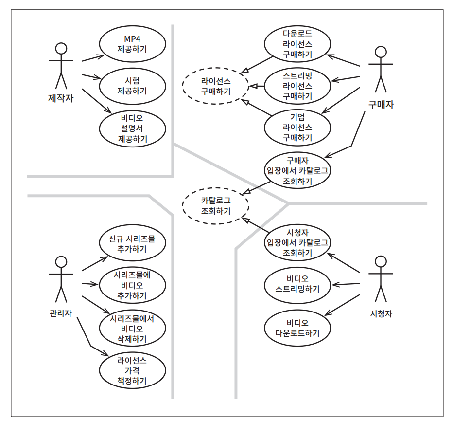
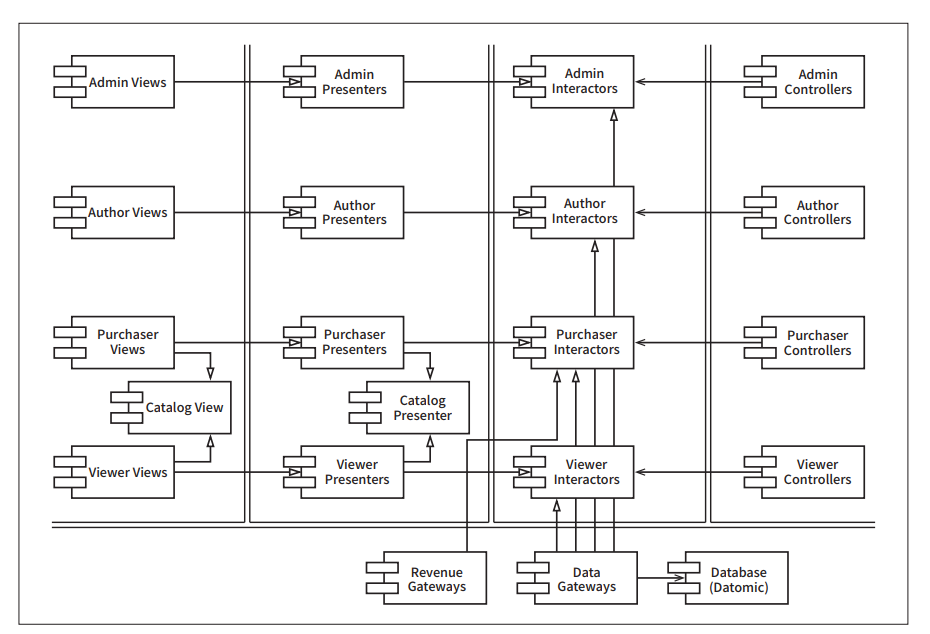

# **사례 연구: 비디오 판매**  
이제 지금까지 살펴본 아키텍처에 대한 규칙과 견해를 종합해서 사례 연구로 적용해 볼 차례다. 짧고 단순한 사례 연구지만 뛰어난 아키텍트가 일을 처리하는 
과정과 결정을 내리는 모습을 보여줄 것이다.  
  
# **제품**  
이번 사례 연구를 위해 다소 친숙한 제품을 선택했다. 바로 웹 사이트에서 비디오를 판매하는 소프트웨어다.  
  
이 소프트웨어의 기본적인 발상은 단순하다. 판매하길 원하는 비디오들이 있고 그걸 개인과 기업에게 웹을 통해 판매한다. 개인은 단품 가격을 지불해 
스트리밍으로 보거나 더 높은 가격을 내고 비디오를 다운로드해서 영구 소장할 수도 있다. 기업용 라이선스는 스트리밍 전용이며 대량 구매를 하면 할인을 
받을 수 있다.  
  
일반적으로 개인은 시청자인 동시에 구매자다. 반면에 기업은 다른 사람들이 시청할 비디오를 구매하는 사람이 따로 있다.  
  
비디오 제작자는 비디오 파일과 비디오에 대한 설명서, 부속 파일을 제공해야 한다. 부속 파일에는 시험, 문제, 해법, 소스 코드 등이 포함된다.  
  
관리자는 신규 비디오 시리즈물을 추가하거나 기존 시리즈물에 비디오를 추가 또는 삭제하며 다양한 라이선스에 맞춰 가격을 책정한다.  
  
시스템의 초기 아키텍처를 결정하는 첫 단계는 액터와 유스케이스를 식별하는 일이다.  
  
# **유스케이스 분석**  
  
  
위 그림은 전형적인 유스케이스 분석을 보여준다.  
  
네 개의 주요 액터는 분명하다. 단일 책임 원칙에 따르면 이들 네 액터가 시스템이 변경되어야 할 네 가지 주요 근원이 된다. 신규 기능을 추가하거나 
기존 기능을 변경해야 한다면 그 이유는 반드시 이들 액터 중 하나에게 해당 기능을 제공하기 위해서다. 따라서 우리는 시스템을 분할하여 특정 액터를 
위한 변경이 나머지 액터에게는 전혀 영향을 미치지 않게 만들고자 한다.  
  
위 그림의 유스케이스 목록은 완벽하지 않다. 예를 들면 로그인이나 로그아웃 관련 유스케이스는 찾을 수가 없다. 이들 유스케이스를 뺀 이유는 문제의 
범위를 이 책에 담을 수 있을 정도로 줄이기 위해서다. 다양한 유스케이스를 모두 포함한다면 이 장은 그 자체로 한 권의 책으로 만들어야 할지도 모른다.  
  
그림 중앙의 점선으로 된 유스케이스를 주목하자. 이들은 추상 유스케이스다. 추상 유스케이스는 범용적인 정책을 담고 있으며 다른 유스케이스에서 이를 
더 구체화한다. 보다시피 시청자 입장에서 카탈로그 조회하기와 구매자 입장에서 카탈로그 조회하기 유스케이스는 모두 카탈로그 조회하기라는 추상 유스케이스를 
상속받는다.  
  
한편 이 추상화를 꼭 생성해야만 했던 건 아니다. 이 추상 유스케이스를 다이어그램에서 없애더라도 전체 제품의 기능을 조금도 손상시키지 않는다. 그러나 이들 
두 유스케이스는 너무 비슷하기 떄문에 유사성을 식별해서 분석 초기에 통합하는 방법을 찾는 편이 더 현명하다고 판단했다.  
  
# **컴포넌트 아키텍처**  
  
이제 엑터와 유스케이스를 식별했으므로 예비 단계의 컴포넌트 아키텍처를 만들어 볼 수 있다 (위 그림).  
  
늘 그렇듯이 그림에서 이중으로 된 선은 아키텍처 경계를 나타낸다. 뷰, 프레젠터, 인터랙터, 컨트롤러로 분리된 전형적인 분할 방법을 확인할 수 있다. 
또한 대응하는 액터에 따라 카테고리를 분리했다는 사실도 확인할 수 있다.  
  
그림에서 각 컴포넌트는 단일 .jar 파일 또는 단일 .dll 파일에 해당한다. 이들 컴포넌트 각각은 자신에게 할당된 뷰, 프레젠터, 인터랙터, 컨트롤러를 포함한다.  
  
특수한 컴포넌트인 Catelog View와 Gatalog Pressenter에 주목해 보자. 이는 카탈로그 조회하기라는 추상 유스케이스를 처리하는 저자의 방식이다. 이 
뷰와 프레젠터는 해당 컴포넌트 내부에 추상 클래스로 코드화될 것이며 상속받는 컴포넌트에서는 이들 추상 클래스로부터 상속받은 뷰와 프레젠터 클래스들을 
포함한다.  
  
정말로 시스템을 이러한 컴포넌트들로 모두 불할해서 여러 개의 .jar나 .dll 파일로 전달해야 할까? 그럴 수도 있고 아닐 수도 있다. 저자는 컴파일과 빌드 
환경은 분명히 이 형태로 나눌 것이며 따라서 각 컴포넌트를 독립적으로 전달할 수 있게 빌드하는 것도 가능할 것이다. 또한 전달해야 할 이 모든 단위를 더 
적은 개수로 합칠 수 있는 권한도 가지고 있다. 예를 들어 위 그림처럼 분할한 경우라면 총 다섯 개의 .jar 파일로 쉽게 합칠 수 있을 것이다. 즉 뷰, 
프레젠터, 인터랙터, 컨트롤러, 유틸리티 각각을 하나의 .jar 파일로 만들 수 있다. 그러면 서로 독립적으로 변경될 가능성이 큰 컴포넌트들을 독립적으로 
배포할 수 있게 된다.  
  
뷰와 프레젠터를 합쳐서 같은 .jar에 두고 인터랙터, 컨트롤러, 유틸리티는 그대로 개별 .jar 파일에 두는 방식도 있다. 더 원시적으로 합치는 방법도 있는데 
두 개의 .jar 파일을 생성해서 하나에는 뷰와 프레젠터를 다른 하느에는 나머지 모두를 포함시키는 방법이다.  
  
이처럼 선택지를 열어 두면 (즉 각 컴포넌트를 독립적으로 컴파일하고 빌드할 수 있는 환경을 구성하면) 후에 시스템이 변경되는 양상에 맞춰 시스템 배포 
방식을 조정할 수 있다.  
  
