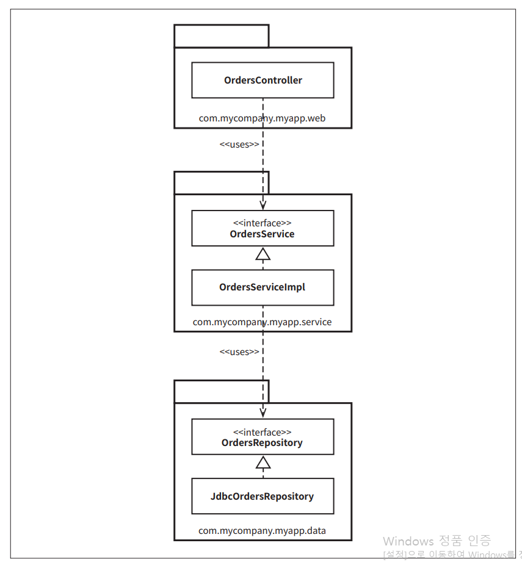
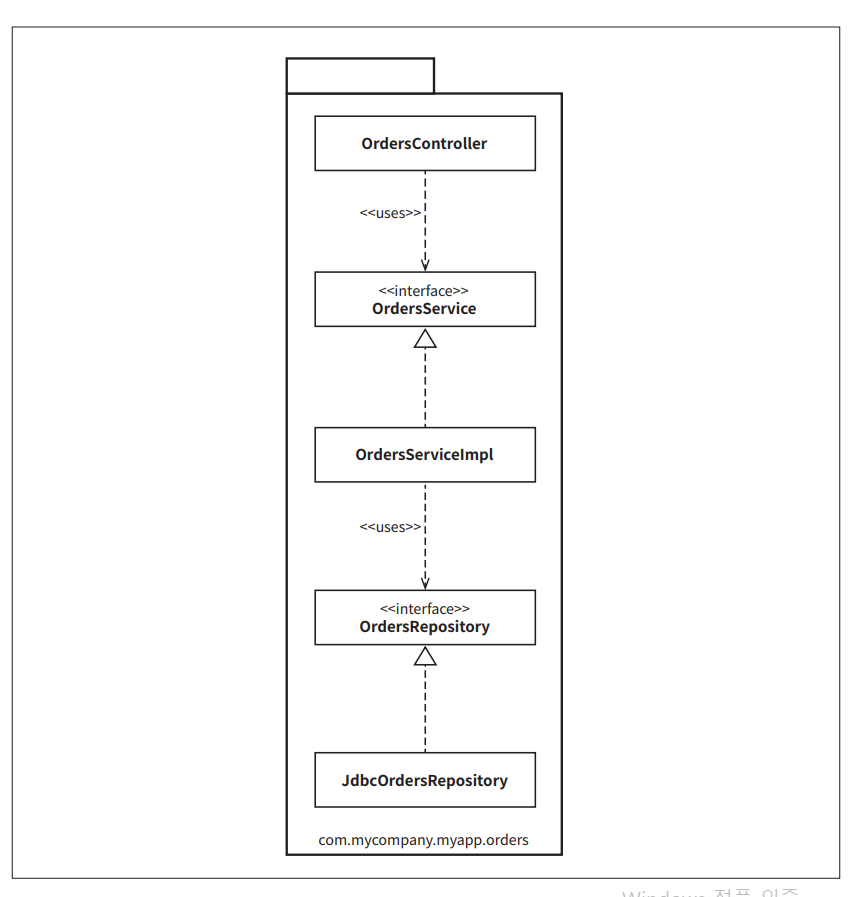
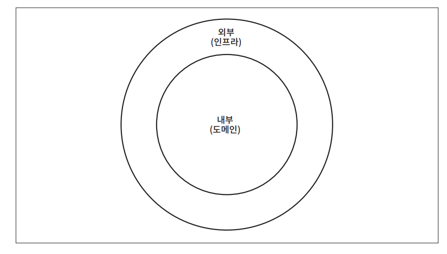
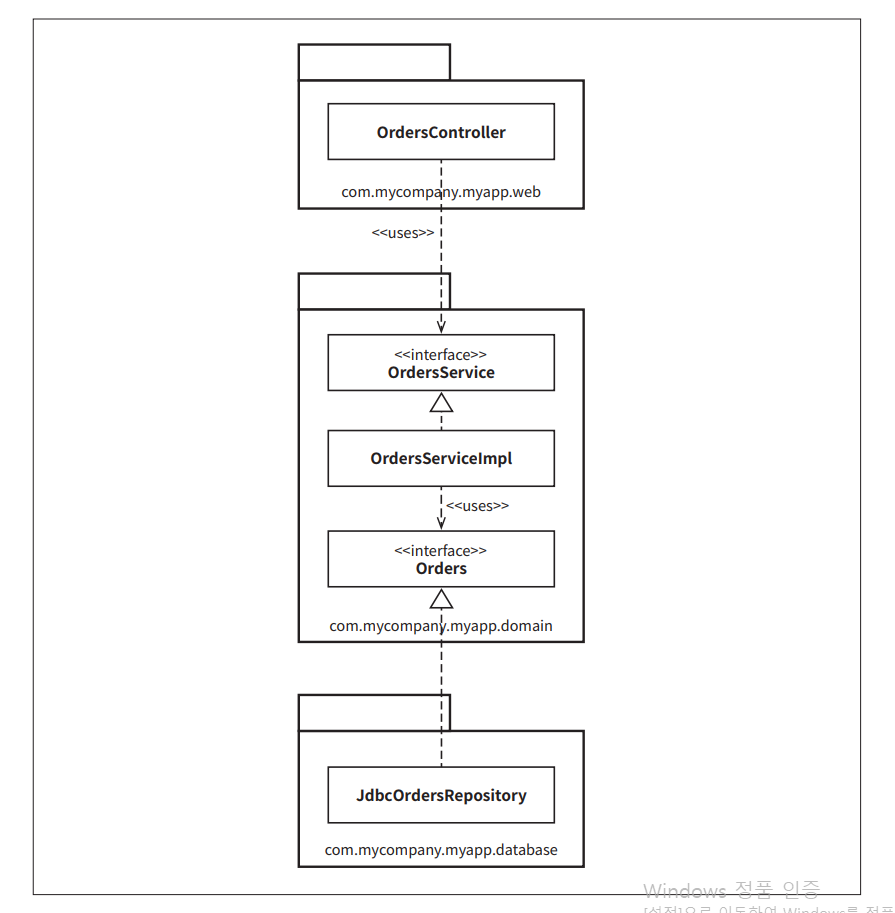
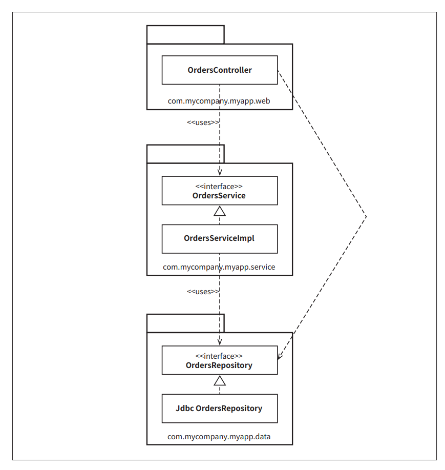
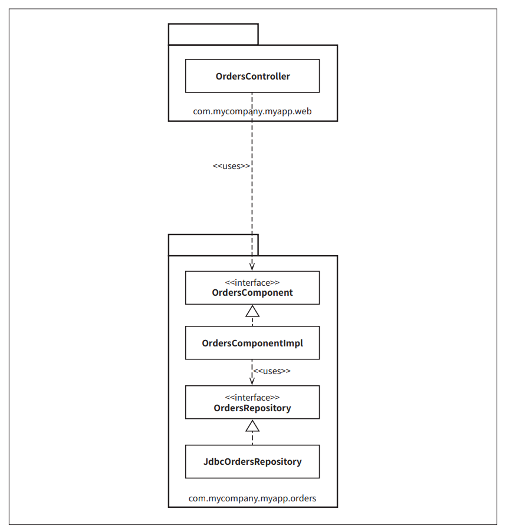
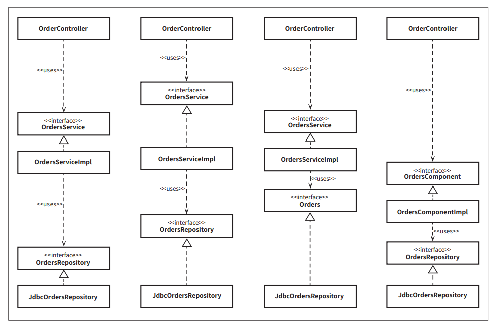
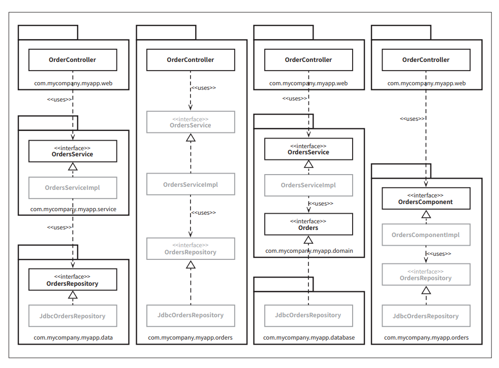
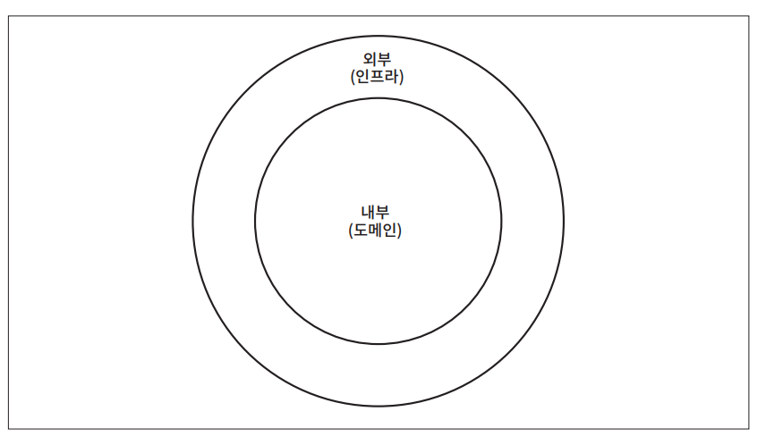

# **빠져 있는 장**  
지금까지 읽은 모든 조언은 더 나은 소프트웨어를 설계하는 데 확실히 도움이 될 것이다. 이러한 소프트웨어는 올바르게 정의된 경계, 명확한 책임, 그리고 통제된 
의존성을 가진 클래스와 컴포넌트로 구성될 것이다. 하지만 악마는 항상 디테일(구현 세부사항)에 있는 법이며 이점을 심사숙고하지 않는다면 마지막 고비에 
걸려 넘어지기 십사일 것이다.  
  
예를 들어 온라인 서점을 구축하고 있으며 고객이 주문 상태를 조회할 수 있어야 한다는 유스케이스를 구현해야 한다고 해 보자. 비록 이 예제에서는 자바를 
사용하지만 그 원칙은 다른 프로그래밍 언어에도 똑같이 적용된다. 클린 아키텍처는 잠시 한쪽으로 제쳐 놓고 설계나 코드 조직화와 관련된 몇 가지 접근법을 
살펴보자.  
  
# **계층 기반 패키지**  
아마도 가장 단순한 첫 번째 설계 방식은 전통적인 수평 계층형 아키텍처다. 기술적인 과점에서 해당 코드가 하는 일에 기반해 그 코드를 분할한다. 흔히 
우리는 이 방식을 계층 기반 패키지라고 부른다.  
  
  
  
위 그림의 UML 클래스 다이어그램에서 계층 기반 패키지가 어떤 모습인지 볼 수 있다.  
  
이 전형적인 계층형 아키텍처에는 웹, 업무 규칙, 영속성 코드를 위해 계층이 각각 하나씩 존재한다. 다시 말해 코드는 계층이라는 얇은 수평 조각으로 
나뉘며 각 계츠응ㄴ 유샇ㄴ 종류의 것들을 묶는 도구로 사용된다. 엄격한 계층형 아키텍처의 경우 계층은 반드시 바로 아래 계층에만 의존해야 한다. 
자바의 경우 계층은 주로 패키지로 구현된다. 그림에서 보듯이 계층(패키지) 사이의 의존성은 모두 아래를 향한다. 이 예에서는 다음의 자바 타입들이 존재한다.  
  
- OrdersController: 웹 컨트롤러이며 웹 기반 요청을 처리한다. Spring MVC 컨트롤러 등이 여기 해당한다.  
- OrderService: 주문 관련 업무 규칙을 정의하는 인터페이스  
- OrderServiceImpl: OrderService의 구현체 (이러한 클래스 명명법은 끔찍한 방시김이 거의 틀림없다. 하지만 나중에 보겠지만 이러한 명명법이 큰 
문제가 되지 않을 수도 있다)  
- OrdersRepository: 영구 저장된 주문 정보에 접근하는 방법을 정의하는 인터페이스  
- JdbcOrdersRepository: OrdersRepository 인터페이스의 구현체  
  
마틴 파울러는 프레젠테이션 도메인 데이터 계층화에서 처음 시작하기에는 계층형 아키텍처가 적합하다고 얘기했다. 이게 마틴 만의 얘기는 아니다. 다수의 책, 
튜토리얼, 교육 과정, 샘플 코드 또한 계층형 아키텍처를 만드는 길로 인도한다. 이 아키텍처는 엄청난 복잡함을 겪지 않고도 무언가를 작동시켜 주는 
아주 빠른 방법이다. 문제는 마틴이 지적했듯이 소프트웨어가 커지고 복잡해지기 시작하면 머지 않아 큰 그릇 세 개만으로 모든 코드를 담기엔 부족하다는 
사실을 깨닫고 더 잘게 모듈화해야 할지를 고민하게 될 것이다.  
  
엉클 밥이 이미 언급했듯이 계층형 아키텍처는 업무 도메인에 대해 아무것도 말해주지 않는다는 문제도 있다. 전혀 다른 업무 도메인이라도 코드를 계층형 
아키텍처로 만들어서 나란히 놓고 보면 웹, 서비스, 리포지터리로 구성된 모습이 기분 나쁠 정도로 비슷하게 보일 것이다. 계층형 아키텍처는 이 밖에도 
큰 문제가 있다.  
  
# **기능 기반 패키지**  
코드를 조직화하는 또 다른 선택지로 기능 기반 패키지 구조도 있다. 이는 서로 연관된 기능, 도메인 개념, 또는 (도메인 주도 설계 용어를 사용한다면) 
Aggregate Root(도메인 주도 설계에 나온 개념으로 AggreGate는 데이터 변경의 단위로 다루는 연관 객체의 묶음이다. 모든 Aggregate는 Root를 가지며 
외부에서 객체에 접근할 때는 반드시 Aggregate Root를 통해야 한다)에 기반하여 수직의 얇은 조각으로 코드를 나누는 방식이다. 전형적인 구현에서는 
모든 타입이 하나의 자바 패키지에 속하며 패키지 이름은 그 안에 담긴 개념을 반영해 짓는다.  
  
  
  
위 그림에서 보듯이 등장하는 인터페이스와 클래스는 이전과 같지만 모두가 (세 개가 아닌) 단 하나의 패키지에 속하게 된다. 이는 계층 기반 패키지를 
아주 간단히 리팩토링한 형태지만 이제 코드의 상위 수준 구조가 업무 도메인에 대해 무언가를 알려주게 된다. 드디어 우리는 이 코드 베이스가 웹, 서비스, 
피로지터리가 아니라 주문과 관련한 무언가를 한다는 걸 볼 수 있다.  
  
또 다른 이점으로 주문 조회하기 유스케이스가 변경될 경우 변경해야 할 코드를 모두 찾는 작업이 더 쉬워질 수 있다. 변경해야 할 코드가 여러 군데 퍼져 
있지 않고 모두 한 패키지에 담겨 있기 떄문이다.  
  
소프트웨어 개발팀이 수평적 계층화(계층 기반 패키지)의 문제를 깨닫고 수직적 계층화(기능 기반 패키지)로 전환하는 걸 자주 목격했다. 두 접근법은 모두 
차선책이다.  
  
# **포트와 어댑터**  
엉클 밥에 따르면 포트와 어댑터(Ports and Adapters) 혹은 육각형 아키텍처(Hexagonal Architecture), 경계, 컨트롤러, 엔티티 등의 방식으로 접근하는 
이유는 업무/도메인에 초점을 둔 코드가 프레임워크나 데이터베이스 같은 기술적인 세부 구현과 독립적이며 분리된 아키텍처를 만들기 위해서다.  
  
  
  
요약하자면 위 그림에서 제시하는 것처럼 그런 코드 베이스는 내부(도메인)와 외부(인프라)로 구성됨을 흔히 볼 수 있다.  
  
내부 영역은 도메인 개념을 모두 포함하는 반면 외부 영역은 외부 세계(예를 들면 UI, 데이터베이스, 서드파티 통합)와의 상호작용을 포함한다. 여기서 
주요 규칙은 바로 외부가 내부에 의존하며 절대 그 반대로는 안된다는 점이다.  
  
  
  
위 그림에서는 주문 조회하기 유스케이스를 이 방식으로 구현한 모습이다.  
  
여기에서 com.mycompany.myapp.domain 패키지가 내부이며 나머지 패키지는 모두 외부다. 의존성이 내부를 향해 흐르는 모습에 주목하라. 이전 다이어그램의 
OrderRepository가 Orders라는 간단한 이름으로 바뀌었음을 눈치챘을 것이다. 이는 도메인 주도 설계라는 세계관에서 비롯된 명명법으로 도메인 주도 
설계에서는 내부에 존재하는 모든 것의 이름은 반드시 유비쿼터스 도메인 언어 관점에서 기술하라고 조언한다. 바꿔 말하면 도메인에 대해 논의할 때 우리는 
주문에 대해 말하는 것이지 주문 리포지터리에 대해 말하는 것이 아니다.  
  
이 그림은 UML 클래스 다이어그램을 간소화할 때 어떻게 표현할 수 있는지를 보여준다는 점도 짚고 갈 만하다. 이 다이어그램에는 인터랙터가 빠졌고 
의존성 경계를 가로질러 데이터를 마샬링하는 객체 등이 누락되었다.  
  
# **컴포넌트 기반 패키지**  
SOLID, REP, CCP, CRP 조언에 대해서 전적으로 동감하지만 코드를 조직화하는 방법에 대해서는 다소 다른 결론에 이르렀다. 그래서 또 다른 선택지를 
제시하려고 하는데 저자는 이 방법을 컴포넌트 기반 패키지라고 부른다.  
  
저자의 프로젝트 대다수는 자바 프로젝트였으며 여러 다양한 업무 도메인을 넘나들며 일해 왔다. 또한 엄청나게 다양한 소프트웨어 시스템을 경험했다. 비록 
기술은 달랐지만 공통된 테마가 있었늗네 바로 대다수가 전통적인 계층형 아키텍처를 기반으로 했다는 사실이다.  
  
계층형 아키텍처를 좋지 않은 아키텍처로 여겨야 하는 이유를 몇 가지 들었지만 이게 전부는 아니다. 계층형 아키텍처의 목적은 기능이 같은 코드끼리 서로 
분리하는 것이다. 웹 관련 코드는 업무 로직으로부터 분리하고 업무 로직은 다시 데이터 접근으로부터 분리한다. UML 클래스 다이어그램에서 봤듯이 구현 
관점에서 보면 각 계층은 일반적으로 자바 패키지에 해당한다. 코드의 접근성 관점에서 Orderscontroller가 OrderService 인터페이스에 의존하려면 
OrdersService 인터페이스는 반드시 public으로 선언되어야 하는데 두 인터페이스는 서로 다른 패키지에 속하기 떄문이다. 마찬가지로 OrdersRepository 
인터페이스도 public이어야만 repository 패키지 외부에 있는 OrdesServiceImpl 클래스에서 접근할 수 있다.  
  
엄격한 계층형 아키텍처에서는 의존성 화살표는 항상 아래를 향해야 하며 각 계층은 반드시 바로 아래 계층에만 의존해야 한다. 이런 방식으로 멋지고 깔끔한 
비순환 의존성 그래프를 만들 수 있을 거라 생각할 수도 있지만 정말로 코드 베이스의 요소들이 서로 의존할 때는 몇 가지 규칙을 반드시 지켜야 한다. 
그런데 여기에는 큰 문제가 있다. 속임수를 써서 몇몇 의존성을 의도치 않은 방식으로 추가하더라도 보기에는 여전히 좋은 비순환 의존성 그래프가 생성된다는 
사실이다.  
  
예를 들어 팀에서 신규 인력을 고용하여 주문과 관련된 또 다른 유스케이스를 구현하라고 지시했다고 가정해 보자. 이 사람은 신입인 탓에 이 유스케이스를 
가능한 한 빨리 구현해서 깊은 인상을 남기고 싶어한다. 이 개발자는 OrdersController 클래스가 이미 존재한다는 사실을 발견하고는 주문 관련 웹 페이지의 
신규 코드를 추가할 위치라고 결정을 내린다. 그런데 데이터베이스로부터 주문과 관련된 몇 가지 데이터가 필요해졌다. 신입은 깨닫는다. "OrdersRepository 
인터페이스도 만들어져 있군. 이제 단순히 이 구현체를 내가 만들 컨트롤러에 의존성으로 주입하면 될 거야."라고 말이다. 잠시 동안 코드를 간단히 조작해서 
웹 페이지가 동작하도록 만든다.  
  
  
  
하지만 그 결과 만들어진 UML 다이어그램은 위 그림과 같다.  
  
의존성 화살표는 여전히 아래를 향하지만 이제 몇몇 유스케이스에서는 OrdersController가 OrdersService를 우회하고 있다. 이러한 조직화는 계층이 
인접한 계층(들)을 건너뛰는 일이 허용되기 떄문에 흔히 완화된 계층형 아키텍처라고 부른다.경우에 따라 이는 의도된 결과이기도 한데 예를 들어 CQRS 패턴
(Command Query Responsibility Segregation 패턴은 데이터를 변경하고 조회하는 패턴을 서로 분리한다.)을 지키려고 시도하는 경우다. 이외의 
경우에서는 업무 로직 계층을 우회하는 일은 바람직하지 못하다. 특히 개별 레코드에 대해 인증된 접근만을 허용하는 일을 업무 로직이 책임지는 경우라면 
더더욱 그렇다.  
  
새로운 유스케이스가 동작은 하곘지만 우리가 기대하는 형태로 구현되지는 않았다. 저자가 컨설턴트로서 방문했던 수많은 팀에서 이러한 현상을 목격했으며 
대개 팀의 코드 베이스의 모습을 시각화하기 시작할 때 처음으로 드러나곤 했다.  
  
여기에서 우리에게 필요한 것은 지침(아키텍처 원칙)으로 "웹 컨트롤러는 절대로 리포지토리에 직접 접근해서는 안 된다"와 같은 원칙이 필요하다. 물론 문제는 
강제성이다. 저자가 만나 본 많은 팀이 "우리는 훌륭한 규율, 코드 리뷰를 통해서 이 원칙을 강제합니다. 우리는 개발자를 믿습니다" 라며 쉽게 말하곤 
했다. 이 같은 신뢰는 듣기에는 좋지만 자금이 바닥나거나 납기가 다가오면 무슨 일이 벌어지는지를 우리는 이미 잘 알고 있다.  
  
훨씬 적은 수의 팀만이 빌드 시 정적 분석 도구(예, NDepend, Structure101, Checkstyle)를 사용해서 아키텍처적인 위반 사항이 없는지를 검사하여 
자동으로 강제한다고 답했다. 아마도 이러한 규칙을 본 적이 있을 텐데 대체로 정규 표현식이나 와일드카드 문자열로 표현되며 "**/web" 패키지에 있는 
타입은 절대로 **/data에 있는 타입에 접근해서는 안 된다와 같은 형태다. 그리고 이들 규칙은 컴파일 단계가 끝난 후 실행된다.  
  
이 방식은 다소 조잡하지만 효과가 있는데 팀 차원에서 정의한 아키텍처 원칙을 위반하는 항목을 알려주고 위반 시 빌드가 실패하기(를 당신이 기대하기) 
떄문이다. 하지만 두 접근법 모두 오류가 있을 수 있으며 그 결과를 알게 되는 주기가 필요 이상으로 길다는 문제가 있다. 손을 쓰지 않고 그대로 둔다면 
이러한 실천법은 코드 베이스를 'Big Ball of Mud' (안티 패턴의 하나로 엉망진창인 방식으로 볼 수 있다)로 만들어 버릴 것이다. 개인적으로는 가능하면 
컴파일러를 사용해서 아키텍처를 강제하는 방식을 선호한다.  
  
'컴포넌트 기반 패키지'를 도입해야 하는 이유는 바로 이 때문이다. 이 접근법은 지금까지 우리가 본 모든 것들을 혼합한 것으로 큰 단위의 단일 컴포넌트와 
관련된 모든 책임을 하나의 자바 패키지로 묶는 데 주안점을 둔다. 이 접근법은 서비스 중심적인 시각으로 소프트웨어 시스템을 바라보며 마이크로서비스 
아키텍처가 가진 시각과도 동일하다. 포트와 어댑터에서 웹을 그저 또 다른 전달 메커니즘으로 취급하는 것과 마찬가지로 컴포넌트 기반 패키지에서도 사용자 
인터페이스를 큰 단위의 컴포넌트로부터 분리해서 유지한다.  
  
  
  
위 그림에서 주문 조회하기 유스케이스가 어떤 모습인지 보여준다.  
  
본질적으로 이 접근법에서는 업무 로직과 영속성 관련 코드를 하나로 묶는데 이 묶음을 저자는 컴포넌트라고 부른다. 엉클 밥은 컴포넌트에 대한 정의를 
아래와 같이 제시했다.  
  
- 컴포넌트는 배포 단위다. 컴포넌트는 시스템의 구성 요소로 배포할 수 있는 가장 작은 단위다. 자바의 경우 jar 파일이 컴포넌트다.  
  
컴포넌트에 대한 저자의 정의는 약간 다르다. "컴포넌트는 멋지고 깔끔한 인터페이스로 감싸진 연관된 기능들의 묶음으로 애플리케이션과 같은 실행 환경 
내부에 존재한다." 이 정의는 저자의 C4 소프트웨어 아키텍처 모델에 따른 것으로 소프트웨어 시스템의 정적 구조를 컨테이너, 컴포넌트, 클래스(또는 코드)
의 측면에서 계층적으로 생각하는 간단한 방법이다. 이 방법론에서 소프트웨어 시스템은 하나 이상의 컨테이너(예를 들어 웹 애플리케이션, 모바일 앱, 독립형 
애플리케이션, 데이터베이스, 파일 시스템 등)로 구성되며 각 컨테이너는 하나 이상의 컴포넌트를 포함한다. 또한 각 컴포넌트는 하나 이상의 클래스
(또는 코드)로 구현된다. 이때 각 컴포넌트가 개별 jar 파일로 분리될지 여부는 직교적인 관심사다. (한 요소에서 발생한 변경이 다른 변경에 영향을 미치지 
않을 때 두 요소는 서로 직교 관계라고 말한다. 독립적인 또는 관련이 없는과 동일한 의미다)  
  
컴포넌트 기반 패키지 접근법의 주된 이점은 주문과 관련된 무언가를 코딩해야 할 때 오직 한 곳, 즉 OrdersComponent만 둘러보면 된다는 점이다. 이 
컴포넌트 내부에서 관심사의 분리는 여전히 유효하며 따라서 업무 로직은 데이터 영속성과 분리되어 있다. 하지만 이는 컴포넌트 구현과 관련된 세부 사항으로 
사용자는 알 필요가 없다. 이는 마이크로서비스나 서비스 지향 아키텍처를 적용했을 때 얻는 이점과도 유사하다. 즉 주문 처리와 관련된 모든 것들을 캡슐화하는 
별도의 OrderService가 존재한다. 큰 차이는 결합 분리 모드에 있다. 모놀리틱 애플리케이션에서 컴포넌트를 잘 정의하면 마이크로서비스 아키텍처로 가기 
위한 발판으로 삼을 수 있다.  
  
# **구현 세부사항엔 항상 문제가 있다**  
표면상으로는 이 네 가지 접근법이 코드를 조직화하는 완전히 서로 다른 방식처럼 보이며 따라서 서로 다른 아키텍처 스타일로 여길 수도 있다. 하지만 세부사항을 
잘못 구현하면 이러한 견해도 아주 빠르게 흐트러지기 시작한다.  
  
자바와 같은 언어에서 public 접근 지시자를 지나칠 정도로 방만하게 사용하는 모습을 자주 본다. 개발자인 우리는 public 키워드를 아무런 고민 없이 마치 
본능적으로 사용하는 것처럼 보인다. 마치 우리 몸에 각인되 것처럼 말이다. 이러한 경향은 누가 봐도 분명하며 코드 베이스에서 지향한 아키텍처 스타일과도 
아무런 관련이 없다. 수평적 계층형이든 수직적 계층형이든 포트와 어댑터 혹은 다른 무엇이든 모두 마찬가지다.  
  
모든 타입에서 public 지시자를 사용한다는 건 사용하는 프로그래밍 언어가 제공하는 캡슐화 관련 이점을 활용하지 않곘다는 뜻이다. 이로 인해 누군가가 구체적인 
구현 클래스의 인스턴스를 직접 생성하는 코드를 작성하는 일을 절대 막을 수 없으니 결국 당신이 지향하는 아키텍처 스타일을 위반하게 될 것이다.  
  
# **조직화 VS 캡슐화**  
이 문제를 다른 방식으로 한번 보자. 만약 자바 애플리케이션에서 모든 타입을 public으로 지정한다면 패키지는 단순히 조직화를 위한 메커니즘(폴더와 
같이 무언가를 묶는 방식)으로 전락하여 캡슐화를 위한 메커니즘이 될 수 없다. public 타입을 코드 베이스 어디에서도 사용할 수 있다면 패키지를 사용하는 
데 따른 이점이 거의 없다. 따라서 사실상 패키지를 사용하지 않는 것과 같다. 패키지를 무시해 버리면 (캡슐화나 은닉을 하는 데 아무런 도움도 되지 않으므로) 
최종적으로 어떤 아키텍처 스타일로 만들려고 하는지는 아무런 의미가 없어진다.  
  
  
  
위 그림에서 각 타입 사이의 화살표를 유심히 살펴보라. 채택하려는 아키텍처 접근법과 아무런 관계 없이 화살표들이 모두 동일한 방향을 가리킨다. 개념적으로 
이 접근법들은 매우 다르지만 구문적으로는 완전히 똑같다. 이처럼 모든 타입을 public으로 선언한다면 우리가 실제로 갖게 되는 것은 수평적 계층형 아키텍처를 
표현하는 네 가지 방식에 지나지 않는다. 묘수처럼 보일 수도 있겠지만 모든 자바 타입을 public으로 지정하는 사람은 한 명도 없을 것이다. 하지만 저자는 
본 적이 있다.  
  
자바의 접근 지시자가 완벽하지는 않지만(예를 들어 자바에서 패키지가 계층적이라고 생각하는 경향이 있지만 접근성 제한 방식을 패키지의 상하위 관계대로 
만들기는 불가능하다. 여러분이 만든 계층은 그저 패키지의 이름과 디스크 상의 디렉토리 구조에만 반영된다.) 그렇다고 무시하면 사서 고생하는 길이다. 
자바에서 접근 지시자를 적절하게 사용하면 타입을 패키지로 배치하는 방식에 따라서 각 타입에 접근할 수 있는 정도(또는 접근 불가능한 정도)가 실제로 
크게 달라질 수 있다.  
  
  
  
만약 다이어그램에서 패키지 구조를 다시 사렬서 더 제한적인 접근 지시자를 사용할 수 있는 타입을 (흐리게) 표시하면 다이어그램은 상당히 인상적으로 변한다.  
  
왼쪽부터 하나씩 살펴보자. 먼저 계층 기반 패키지 접근법에서 OrdersService와 OrdersRepository 인터페이스는 외부 패키지의 클래스로부터 자신이 속한 
패키지 내부로 들어오는 의존성이 존재하므로 public으로 선언되어야 한다. 반면 구현체 클래스(OrdersServiceImpl과 JdbcOrdersRepository)는 더 
제한적으로 선언할 수 있다(패키지 protected). 이들 클래스는 누구도 알 필요가 없는 구현 세부사항이다.  
  
두 번째, 기능 기반 패키지 접근법에서는 OrdersController가 패키지로 들어올 수 있는 유일한 통로를 제공하므로 나머지는 모두 패키지 protected로 
지정할 수 있다. 이 방식에서 가장 주의할 점은 이 패키지 밖의 코드에서는 컨트롤러를 통하지 않으면 주문 관련 정보에 접근할 수 없다는 사실이다. 이는 
바람직할 때도 있고 아닐 떄도 있ㄷ.  
  
세 번째, 포트와 어댑터 접근법의 경우 OrdersService와 Orders 인터페이스는 외부로부터 들어오는 의존성을 가지므로 public을 지정해야 한다. 이 경우에도 
구현 클래스는 패키지 protected로 지정하며 런타임에 의존성을 주입할 수 있다.  
  
마지막으로 컴포넌트 기반 패키지 접근법에서는 컨트롤러에서 OrdersComponent 인터페이스로 향하는 의존성을 가지며 그 외의 모든 패키지 protected로 
지정할 수 있다. public 타입이 적으면 적을수록 필요한 의존성의 수도 적어진다. 이제 이 패키지 외부의 코드에서는 OrderRepository 인퍼테이스나 
구현체를 직접 사용할 수 있는 방법이 전혀 없다. 따라서 우리는 컴파일러의 도움을 받아서 컴포넌트 기반 패키지 아키텍처 접근법을 강제할 수 있다. 
.NET에서도 internal 키워드를 사용하면 동일한 결과를 얻을 수 있다. 단 각 컴포넌트를 별도의 어셈블리로 생성해야 한다.  
  
분명하게 해 두고 싶은 점은 여기에서 설명한 내용은 모놀리틱 애플리케이션에 대한 것으로 모든 코드가 단 하나의 소스 코드 트리에 존재하는 경우다. 
이러한 애플리케이션을 구축 중이라면(사실 많은 사람들이 이렇겠지만) 아키텍처 원칙을 강제할 때 자기 규율이나 컴파일 후처리 도구를 이용하지 말고 
반드시 컴파일러에 의지할 것을 권장한다.  
  
# **다른 결합 분리 모드**  
프로그래밍 언어가 제공하는 방법 외에도 소스 코드 의존성을 분리하는 방법은 존재할 수 있다. 예를 들어 자바에는 OSGi 같은 모듈 프레임워크나 자바9에서 
제공하는 새로운 모듈 시스템이 있다. 모듈 시스템을 제대로 사용하면 public 타입과 외부에 공표할 타입을 분리할 수 있다. 예를 들어 Orders 모듈을 
생성할 때 모든 타입을 public으로 지정하더라도 그중 일부 타입만을 외부에서 사용할 수 있도록 공표할 수 있다. 이렇게 되기까지 오랜 시간이 걸렸지만 
자바 9 모듈 시스템은 더 나은 소프트웨어를 빌드할 수 있는 새로운 도구를 제공할 것이다.  
  
다른 선택지로는 소스 코드 수준에서 의존성을 분리하는 방법도 있다. 정확하게는 서로 다른 소스 코드 트리로 분리하는 방법이다. 포트와 어댑터를 예로 
들자면 다음과 같은 소스 코드 트리를 만들 수 있다.  
  
- 업무와 도메인용 소스 코드(즉, 선택된 기술이나 프레임워크와는 독립적인 모든 것): OrderService, OrderServiceImpl, Orders  
- 웹용 소스 코드: OrdersController  
- 데이터 영속성용 소스 코드: JdbcOrderRepository  
  
마지막 두 소스 코드 트리는 업무와 도메인 코드에 대해 컴파일 시점에 의존성을 가지며 업무와 도메인 코드 자체는 웹이나 데이터 영속성 코드에 대해서는 
아무것도 알지 못한다. 구현 관점에서 이렇게 분리하려면 빌드 도구(예를 들어 메이븐, 그대르, MSBuild)를 사용해서 모듈이나 프로젝트가 서로 분리되도록 
구성해야 한다. 이상적으로는 이러한 형태를 반복적으로 적용하여 애플리케이션을 구성하는 모든 컴포넌트 각각을 개별적인 소스 코드 트리로 구성해야 한다.  
  
하지만 이는 너무 이상적인 해결책이다. 현실에서 소스 코드를 이처럼 나누다 보면 성능, 복잡성, 유지보수 문제가 생기기 떄문이다.  
  
포트와 어댑터 접근법을 적용할 때는 이보다 간단한 방법을 사용하기도 하는데 단순히 소스 코드 트리를 두 개만 만드는 것이다.  
  
- 도메인 코드(내부)  
- 인프라 코드(외부)  
  
  
  
이 방식은 위 그림과 같은 멋진 다이어그램으로 표현되며 많은 사람이 포트와 어댑터 아키텍처를 간략하게 설명할 떄 사용하는 그림이다. 이 다이어그램에서 
인프라는 도메인에 대해 컴파일 시점의 의존성을 가진다.  
  
이 접근법은 소스 코드를 조직화할 때 효과가 있겠지만 잠재적으로 절충해야 할 부분이 있음을 알고 있어야만 한다. 이를 저자는 포트와 어댑터에 대한 페리페리크 
안티 패턴이라고 부른다. 프랑스 파리에는 블러바드 페리페리크라는 이름의 원형 순환도로가 있는데 이 도로를 이용하면 북적대는 파리 시내에 진입하지 
않고도 파리 전체를 다 들 수 있다. 인프라 코드를 단일 소스 코드에 모두 모아둔다는 말은 애플리케이션에서 특정 영역(예를 들어 웹 컨트롤러)에 있는 
인프라 코드가 애플리케이션의 다른 영역(예를 들어 데이터베이스 리포지터리)에 있는 코드를 직접 호출할 수 있다는 뜻이다. 도메인을 통하지 않고 말이다. 
특히 해당 코드에 적절한 접근 지시자를 적용하는 걸 잊어버린 경우라면 이러한 호출을 막기는 더욱 힘들다.  
  
# **결론: 빠져 있는 조언**  
이 장은 최적의 설계를 꾀했더라도 구현 전략에 얽힌 복잡함을 고려하지 않으면 설계가 순식간에 망가질 수도 있다는 사실을 강조하는 데 그 목적이 있다. 
설계를 어떻게 해야만 원하는 코드 구조로 매핑할 수 있을지, 그 코드를 어떻게 조직화할지, 런타임과 컴파일타임에 어떤 결합 분리 모드를 적용할지를 고민하라. 
가능하다면 선택사항을 열어두되 실용주의적으로 행하라. 그리고 팀의 규모, 기술 수준, 해결책의 복잡성을 일정과 예산이라는 제약과 동시에 고려하라. 또한 
선택된 아키텍처 스타일을 강제하는 데 컴파일러의 도움을 받을 수 있을지를 고민하며 데이터 모델과 같은 다른 영역에 결합되지 않도록 주의하라. 구현 세부사항에는 
항상 문제가 있는 법이다.