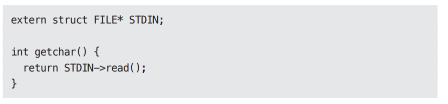

# **객체 지향 프로그래밍**  
좋은 아키텍처를 만드는 일은 객체 지향(Object-Oriented, OO) 설계 원칙을 이해하고 응용하는 데서 출발한다. 그렇다면 대체 OO란 무엇인가?  
  
이 질문에 대해 누군가는 "데이터와 함수의 조합"이라고 답할 수 있다. 대체로 이런 방식으로 많이 설명되지만 그다지 만족스러운 대답은 아닌데 o.f()가 
왠지 f(o)와 다르다는 의미를 내포하기 떄문이다. 이는 터무니없는 말이다. 달과 니가드가 함수 호출 스택 프레임을 힙으로 옮기고 OO를 발명한 1966년보다 
훨씬 이전부터 프로그래머는 데이터 구조를 함수에 전달해 왔다.  
  
또는 이 질문에 흔히 "실제 세계를 모델링하는 새로운 방법"이라고들 답한다. 이는 기껏해야 얼버무리는 수준에 지나지 않는다. 도대체 "실제 세계를 모델링한다"
라는 말이 무엇을 의미하며 왜 우리는 그 방향을 추구해야 하는가? 이 답변이 전달하려는 의도는 OO는 현실 세계와 의미적으로 가깝기 때문에 OO를 사용하면 
소프트웨어를 좀 더 쉽게 이해할 수 있다는 데 있는 듯하다. 하지만 이 의도조차도 불분명하며 그 정의가 너무 모호하다. 다시 말해 이 답변도 OO가 무엇인지를 
설명해주지 않는다.  
  
OO의 본질을 설명하기 위해 세 가지 주문에 기대는 부류도 있는데, 캡슐화, 상속, 다형성이 바로 그 주문이다. 이들은 OO가 이 세 가지 개념을 적절하게 
조합한 것이거나 또는 OO언어는 최소한 세 가지 요소를 반드시 지원해야 한다고 말한다.  
  
# **캡슐화?**  
OO를 정의하는 요소 중 하나로 캡슐화를 언급하는 이유는 데이터와 함수를 쉽고 효과적으로 캡슐화하는 방법을 OO언어가 제공하기 떄문이다. 그리고 이를 통해 
데이터와 함수가 응집력 있게 구성된 집단을 서로 구분 짓는 선을 그을 수 있다. 구분선 바깥에서 데이터는 은닉되고 일부 함수만이 외부에 노출된다. 이 
개념들이 실제 OO언어에서는 각각 클래스의 private 멤버 데이터와 public 멤버 함수로 표현된다.  
  
이러한 개념이 OO에만 국한된 것은 아니다. 사실 C 언어에서도 완벽한 캡슐화가 가능하다. 아래의 간단한 C 프로그램을 보자.  
  
  
  
point.h를 사용하는 측에서는 struct Point의 멤버에 접근할 방법이 전혀 없다. 사용자는 makePoint() 함수와 distance() 함수를 호출할 수는 있지만 
Point 구조체의 데이터 구조와 함수가 어떻게 구현되었는지에 대해서는 조금도 알지 못한다.  
  
이것이 바로 완벽한 캡슐화이며 보다시피 OO가 아닌 언어에서도 충분히 가능하다. C 프로그래머는 항상 이러한 방식을 활용했다. 즉 먼저 데이터 구조와 함수를 
헤더 파일에 선언하고 구현 파일에서 이들을 구현했다. 그리고 프로그램 사용자는 구현 파일에 작성된 항목에 대해서는 어떠한 방법으로도 접근할 수 없었다.  
  
이후에 C++라는 형태로 OO가 등장했고 C가 제공하던 완전한 캡슐화가 깨지게 되었다.  
  
C++ 컴파일러는 기술적인 이유로 클래스의 멤버 변수를 해당 클래스의 헤더 파일에 선언할 것을 요구했다. 따라서 앞의 Point 프로그램은 아래와 같이 변경해야 한다.  
  
  
  
이제 point.h 헤더 파일을 사용하는 측에서는 멤버 변수인 x와 y를 알게 된다. 물론 멤버 변수에 접근하는 일은 컴파일러가 막겠지만 사용자는 멤버 변수가 
존재한다는 사실 자체를 알게 된다. 예를 들어 멤버 변수의 이름이 바뀐다면 point.cc 파일은 다시 컴파일해야 한다. 캡슐화가 깨진 것이다.  
  
언어에 public, private, protected 키워드를 도입함으로써 불완전한 캡슐화를 사실상 어느 정도 보완하기는 했다. 하지만 이는 컴파일러가 헤더 파일에서 
멤버 변수를 볼 수 있어야 했기 떄문에 조치한 임시방편일 뿐이다.  
  
자바와 C#은 헤더와 구현체를 분리하는 방식을 모두 버렸고 이로 인해 캡슐화는 더욱 심하게 훼손되었다. 이들 언어에서는 클래스 선언과 정의를 구분하는 게 
아예 불가능하다.  
  
이 때문에 OO가 강력한 캡슐화에 의존한다는 정의는 받아들이기 힘들다. 실제로 많은 OO언어가 캡슐화를 거의 강제하지 않는다.  
  
OO 프로그래밍은 프로그래머가 충분히 올바르게 행동함으로써 캡슐화된 데이터를 우회해서 사용하지 않을 거라는 믿음을 기반으로 한다. 하지만 OO를 제공한다고 
주창한 언어들이 실제로는 C 언어에서 누렸던 완벽한 캡슐화를 약화시켜 온 것은 틀림없다.  
  
# **상속?**  
OO 언어가 더 나은 캡슐화를 제공하지는 못했지만 상속만큼은 OO 언어가 확실히 제공했다.  
  
얼추 맞는 말이다. 하지만 상속이란 단순히 어떤 변수와 함수를 하나의 유효 범위로 묶어서 재정의하는 일에 불과하다. 사실상 OO 언어가 있기 훨씬 이전에도 
C 프로그래머는 언어의 도움 없이 손수 이러한 방식으로 구현할 수 있었다.  
  
  

  
  
  
main 프로그램을 잘 살펴보면 NamedPoint 데이터 구조가 마치 Point 데이터 구조로부터 파생된 구조인 것처럼 동작한다는 사실을 볼 수 있다. 이는 NamedPoint에 
선언된 두 변수의 순서가 Point와 동일하기 떄문이다. 다시 말해 NamedPoint는 Point의 가면을 쓴 것처럼 동작할 수 있는데 이는 NamedPoint가 순전히 
Point를 포함하는 상위 집합으로 Point에 대응하는 멤버 변수의 순서가 그대로 유지되기 때문이다.  
  
눈속임처럼 보이는 이 방식은 OO가 출현하기 이전부터 프로그래머가 흔히 사용하던 기법이었다. 실제로 C++에서는 이 방법을 이용해서 단일 상속을 구현했다.  
  
따라서 OO 언어가 고안되기 훨씬 이전에도 상속과 비슷한 기법이 사용되었다고 말할 수 있다. 하지만 이렇게 말하는 데는 어폐가 있다. 상속을 흉내 내는 
요령은 있었지만 사실상 상속만큼 편리한 방식은 절대 아니기 때문이다. 게다가 이 기법을 이용해서 다중 상속을 구현하기란 훨씬 더 어려운 일이었다.  
  
또한 main.c에서 NamesPoint 인자를 Point로 타이블 강제로 변환한 점도 확인할 수 있다. 진짜 OO언어에서는 이러한 업캐스팅이 암묵적으로 이뤄진다.  
  
따라서 OO언어가 완전히 새로운 개념을 만들지는 못했지만 데이터 구조에 가면을 씌우는 일을 상당히 편리한 방식으로 제공했다고 볼 수는 있다.  
  
간략히 요약하면 캡슐화에 대해서는 OO에 점수를 줄 수 없고 상속에 대해서만 0.5점 정도를 부여할수 있다. 이렇게만 보면 그저 그런 점수다.  
  
# **다형성?**  
OO 언어가 있기 이전에 다형성을 표현할 수 있는 언어가 있었던거? 당연히 있었다. 아래의 C로 작성한 간단한 복사 프로그램을 살펴보자.  
  
  
  
getchar() 함수는 STDIN에서 문자를 읽는다. 그러면 STDIN은 어떤 장치인가? putchar() 함수는 STDOUT으로 문자를 쓴다. 그런데 STDOUT은 또 어떤 
장치인가? 이러한 함수는 다형적이다. 즉 행위가 STDIN과 STDOUT의 타입에 의존한다.  
  
STDIN과 STDOUT은 사실상 자바 형식의 인터페이스로 자바에서는 각 장치별로 구현체가 있다. 물론 예제의 C 프로그램에는 이러한 인터페이스는 없다. 
그렇다면 getchar() 함수를 호출할 떄 도대체 어떤 방식으로 문자를 읽는 장치 드라이버를 호출할 수 있는가?  
  
이 질문에 대한 대답은 대체로 간단한 편이다. 유닉스 운영체제의 경우 모든 입출력 장치 드라이버가 다섯 가지 표준 함수를 제공할 것을 요구한다. 열기
(open), 닫기(close), 읽기(read), 쓰기(write), 탐색(seek)이 바로 이 표준 함수들이다.  
  
FILE 데이터 구조는 이들 다섯 함수를 가리키는 포인터들을 포함한다. 이 예제의 경우라면 다음과 같을 것이다.  
  
  
  
콘솔용 입출력 드라이버에서는 이들 함수를 아래와 같이 정의하며 FILE 데이터 구조를 함수에 대한 주소와 함께 로드할 것이다.  
  
  
  
이제 STDIN을 FILE*로 선언하면 STDIN은 콘솔 데이터 구조를 가리키므로 getchar()는 아래와 같은 방식으로 구현할 수 있다.  
  
  
  
다시 말해 getchar()는 STDIN으로 참조되는 FILE 데이터 구조의 read 포인터가 가리키는 함수를 단순히 호출할 뿐이다.  
  
이처럼 단순한 기법이 모든 OO가 지닌 다형성의 근간이 된다. 예를 들어 C++에서는 클래스의 모든 가상 함수(virtual function)는 vtable이라는 
테이블에 포인터를 가지고 있고 모든 가상 함수 호출은 이 테이블을 거치게 된다. 파생 클래스의 생성자는 생성하려는 객체의 vtable을 단순히 자신(파생 클래스)
의 함수들로 덮어 쓸 뿐이다.  
  
말하려는 요지는 함수를 가리키는 포인터를 응용한 것이 다형성이라는 점이다. 1940년대 후반 폰 노이만 아키텍처가 처음 구현된 이후 프로그래머는 다형적 행위를 
수행하기 위해 함수를 가리키는 포인터를 사용해 왔다. 따라서 OO가 새롭게 만든 것은 전혀 없다.  
  
이 말이 완전히 옳은 말은 아니긴 하다. OO 언어는 다형성을 제공하지는 못했지만 다형성을 좀 더 안전하고 더욱 편리하게 사용할 수 있게 해준다.  
  
함수에 대한 포인터를 직접 사용하여 다형적 행위를 만드는 이 방식에는 문제가 있는데 함수 포인터는 위험하다는 사실이다. 이러한 기법은 프로그래머가 
특정 관례를 수동으로 따르는 방식이다. 즉 이들 포인터를 초기화하는 관례를 준수해야 한다는 사실을 기억해야 한다. 그리고 이들 포인터를 통해 모든 함수를 
호출하는 관례를 지켜야 한다는 점도 기억해야 한다. 만약 프로그래머가 관례를 지켜야 한다는 사실을 망각하게 되면 버그가 발생하고 이러한 버그는 찾아내고 
없애기가 지독히도 힘들다.  
  
OO 언어는 이러한 관례를 없애주며 따라서 실수할 위험이 없다. OO 언어를 사용하면 다형성은 대수롭지 않은 일이 된다. OO 언어는 과거 C 프로그래머가 꿈에서야 
볼 수 있던 강력한 능력을 제공한다. 이러한 이유로 OO는 제어흐름을 간접적으로 전환하는 규칙을 부과한다고 결론지을 수 있다.  
  
# **다형성이 가진 힘**  
다형성이 뭐가 그렇게 좋은가? 다형성이 가진 매력의 진가를 알아보기 위해 복사 프로그램 예제를 다시 살펴보자. 새로운 입출력 장치가 생겼을 때 이 새로운 
장비에서도 복사 프로글매이 동작하도록 만들려면 어떻게 수정해야 하는가?  
  
아무런 변경도 필요없고 복사 프로그램을 다시 컴파일할 필요조차 없다. 복사 프로그램의 소스 코드는 입출력 드라이버의 소스 코드에 의존하지 않기 때문이다. 
입출력 드라이버가 FILE에 정의된 다섯 가지 표준 함수를 구현한다면 복사 프로그램에서는 이 입출력 드라이버를 얼마든지 사용할 수 있다.  
  
다시 말해 입출력 드라이버가 복사 프로그램의 플러그인이 된 것이다.  
  
1950년대 후반에 우리는 프로그램이 장치 독립적(device independent)이어야 한다는 사실을 이미 배웠기 떄문이다. 당시 우리는 장치에 의존적인(dependent) 
수많은 프로그램을 만들고 나서야 이들 프로그램이 다른 장치에서도 동일하게 동작할 수 있도록 만드는 것이 우리가 진정 바랐던 일임을 깨달았다.  
  
플러그인 아키텍처(plugin architecture)는 이처럼 입출력 장치 독립성을 지원하기 위해 만들어졌고 등장 이후 거의 모든 운영체제에서 구현되었다. 그럼에도 
대다수의 프로그래머는 직접 작성하는 프로그램에서는 이러한 개념을 확장하여 적용하지 않았는데 함수를 가리키는 포인터를 사용하면 위험을 수반하기 떄문이었다.  
  
OO의 등장으로 언제 어디서든 플러그인아키텍처를 적용할 수 있게 되었다.  
  
# **의존성 역전**  
다형성을 안전하고 편리하게 적용할 수 있는 메커니즘이 등장하기 전 소프트웨어는 어떤 모습이었을지 생각해 보자. 전형적인 호출 트리의 경우 main 함수가 
고수준 함수를 호출하고 고수준 함수는 다시 중간 수준 함수를 호출하며 중간 수준 함수는 다시 중간 수준 함수를 호출하며 중간 수준 함수는 다시 저수준 함수를 호출한다.  
  
  
  
이러한 호출 트리에서 소스 코드 의존성의 방향은 반드시 제어흐림(flow of control)을 따르게 된다. (위 그림)  
  
main 함수가 고수준 함수를 호출하려면 고수준 함수가 포함된 모듈의 이름을 지정해야만 한다. C의 경우 이러한 지정자는 #include다. 자바에서는 import 
구문이다. C#에서는 using 구문이다. 실제로 모든 호출 함수는 피호출 함수가 포함된 모듈의 이름을 명시적으로 지정해야 한다.  
  
이러한 제약 조건으로 인해 소프트웨어 아키텍트에게 남은 선택지는 별로 없었다. 즉 제어흐름은 시스템의 행위에 따라 결정되며 소스 코드 의존성은 제어흐름에 
따라 결정된다.  
  
  
  
하지만 다형성이 끼어들면 무언가 특별한 일이 일어난다. (위 그림)  
  
위 그림에서 HL1 모듈은 ML1 모듈의 F() 함수를 호출한다. 소스 코드에서는 HL1 모듈은 인터페이스를 통해 F() 함수를 호출한다. 이 인터페이스는 런타임에는 
존재하지 않는다. HL1은 단순히 ML1 모듈의 함수 F()를 호출할 뿐이다.  
  
하지만 ML1과 I 인터페이스 사이의 소스 코드 의존성(상속 관계)이 제어흐름과는 반대인 점을 주목하자. 이는 의존성 역전(dependency inversion)이라고 
부르며 소프트웨어 아키텍트 관점에서 이러한 현상은 심오한 의미를 갖는다.  
  
OO언어가 다형성을 안전하고 편리하게 제공한다는 사실은 소스 코드 의존성을 어디에서든 역전시킬 수 있다는 뜻이기도 하다.  
  
이제 다시 main 호출 트리를 보면 수많은 소스 코드 의존성을 확인할 수 있다. 이러한 소스 코드 의존성은 소스 코드 사이에 인터페이스를 추가함으로써 방향을 
역전시킬 수 있다.  
  
이러한 접근법을 사용한다면 OO언어로 개발된 시스템을 다루는 소프트웨어 아키텍트는 시스템의 소스 코드 의존성 전부에 대해 방향을 결정할 수 있는 
절대적인 권한을 갖는다. 즉 소스 코드 의존성이 제어흐름의 방향과 일치되도록 제한되지 않는다. 호출하는 모듈이든 아니면 호출 받는 모듈이든 관계없이 
소프트웨어 아키텍트는 소스 코드 의존성을 원하는 방향으로 설정할 수 있다.  
  
이것이 바로 OO가 제공하는 힘이다. 그리고 이것이 바로 OO가 지향하는 것이다(최소한 아키텍트의 관점에서는).  
  
그럼 이 힘으로 무엇을 할 수 있는가? 예를 들어 업무 규칙이 데이터베이스와 사용자 인터페이스(UI)에 의존하는 대신에 시스템의 소스 코드 의존성을 
반대로 배치하여 데이터베이스와 UI가 업무 규칙에 의존하게 만들 수 있다.  
  
  
  
즉 UI와 데이터베이스가 업무 규칙의 플러그인이 된다는 뜻이다. 다시 말해 업무 규칙의 소스 코드에서는 UI나 데이터베이스를 호출하지 않는다.  
  
결과적으로 업무 규칙, UI, 데이터베이스는 세 가지로 분리된 컴포넌트 또는 배포 가능한 단위(예를 들면 jar 파일, DLL, Gem 파일 등)로 컴파일할 수 
있고 이 배포 단위들의 의존성 역시 소스 코드 사이의 의존성과 같다. 따라서 업무 규칙을 포함하는 컴포넌트는 UI와 데이터베이스를 포함하는 컴포넌트에 
의존하지 않는다.  
  
따라서 업무 규칙을 UI와 데이터베이스와는 독립적으로 배포할 수 있다. UI나 데이터베이스에서 발생한 변경사항은 업무 규칙에 일절 영향을 미치지 않는다. 
즉 이들 컴포넌트는 개별적이며 독립적으로 배포 가능하다.  
  
다시 말해 특정 컴포넌트의 소스 코드가 변경되면 해당 코드가 포함된 컴포넌트만 다시 배포하면 된다. 이것이 바로 배포 독립성(independent deployability)
이다.  
  
시스템의 모듈을 독립적으로 배포할 수 있게 되면 서로 다른 팀에서 각 모듈을 독립적으로 개발할 수 있다. 그리고 이것이 개발 독립성(independent developability)
이다.  
  
