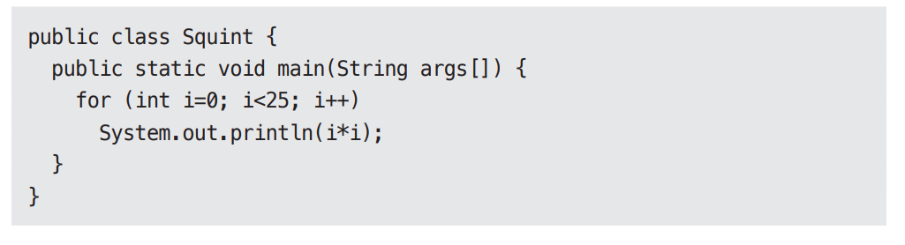
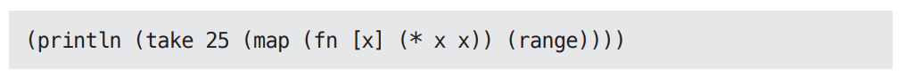
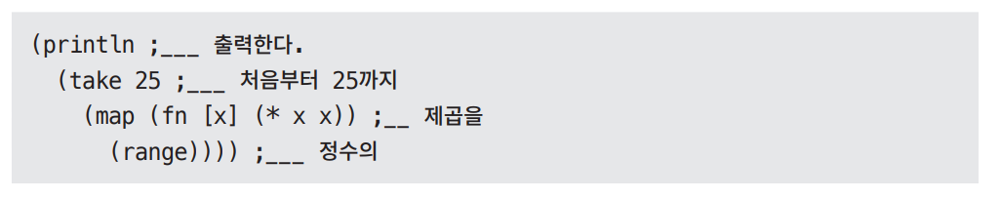
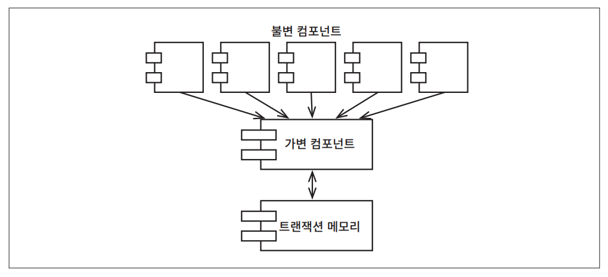
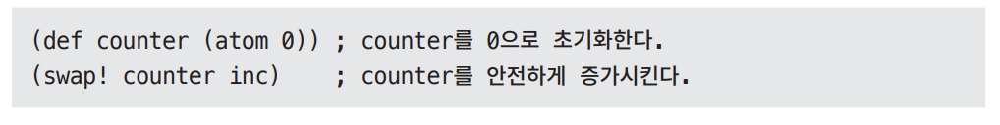

# **함수형 프로그래밍**  
여러 가지 의미로 함수형 프로그래밍이라는 개념은 프로그래밍 그 자체보다 앞서 등장했다. 이 패러다임에서 핵심이 되는 기반은 람다(lambda) 계산법으로 
알론조 처치가 1930년대에 발명했다.  
  
# **정수를 제곱하기**  
25까지의 정수의 제곱을 출력하는 간단한 문제를 다뤄보자.  
  
자바 언어라면 아래와 같이 작성할 수 있다.  
  
  
  
리스프에서 파생한 클로저(Clojure)는 함수형 언어로 클로저를 이용하면 같은 프로그램을 다음과 같이 구현할 수 있다.  
  
  
  
리스프를 잘 모른다면 위의 코드가 다소 생소하게 느껴질 수도 있다. 위의 코드를 다시 다음과 같은 형태로 작성하고 주석을 달아보자.  
  
  
  
println, take, map, range는 분명히 모두 함수다. 리스프에서는 함수를 괄호 안에 넣는 방식으로 호추한다. 예를 들어 (range)는 range 함수를 호출한다.  
  
표현식 (fn [x] (* x x))는 익명 함수(anonymous function)로 곱셈 함수를 호출하면서 입력 인자를 두 번 전달한다. 즉 입력의 제곱을 계산한다.  
  
이제 전체 코드를 다시 볼 텐데 가장 안쪽의 함수 호출부터 시작하는게 가장 좋다.  
  
- range 함수는 0부터 시작해서 끝이 없는 정수 리스트를 반환한다.  
- 반환된 정수 리스트는 map 함수로 전달되고 각 정수에 대해 제곱을 계산하는 익명 함수를 호출하여 모든 정수의 제곱에 대해 끝이 없는 리스트를 생성한다.  
- 제곱된 리스트는 take 함수로 전달되고 이 함수는 앞의 25개까지의 항목으로 구성된 새로운 리스트를 반환한다.  
- println 함수는 입력 값을 출력하는데 이 경우 입력은 앞의 25개의 정수에 대한 제곱 값으로 구성된 리스트다.  
  
끝이 없는 리스트라는 개념에 놀랄 수도 있지만 실제로는 이 끝이 없는 리스트 중에서 앞의 25개까지만 생성될 뿐이다. 끝이 없는 리스트의 어떤 항목도 
실제로 접근하기 전에는 평가각 이뤄지지 않기 떄문이다.  
  
이 책에서는 클로저와 자바 프로그램 사이의 극단적인 차이를 짚어보고자 한다. 자바 프로그램은 가변 변수(mutable variable)를 사용하는데 가변 변수는 
프로그램 실행 중에 상태가 변할 수 있다. 클로저 프로그램에서는 이러한 가변 변수가 전혀 없다. 클로저에서는 x와 같은 변수가 한 번 초기화되면 절대로 
변하지 않는다.  
  
이는 우리에게 놀라운 사실을 알려준다. 함수형 언어에서 변수는 변경되지 않는다.  
  
# **불변성과 아키텍처**  
아키텍처를 고려할 때 이러한 내용이 왜 중요한가? 아키텍트는 왜 변수의 가변성을 염려하는가? 경합(race) 조건, 교착상태(deadlock) 조건, 동시 업데이트
(concurrent update)문제가 모두 가변 변수로 인해 발생하기 떄문이다. 만약 어떠한 변수도 갱신되지 않는다면 경합 조건이나 동시 업데이트 문제가 
일어나지 않는다. 락(lock)이 가변적이지 않다면 교착상태도 일어나지 않는다.  
  
다시 말해 우리가 동시성 애플리케이션에서 마주치는 모든 문제, 즉 다수의 스레드와 프로세스를 사용하는 애플리케이션에서 마주치는 모든 문제는 가변 변수가 
없다면 절대로 생기지 않는다.  
  
아키텍트라면 동시성 문제에 지대한 관심을 가져야만 한다. 우리는 스레드와 프로세스가 여러 개인 상황에서도 설계한 시스템이 여전히 강건하기를 바란다. 그러다면 
이제 불변성이 정말로 실현 가능한지를 스스로에게 반드시 물어봐야 한다.  
  
이 질문에 대한 대답은 대체로 긍정적이다. 단 저장 공간이 무한하고 프로세서의 속도가 무한히 빠르다고 전제한다면 말이다. 자원이 무한대가 아니라면 대답은 
조금 미묘하다. 불변성은 실현 가능하겠지만 일종의 타협을 해야 한다.  
  
# **가변성의 분리**  
불변성과 관련하여 가장 주요한 타협 중 하나는 애플리케이션, 또는 애플리케이션 내부의 서비스를 가변 컴포넌트와 불변 컴포넌트로 분리하는 일이다. 불변 
컴포넌트에서는 순수하게 함수형 방식으로만 작업이 처리되며 어떤 가변 변수도 사용되지 않는다. 불변 컴포넌트는 변수의 상태를 변경할 수 있는 즉 순수 함수형 
컴포넌트가 아닌 하나 이상의 다른 컴포넌트와 서로 통신한다.  
  
  
  
상태 변경은 컴포넌트를 갖가지 동시성 문제에 노출하는 꼴이므로 흔히 트랜잭션 메모리(transactional memory)와 같은 실천법을 사용하여 동시 업데이트와 
경합 조건 문제로부터 가변 변수를 보호한다.  
  
트랜잭션 메모리는 데이터베이스가 디스크의 레코드를 다루는 방식과 동일한 방식으로 메모리의 변수를 처리한다. 즉 트랜잭션을 사용하거나 또는 재시도 
기법을 통해 이들 변수를 보호한다.  
  
이러한 접근법의 간단한 예로 클로저의 atom 기능을 들 수 있다.  
  
  
  
이 코드에서는 counter 변수는 atom으로 정의되었다. 클로저에서 atom은 특수한 형태의 변수로, 값을 변경하려면 반드시 swap! 함수를 사용해야 한다는 
매우 엄격한 제약이 걸려 있다.  
  
앞의 코드에서처럼 swap! 함수는 2개의 인자를 받는다. 하나는 변경할 수 있는 atom 변수이며 다른 하나는 atom에 저장할 새로운 값을 계산할 함수다. 
이 예제 코드에서 atom인 counter는 inc 함수가 계산한 값으로 변경되며 inc 함수는 단수히 인자 값을 1씩 증가시킨다.  
  
swap! 함수는 전통적인 비교 및 스왑(compare and swap)알고리즘을 전략으로 사용한다. 먼저 counter의 값을 읽은 후 inc 함수로 전달한다. inc 함수가 
반환되면 counter의 값은 잠기게 되고 inc 함수로 전달했던 값과 비교한다. 만약 값이 같다면 inc 함수가 반환한 값이 counter에 저장되고 잠금은 해제된다. 
값이 같지 않다면 잠금을 해제한 후 이 전략을 처음부터 재시도한다.  
  
atom 기능은 간단한 애플리케이션에는 적합하다. 하지만 안타깝게도 여러 변수가 상호 의존하는 상황에서는 동시 업데이트와 교착상태 문제로부터 완벽히 
보호해 주지 못한다. 이러한 상황에서는 더 정교한 장치를 사용해야 한다.  
  
말하려는 요지는 애플리케이션을 제대로 구조화하려면 변수를 변경하는 컴포넌트와 변경하지 않는 컴포넌트를 분리해야 한다는 것이다. 그리고 이렇게 분리하려면 
가변 변수들을 보호하는 적절한 수단을 동원해 뒷받침해야 한다.  
  
현명한 아키텍트라면 가능한 한 많은 처리를 불변 컴포넌트로 옮겨야 하고 가변 컴포넌트에서는 가능한 한 많은 코드를 빼내야 한다.  
  
