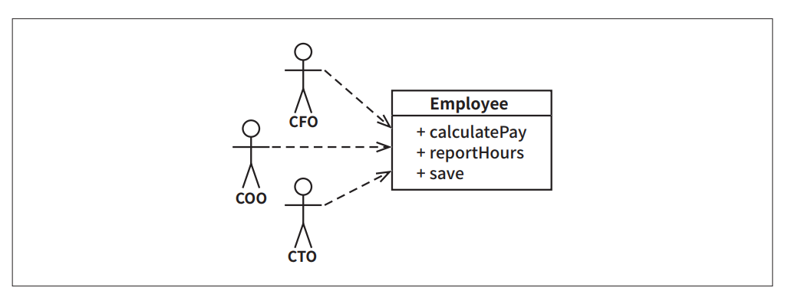

# **설계 원칙**  
좋은 소프트웨어 시스템은 깔끔한 코드(clean code)로부터 시작한다. 좋은 벽돌을 사용하지 않으면 빌딩의 아키텍처가 좋고 나쁨은 그리 큰 의미가 없는 
것과 같다. 반대로 좋은 벽돌을 사용하더라도 빌딩의 아키텍처를 엉망으로 만들 수 있다. 그래서 좋은 벽돌로 좋은 아키텍처를 정의하는 원칙이 필요한데 
그게 바로 SOLID다.  
  
SOLID 원칙은 함수와 데이터 구조를 클래스로 배치하는 방법, 그리고 이들 클래스를 서로 결합하는 방법을 설명해준다. '클래스'라는 단어를 사용했다고 
해서 SOLID 원칙이 객체 지향 소프트웨어만 적용된다는 뜻은 아니다. 여기에서 클래스는 단순히 함수와 데이터를 결합한 집합을 가리킨다. 소프트웨어 시스템은 
모두 이러한 집합을 포함하며 이러한 집합이 클래스라고 불릴 수도 있고 아닐 수도 있다. SOLID 원칙은 이러한 집합에 적용된다.  
  
SOLID 원칙의 목적은 중간 수준의 소프트웨어 구조가 아래와 같도록 만드는 데 있다.  
  
- 변경에 유연하다.  
- 이해하기 쉽다.  
- 많은 소프트웨어 시스템에 사용될 수 있는 컴포넌트의 기반이 된다.  
  
'중간 수준'이라 함은 프로그래머가 이들 원칙을 모듈 수준에서 작업할 때 적용할 수 있다는 뜻이다. 즉 코드 수준보다는 조금 상위에서 적용되며 모듈과 
컴포넌트 내부에서 사용되는 소프트웨어 구조를 정의하는 데 도움을 준다.  
  
잘 만들어진 벽돌로도 빌딩의 아키텍처를 완전히 망쳐버릴 수 있듯이 잘 설계된 중간 수준의 컴포넌트를 이용하더라도 시스템 전체를 엉망진창으로 만들 가능성 
또한 존재한다.  
  
아래는 이들 원칙의 개략적인 설명이다.  
  
- SRP: 단일 책임 원칙(Single Responsibility Principle)  
콘웨이(Conway) 법칙에 따른 따름정리: 소프트웨어 시스템이 가질 수 있는 최적의 구조는 시스템을 만드는 조직의 사회적 구조에 커다란 영향을 받는다. 
따라서 각 소프트웨어 모듈은 변경의 이유가 하나, 단 하나여야만 한다.  
- OCP: 개방-폐쇄 원칙(Open-Closed Principle)  
1980년대에 버트란트 마이어에 의해 유명해진 원칙이다. 기존 코드를 수정하기보다는 반드시 새로운 코드를 추가하는 방식으로 시스템의 행위를 변경할 수 
있도록 설계해야만 소프트웨어 시스템을 쉽게 변경할 수 있다는 것이 이 원칙의 요지다.  
- LSP: 리스코프 치환 원칙 (Liskov Substitution Principle)  
1988년 바바라 리스코프가 정의한 하위 타입(subtype)에 관한 유명한 원칙이다. 요약하면 상호 대체 가능한 구성요소를 이용해 소프트웨어 시스템을 만들 수 
있으려면 이들 구성요소는 반드시 서로 치환 가능해야 한다는 계약을 반드시 지켜야 한다.  
- ISP: 인터페이스 분리 원칙(Interface Segregation Principle)  
이 원칙에 따르면 소프트웨어 설계자는 사용하지 않는 것에 의존하지 않아야 한다.  
- DIP: 의존성 역전 원칙(Dependency Inversion Principle)  
고수준 정책을 구현하는 코드는 저수준 세부사항을 구현하는 코드에 절대로 의존해서는 안 된다. 대신 세부사항이 정책에 의존해야 한다.  
  
# **SRP: 단일 책임 원칙**  
SOLID 원칙 중에서 그 의미가 가장 잘 전달되지 못한 원칙은 바로 단일 책임 원칙(SRP)이다. 아마도 현저히 부적절한 이름 때문이기도 할 것이다. 프로그래머가 
이 원칙의 이름을 듣는다면 모든 모듈이 단 하나의 일만 해야 한다는 의미로 받아들이기 쉽다.  
  
헷갈리지 말라. 단 하나의 일만 해야 한다는 원칙은 사실 따로 있다. 그것은 바로 함수는 반드시 하나의, 단 하나의 일만 해야 한다는 원칙이다. 이 원칙은 
커다란 함수를 작은 함수들로 리팩터링하는 더 저수준에서 사용된다. 하지만 이 원칙은 SOLID 원칙이 아니며 SRP도 아니다.  
  
역사적으로 SRP는 아래와 같이 기술되어 왔다.  
  
- 단일 모듈은 변경의 이유가 하나, 오직 하나뿐이어야 한다.  
  
소프트웨어 시스템은 사용자와 이해관계자를 만족시키기 위해 변경된다. SRP가 말하는 '변경의 이유'란 바로 이들 사용자와 이해관계자를 가리킨다. 사실 
이 원칙은 아래와 같이 바꿔 말할 수도 있다.  
  
- 하나의 모듈은 하나의, 오직 하나의 사용자 또는 이해관계자에 대해서만 책임져야 한다.  
  
안타깝게도 사용자와 이해관계자라는 단어를 여기에 쓰는 것은 사실 올바르지 않다. 시스템이 동일한 방식으로 변경되기를 원하는 사용자나 이해관계자가 두 
명 이상일 수도 있기 때문이다. 여기에서는 이런 의미보다는 집단, 즉 해당 변경을 요청하는 한 명 이상의 사람들을 가리킨다. 이러한 집단을 액터(actor)라고 
부르겠다.  
  
이제 SRP의 최종 버전은 아래와 같다.  
  
- 하나의 모듈은 하나의, 오직 하나의 액터에 대해서만 책임져야 한다.  
  
그럼 모듈이란 또 무슨 뜻인가? 가장 단순한 정의는 바로 소스 파일이다. 대부분의 경우 이 정의는 잘 들어맞는다. 하지만 일부 언어와 개발 환경에서는 
코드를 소스 파일에 저장하지 않는다. 이러한 경우 모듈은 단순히 함수와 데이터 구조로 구성된 응집된 집합이다.  
  
응집된(cohesive)이라는 단어가 SRP를 암시한다. 단일 액터를 책임지는 코드를 함께 묶어주는 힘이 바로 응집성이다.  
  
아마도 이 원칙을 이해하는 가장 좋은 방법은 이 원칙을 위반하는 징후들을 살펴보는 일일 거다.  
  
# **징후 1: 우발적 중복**  
급여 애플리케이션의 Employee 클래스를 예시로 든다. 이 클래스는 세 가지 메서드 calculatePay(), reportHours(), save()를 가진다.  
  
  
  
이 클래스는 SRP를 위반하는데 이들 세 가지 메서드가 서로 매우 다른 세 명의 액터를 책임지기 때문이다.  
  
- calculatePay() 메서드는 회계팀에서 기능을 정의하며 CFO 보고를 위해 사용한다.  
- reportHours() 메서드는 인사팀에서 기능을 정의하고 사용하며 COO 보고를 위해 사용한다.  
- save() 메서드는 데이터베이스 관리자(DBA)가 기능을 정의하고 CTO 보고를 위해 사용한다.  
  
개발자가 이 세 메서드를 Employee라는 단일 클래스에 배치하여 세 액터가 서로 결합되어 버렸다. 이 결합으로 인해 CFO 팀에서 결정한 조치가 COO 팀이 
의존하는 무언가에 영향을 줄 수 있다.  
  
예를 들어 calculatePay() 메서드와 reportHours() 메서드가 초과 근무를 제외한 업무 시간을 계산하는 알고리즘을 공유한다고 해보자. 그리고 개발자는 
코드 중복을 피하기 위해 이 알고리즘을 regularHours()라는 메서드에 넣었다고 해보자.  
  
  
  
이제 CFO 팀에서 초과 근무를 제외한 업무 시간을 계산하는 방식을 약간 수정하기로 결정했다고 하자. 반면 인사를 담당하는 COO 팀에서는 초과 근무를 
제외한 업무 시간을 CFO 팀과는 다른 목적으로 사용하기 때문에 이 같은 변경을 원하지 않는다고 해보자.  
  
이 변경을 적용하는 업무를 할당받은 개발자는 calculatePay() 메서드가 편의 메서드인 regularHours()를 호출한다는 사실을 발견한다. 하지만 안타깝게도 
이 함수가 reportHours() 메서드에서도 호출된다는 사실은 눈치채지 못한다.  

개발자는 요청된 변경사항을 적용하고 신중하게 테스트한다. CFO 팀은 새로운 메서드가 원하는 방식으로 동작하는지 검증하고 시스템은 배포된다. 물론 COO 
팀에서는 이러한 일이 벌어지고 있다는 사실을 알지 못한다.  
  
COO 팀 직원은 reportHours() 메서드가 생성한 보고서를 여전히 이용한다. 하지만 이제 이 보고서에 포함된 수치들은 엉터리다. 마침내 문제가 발견되고 
COO는 격노한다. 잘못된 데이터로 인해 수백만 달러의 예산이 지출되었기 때문이다.  
  
우리 모두는 이와 같은 상황을 목격한 경험이 있다. 이러한 문제는 서로 다른 액터가 의존하는 코드를 너무 가까이 배치했기 때문에 발생한다. SRP는 
서로 다른 액터가 의존하는 코드를 서로 분리하라고 말한다.  
  

