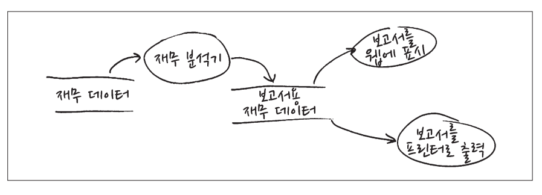
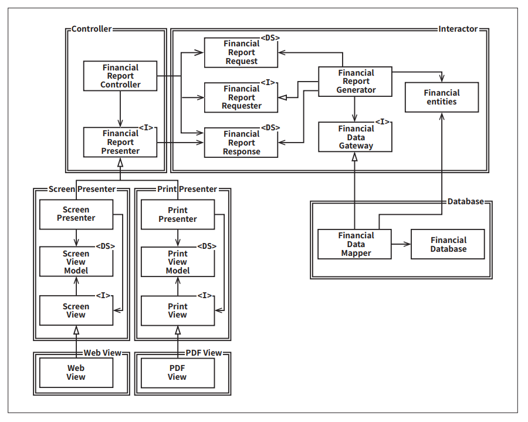
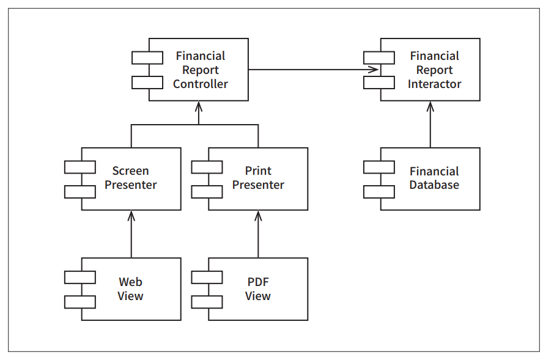

# **OCP: 개방-폐쇄 원칙**  
개방-폐쇄 원칙(OCP)이라는 용어는 1988년에 버트란트 마이어가 만들었는데 다음과 같다.  
  
- 소프트웨어 개채(artifact)는 확장에는 열여 있어야 하고 변경에는 닫혀 있어야 한다.  
  
다시 말해 소프트웨어 개체의 행위는 확장할 수 있어야 하지만 이때 개체를 변경해서는 안 된다.  
  
소프트웨어 아키텍처를 공부하는 가장 근본적인 이유가 이 떄문이다. 만약 요구사항을 살짝 확장하는 데 소프트웨어를 엄청나게 수정해야 한다면 그 소프트웨어 
시스템을 설계한 아키텍트는 엄청난 실패에 맞닥뜨린것이다.  
  
소프트웨어 설계를 공부하기 시작한 지 얼마 안 된 사람들 대다수는 OCP를 클래스와 모듈을 설계할 때 도움되는 원칙이라고 알고 있다. 하지만 아키텍처 
컴포넌트 수준에서 OCP를 고려할 때 훨씬 중요한 의미를 가진다.  
  
사고 실험(thought experiment)을 해 보면 이 점이 분명해진다.  
  
# **사고 실험**  
재무제표를 웹 페에지로 보여주는 시스템이 있다고 생각해보자. 웹 페이지에 표시되는 데이터는 스크롤할 수 있으며 음수는 빨간색으로 출력한다.  
  
이제 이해관계자가 동일한 정보를 보고서 형태로 변환해서 흑백 프린터로 출력해 달라고 요청했다고 해보자. 이 보고서에는 페이지 번호가 제대로 매겨져 
있어야 하고 페이지마다 적절한 머리글과 바닥글이 있어야 하며 표의 각 열에는 레이블이 있어야 한다고 해보자. 또한 음수는 괄호로 감싸야 한다.  
  
당연히 새로운 코드를 작성해야 한다. 그렇다면 원래 코드는 얼마나 많이 수절해야 할까?  
  
소프트웨어 아키텍처가 훌륭하다면 변경되는 코드의 양이 가능한 한 최소화될 것이다. 이상적인 변경량은 0이다.  
  
어떻게 하면 될까? 서로 다른 목적으로 변경되는 요소를 적절하게 분리하고(단일 책임 원칙, SRP), 이들 요소 사이의 의존성을 체계화함으로써(의존성 
역전 원칙, DIP) 변경향을 최소화할 수 있다.  
  
  
  
단일 책임 원칙(SRP)을 적용하면 데이터 흐름을 위 그림과 같은 형태로 만들 수 있다. 재무 데이터를 검사한 후 보고서용 데이터를 생성한 다음, 필요에 
따라 두 가지 보고서 생성 절차 중 하나를 거쳐 적절히 포매팅한다.  
  
여기서 얻을 수 있는 가장 중요한 영감은 보고서 생성이 두 개의 책임으로 분리된다는 사실이다. 하나는 보고서용 데이터를 계산하는 책임이며 나머지 하나는 
이 데이터를 웹으로 보여주거나 종이로 프린트하기에 적합한 형태로 표현하는 책임이다.  
  
이처럼 책임을 분리했다면 두 책임 중 하나에서 변경이 발생하더라도 다른 하나는 변경되지 않도록 소스 코드 의존성도 확실히 조직화해야 한다. 또한 새로 
조직화한 구조에서는 행위가 확장될 때 변경이 발생하지 않음을 보장해야 한다.  
  
  
  
이러한 목적을 달성하려면 처리 과정을 클래스 단위로 분리하고 이들 클래스를 위 그림에서 이중선으로 표시한 컴포넌트 단위로 구분해야 한다. 이 그림에서 
좌측 상단의 컴포넌트는 Controller다. 우측 상단에서는 Interactor 컴포넌트를, 우측 하단에서는 Database 컴포넌트를 볼 수 있다. 좌측 하단에는 
Presenter와 View를 담당하는 네 가지 컴포넌트가 위치한다.  
  
<I>로 표시된 클래스는 인터페이스이며 <DS>로 표시된 클래스는 데이터 구조다. 화살표가 열려 있다면 사용관계이며 닫혀 있다면 구현 관계 또는 상속 관계다.  
  
여기에서 주목할 점은 모든 의존성이 소스 코드 의존성을 나타낸다는 사실이다. 예를 들어 화살표가 A 클래스에서 B 클래스로 향한다면 A 클래스에서는 B 클래스를 
호출하지만 B 클래스에서는 A 클래스를 전혀 호출하지 않음을 뜻한다. 따라서 위 그림에서 FinancialDataMapper는 구현 관계를 통해 FinancialDataGateway를 
알고 있지만 FinancialDataGateway는 FinancialDataMapper에 대해 아무것도 알지 못한다.  
  
여기에서 주목해야 할 또 다른 점은 이중선은 화살표와 오직 한 방향으로만 교차한다는 사실이다.  
  
  
  
이는 위 그림에서 보듯 모든 컴포넌트 관계는 단방향으로 이루어진다는 뜻이다. 이들 화살표는 변경으로부터 보호하려는 컴포넌트를 향하도록 그려진다.  
  
A 컴포넌트에서 발생한 변경으로부터 B 컴포넌트를 보호하려면 반드시 A 컴포넌트가 B 컴포넌트에 의존해야 한다.  
  
이 예제의 경우 Presenter에서 발생한 변경으로부터 Controller를 보호하고자 한다. 그리고 View에서 발생한 변경으로부터 Presenter를 보호하고자 한다. 
Interactor는 다른 모든 것에서 발생한 변경으로부터 보호하고자 한다.  
  
Interactor는 OCP를 가장 잘 준수할 수 있는 곳에 위치한다. Database, Controller, Presenter, View에서 발생한 어떤 변경도 Interactor에 영향을 
주지 않는다.  
  
왜 Interactor가 이처럼 특별한 위치를 차지애햐만 하는가? 그 이유는 바로 Interactor가 업무 규칙을 포함하기 때문이다. Interactor는 애플리케이션에서 
가장 높은 수준의 정책을 포함한다. Interactor 이외의 컴포넌트는 모두 주변적인 문제를 처리한다. 가장 중요한 문제는 Interactor가 담당한다.  
  
Interactor 입장에서는 Controller가 부수적이지만 Controller는 Presenter와 View에 비해서는 중심적인 문제를 담당한다. 마찬가지로 Presenter가 
Controller보다는 수적이더라도 View 보다는 중심적인 문제를 처리한다.  
  
보호의 계층구조가 수준(level)이라는 개념을 바탕으로 어떻게 생성되는지 주목하자. Interactor는 가장 높은 수준의 개념이며 따라서 최고의 보호를 받는다. 
View는 가장 낮은 수준의 개념 중 하나이며 따라서 거의 보호를 받지 못한다. Presenter는 View보다는 높고 Controller나 Interactor보다는 낮은 수준에 
위치한다.  
  
이것이 바로 아키텍처 수준에서 OCP가 동작하는 방식이다. 아키텍트는 기능이 어떻게, 왜, 언제 발생하는지에 따라서 기능을 분리하고 분리한 기능을 컴포넌트의 
계층구조로 조직화한다. 컴포넌트 계층구조를 이와 같이 조직화하면 저수준 컴포넌트에서 발생한 변경으로부터 고수준 컴포넌트를 보호할 수 있다.  
  
# **방향성 제어**  
위의 클래스 걸계를 보고 너무 놀라 뒷걸음질쳤다면 다시 한번 살펴보자. 이 다이어그램은 일부러 다소 복잡하게 그렸는데 각 컴포넌트 간 의존성이 제대로 된 
방향으로 향하고 있음을 확실히 보여주기 위해서다.  
  
예를 들어 FinancialDataGateway 인터페이스는 FinancialReportGenerator와 FinancialDataMapper 사이에 위치하는데 이는 의존성을 역전시키기 
위해서다. FinancialDataGateway 인터페이스가 없었다면 의존성이 Interactor 컴포넌트에서 Database 컴포넌트로 바로 향하게 된다. FinancialReportPresenter 
인터페이스와 2개의 View 인터페이스도 같은 목적을 가진다.  
  
# **정보 은닉**  
FinancialReportRequester 인터페이스는 방향성 제어와는 다른 목적을 가진다. 이 인터페이스는 FinancialReportController가 Interactor 내부에 
대해 너무 많이 알지 못하도록 막기 위해서 존재한다. 만약 이 인터페이스가 없었다면 Controller는 FinancialEntities에 대해 추이 종속성(transitive dependency, 
클래스 A가 클래스 B에 의존하고 다시 클래스 B가 클래스 C에 의존한다면 클래스 A는 클래스 C에 의존하게 된다. 이를 추이 종속성이라고 부르며 클래스 이외의 
소프트웨어의 모든 엔티티에도 동일하게 적용된다. 만약 클래스 의존성이 순환적이라면 모든 클래스가 서로 의존하게 되는 문제가 있다.)  
  
추이 종속성을 가지게 되면 소프트웨어 엔티티는 '자신이 직접 사용하지 않는 요소에는 절대로 의존해서는 안 된다'는 소프트웨어 원칙을 위반하게 된다. 
  
다시 말해서 Controller에서 발생한 변경으로부터 Interactor를 보호하는 일의 우선순위가 가장 높지만 반대로 Interactor에서 발생한 변경으로부터 Controller도 
보호되기를 바란다. 이를 위해 Interactor 내부를 은닉한다.  
  
# **결론**  
OCP는 시스템의 아키텍처를 떠받치는 원동력 중 하나다. OCP의 목표는 시스템을 확장하기 쉬운 동시에 변경으로 인해 시스템이 너무 많은 영향을 받지 않도록 
하는 데 있다. 이러한 목표를 달성하려면 시스템을 컴포넌트 단위로 분리하고 저수준 컴포넌트에서 발생한 변경으로부터 고수준 컴포넌트를 보호할 수 있는 
형태의 의존성 계층구조가 만들어지도록 해야 한다.  
  
