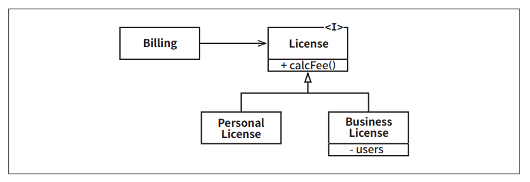
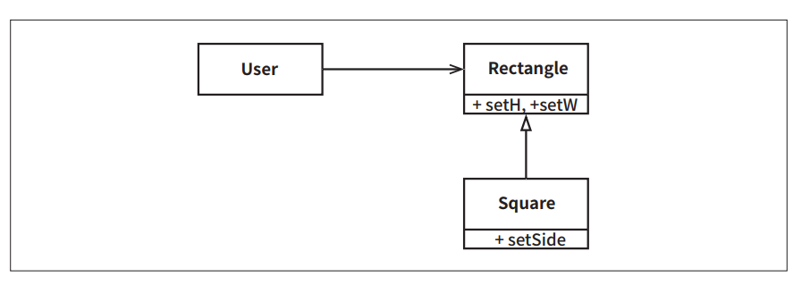
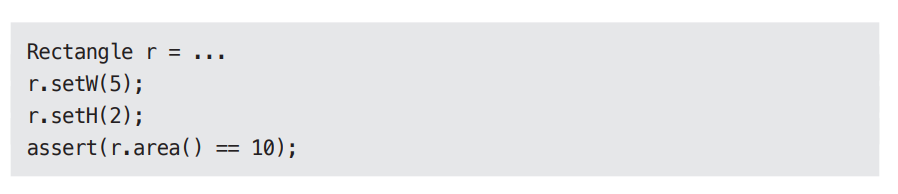

# **LSP: 리스코프 치환 원칙**  
1988년 바바라 리스코프는 하위 타입(subtype)을 아래와 같이 정의했다.  
  
- 여기에서 필요한 것은 다음과 같은 치환(substitution)원칙이다. S 타입의 객체 o1 각각에 대응하는 T 타입 객체 o2가 있고, T 타입을 이용해서 
정의한 모든 프로그램 P에서 o2의 자리에 o1을 치환하더라도 P의 행위가 변하지 않는다면 S는 T의 하위 타입이다.  
  
# **상속을 사용하도록 가이드하기**  
  
위 그림과 같이 License라는 클래스가 있다고 해보자. 이 클래스는 calcFee() 하는 메서드를 가지며 Billing 애플리케이션에서 이 메서드를 호출한다. 
License에는 PersonalLicense와 BusinessLicense라는 두 가지 하위 타입이 존재한다. 이들 두 하위 타입은 서로 다른 알고리즘을 이용해서 라이선스 
비용을 계산한다.  
  
이 설계는 LSP를 준수하는데 Billing 애플리케이션의 행위가 License 하위 타입 중 무엇을 사용하는지에 전혀 의존하지 않기 때문이다. 이들 하위 타입은 
모두 License 타입을 치환할 수 있다.  
  
# **정사각형/직사각형 문제**  
LSP를 위반하는 전형적인 문제로는 유명한(보는 관점에 따라서는 악명 높은) 정사각형/직사각형 문제가 있다.  
  
  
  
이 예제에서 Square는 Rectangle의 하위 타입으로는 적합하지 않은데 Rectangle의 높이와 너비는 서로 독립적으로 변경될 수 있는 반면 Square의 높이와 
너비는 반드시 함께 변경되기 때문이다. User는 대화하고 있는 상태가 Rectangle이라고 생각하므로 혼동이 생길 수 있다. 아래의 코드를 보면 혼동의 이유가 
분명해진다.  
  
  
  
... 코드에서 Square를 생성한다면 assert 문은 실패하게 된다.  
  
이런 형태의 LSP 위반을 막기 위한 유일한 방법은 (if문 등을 이용해서) Rectangle이 실제로는 Square인지를 검사하는 메커니즘을 User에 추가하는 
것이다. 하지만 이렇게 하면 User의 행위가 사용하는 타입에 의존하게 되므로 결국 타입을 서로 치환할 수 없게 된다.  
  
# **LSP와 아키텍처**  
객체 지향이 혁명처럼 등장한 초창기에는 앞서 본 것처럼 LSP는 상속을 사용하도록 가이드하는 방법 정도로 간주되었다. 하지만 시간이 지나면서 LSP는 
인터페이스와 구현체에도 적용되는 더 광범위한 소프트웨어 설계 원칙으로 변모해 왔다.  
  
여기에서 말하는 인터페이스는 다양한 형태로 나타난다. 자바스러운 언어라면 인터페이스 하나와 이를 구현하는 여러 개의 클래스로 구성된다. 루비라면 동일한 
메서드 시그니처를 공유하는 여러 개의 클래스로 구성된다. 또는 동일한 REST 인터페이스에 응답하는 서비스 집단일 수도 있다.  
  
이상의 모든 상황은 물론 더 많은 경우에 LSP를 적용할 수 있다. 잘 정의된 인터페이스와 그 인터페이스의 구현체끼리의 상호 치환 가능성에 기대는 사용자들이 
존재하기 때문이다.  
  
아키텍처 관점에서 LSP를 이해하는 최선의 방법은 이 원칙을 어겼을 때 시스템 아키텍처에서 무슨 일이 일어나는지 관찰하는 것이다.  
  
